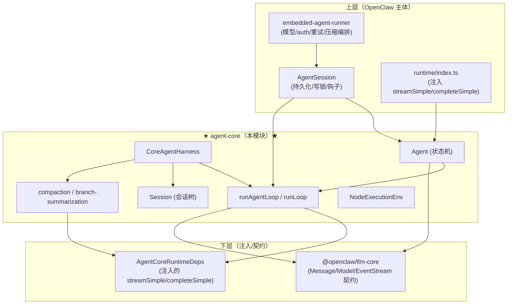

# 01 · 模块定位与职责边界

## 1.1 是什么

`@openclaw/agent-core` 是 OpenClaw 的**核心循环引擎库**，提供「运行一个 LLM Agent」所需的全部 provider-agnostic 机制：

- **ReAct 循环**：流式调用模型 → 解析工具调用 → 执行工具 → 回灌结果 → 判断是否继续。
- **有状态 Agent 封装**：转写管理、steering/follow-up 队列、生命周期事件、abort。
- **会话化 Harness**：会话树持久化、上下文压缩、分支摘要、17 类外部钩子、资源（技能/模板）。
- **会话存储**：append-only 树形存储（JSONL 文件 / 内存两种实现）。
- **压缩与摘要算法**：token 估算、切点选择、结构化摘要生成。
- **执行环境**：`NodeExecutionEnv`（FileSystem + Shell 的 Node 实现）。
- **工具函数**：消息转换、技能/模板格式化、工具参数校验、文本截断、进程树终止。

## 1.2 不是什么（职责边界）

agent-core **刻意不包含**以下内容（它们由调用方注入或在更上层实现）：

| 不负责 | 谁负责 |
|---|---|
| 具体 LLM provider 调用（HTTP/SSE） | 由 `AgentCoreRuntimeDeps.streamSimple/completeSimple` 注入（OpenClaw 在 `src/plugin-sdk/llm.ts` 实现） |
| 模型解析、auth、失败转移、重试状态机 | `src/agents/embedded-agent-runner/run.ts`（上层） |
| 系统提示装配 | `src/agents/system-prompt.ts`（上层，作为字符串/回调传入 harness） |
| 工具的具体实现（read/bash/...） | `src/agents/tools/*`（上层，作为 `AgentTool[]` 传入） |
| 工具权限/策略/沙箱 | 上层通过 `beforeToolCall`/`afterToolCall` 钩子注入 |
| 渠道、路由、网关 | OpenClaw 主体 |
| 记忆插件、向量检索 | 记忆插件（上层通过 `transformContext`/`context` 钩子注入上下文） |
| 上下文引擎（可插拔） | `src/context-engine/*`（上层；agent-core 只提供基础压缩，可被 delegate 复用） |

**一句话边界**：agent-core 知道「如何驱动一次对话循环、如何存会话树、如何压缩」，但**不知道**「用哪个模型、调哪个 API、用什么工具、什么权限、什么提示」。后者全靠注入。

## 1.3 在系统中的层级

agent-core 位于「llm-core 契约层」之上、「OpenClaw 运行时编排层」之下。它是**承上启下的引擎层**：向下消费 llm-core 的消息/事件契约 + 注入的流式函数，向上为 OpenClaw 运行时提供循环/会话/压缩能力。

## 1.4 三个使用层次（由简到繁）

agent-core 暴露三个粒度递增的入口，调用方按需选用：

| 层次 | 入口 | 用途 | 状态 |
|---|---|---|---|
| **L1 纯循环** | `runAgentLoop(prompts, context, config, emit, signal, streamFn, runtime)` | 跑一次 ReAct 循环，事件经 emit 回调 | 无状态（context 由调用方持有） |
| **L2 有状态 Agent** | `new Agent(options).prompt(msg)` | 持有转写 + 队列 + 事件订阅 | 有状态（内存转写） |
| **L3 会话 Harness** | `new CoreAgentHarness(options).prompt(text)` | 会话树持久化 + 压缩 + 分支 + 钩子 | 有状态（持久会话树） |

**OpenClaw 实际用的是 L2**：`AgentSession`（`src/agents/sessions/agent-session.ts`）持有 `Agent` 实例（经 `runtime/index.ts` 的 `Agent` 子类），自行实现持久化/压缩，而不用 L3 的 `CoreAgentHarness`。`CoreAgentHarness` 是 agent-core 提供的**参考实现/可选完整外壳**，也被部分场景与外部使用。

## 1.5 依赖关系

**对外依赖（极小）**：
- `@openclaw/llm-core`（workspace）：`Message`/`AssistantMessage`/`ToolResultMessage`/`Model`/`Context`/`Tool`/`Usage`/`StreamFn`/`CompleteSimpleFn`/`AssistantMessageEvent`/`EventStream`/`SimpleStreamOptions`/`Transport`/`ThinkingBudgets` + `resolveClaudeFable5ModelIdentity`/`validateToolArguments`/`validateToolCall`。
- `typebox`：`Static`/`TSchema`（工具参数 schema 类型）。
- Node 内置：`node:fs`/`node:fs/promises`/`node:path`/`node:os`/`node:crypto`/`node:child_process`/`node:readline`（仅 `NodeExecutionEnv` 与 `kill-tree` 用）。

**内部不依赖任何 OpenClaw `src/**`** —— 这是其可独立复用的硬约束。注入运行时（`AgentCoreRuntimeDeps`）是它与 OpenClaw 的唯一耦合点，且是依赖倒置（DIP）：agent-core 定义接口，OpenClaw 实现并注入。
