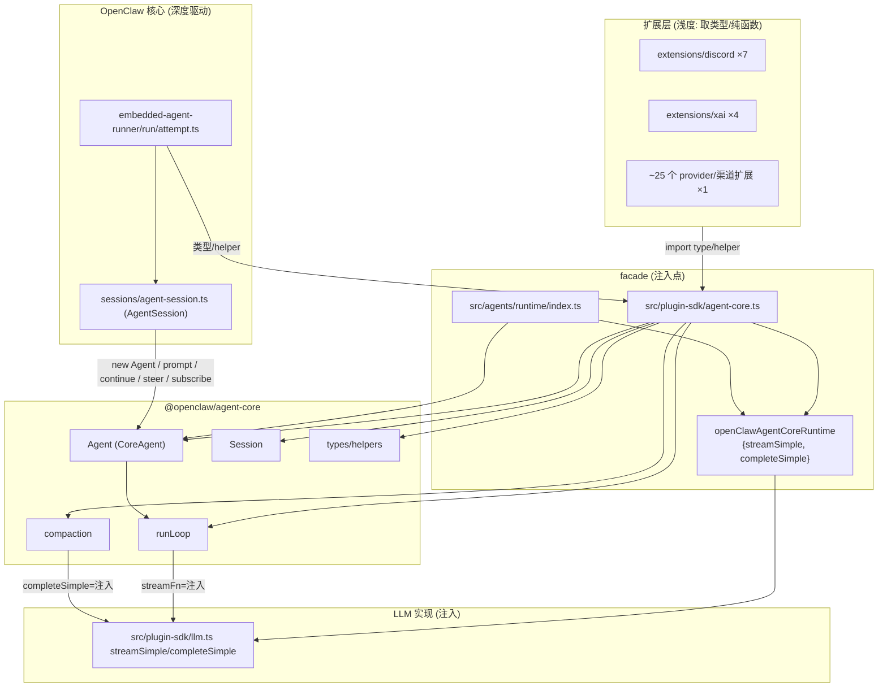

# 03 · 调用方图谱（谁来调用 agent-core）

这是本规格的核心问题之一：**谁向上调用 agent-core，怎么调用。**

## 3.1 两条 facade（唯一入口）

外部代码**从不**直接 `import "@openclaw/agent-core"`（实测 0 处）。所有访问经两条 facade，二者代码几乎完全相同：

### facade A：`src/plugin-sdk/agent-core.ts`（SDK 子路径，对应导入说明符 `openclaw/plugin-sdk/agent-core`）
```ts
export const openClawAgentCoreRuntime = {
  completeSimple: completeSimple as unknown as CompleteSimpleFn,
  streamSimple:   streamSimple   as unknown as StreamFn,
} satisfies AgentCoreRuntimeDeps;          // 注入 OpenClaw 的 LLM 实现

export class Agent extends CoreAgent {     // 预绑运行时的 Agent 子类
  constructor(options = {}) { super({ runtime: openClawAgentCoreRuntime, ...options }); }
}
export * from "../../packages/agent-core/src/index.js";  // re-export 整个 agent-core
export * from "../agents/runtime/proxy.js";
```

### facade B：`src/agents/runtime/index.ts`（运行时 facade，内部用相对路径）
与 A 内容一致，只是路径深度不同。它是 OpenClaw 主体内部用的版本。

**两条 facade 做的唯一实质工作**：
1. 把 OpenClaw 的 `streamSimple`/`completeSimple`（来自 `src/plugin-sdk/llm.ts`，最终连到 70 个 provider）包装成 `AgentCoreRuntimeDeps`。
2. 导出 `class Agent extends CoreAgent`，构造时默认注入该运行时（调用方 `new Agent()` 即得到「已连好 LLM 的 Agent」）。
3. `export *` 把整个 agent-core re-export 出去（含 Session/compaction/types/...）。

> 这就是依赖倒置的落地点：agent-core 定义 `AgentCoreRuntimeDeps` 接口，facade 注入实现。**重写 agent-core 时必须保留这个注入点契约**。

## 3.2 导入统计（实测）

| 导入说明符 | 处数 | 含义 |
|---|---|---|
| `openclaw/plugin-sdk/agent-core` | 78 | 主要消费路径（SDK 子路径，含扩展与核心） |
| `../../packages/agent-core/src/types.js` | 3 | 直接取类型 |
| `.../harness/prompt-template-arguments.js` | 2 | 模板格式化 |
| `.../harness/messages.js` | 2 | 消息转换 |
| `.../runtime-deps.js` | 2 | 注入类型（facade 用） |
| `.../index.js` | 2 | facade re-export |
| `.../agent.js` | 2 | facade 取 CoreAgent |
| `.../harness/utils/truncate.js` | 1 | 截断 |
| `.../harness/env/kill-tree.js` | 1 | `src/process/kill-tree.ts` 复用 |
| 合计（非测试，外部） | ~94 | — |

## 3.3 消费方分布（`openclaw/plugin-sdk/agent-core` 的 78 处，按目录）

| 目录 | 处数 | 用途 |
|---|---|---|
| `extensions/discord` | 7 | provider/渠道扩展取类型与 helper |
| `extensions/xai` | 4 | provider 扩展 |
| `extensions/slack` | 3 | 渠道扩展 |
| `extensions/anthropic-vertex` | 2 | provider |
| `src/agents/sessions` | 1 | **核心：AgentSession 取 Agent** |
| `src/agents/embedded-agent-runner` | 1 | **核心：运行编排** |
| 其余 ~20 个 extensions（anthropic/openai/google/qwen/ollama/telegram/whatsapp/matrix/codex/browser/memory-lancedb/...） | 各 1 | 取类型/helper（如 `AgentMessage`/`AgentTool`/`ThinkingLevel`/`convertToLlm`/`estimateTokens`） |

**结论**：消费分两类 ——
- **核心驱动者**（少数、深度使用）：`src/agents/sessions/` 与 `src/agents/embedded-agent-runner/`，它们真正实例化并驱动 `Agent`/循环。
- **类型/工具消费者**（多数、浅度使用）：大量 provider/渠道扩展只是 `import type` 取消息/工具/思考级别类型，或用 `convertToLlm`/`estimateTokens` 等纯函数。

## 3.4 核心驱动者：AgentSession 如何驱动 Agent

`src/agents/sessions/agent-session.ts` 是真正驱动循环的类。关键调用（实测）：
- 构造时持有一个 `Agent` 实例（经 facade 的 `Agent` 子类，已注入运行时）。
- `this.unsubscribeAgent = this.agent.subscribe(this.handleAgentEvent)`（`:427`/`:836`）— 订阅事件做持久化与转发。
- `await this.agent.prompt(messages)`（`:1091`）— 启动循环。
- `await this.agent.continue()`（`:1093`/`:1216`/`:1218`）— 续跑（处理工具结果/队列）。
- `this.agent.steer({...})`（`:1402`）/ `this.agent.followUp({...})`（`:1419`/`:1469`）/ `this.agent.steer(appMessage)`（`:1471`）— 中途纠偏与追加。

即：**AgentSession = Agent（agent-core L2）+ OpenClaw 的持久化/写锁/压缩/工具钩子**。它把 agent-core 的内存态 Agent 接到 OpenClaw 的会话存储与策略上。

## 3.5 核心驱动者：embedded-agent-runner

`src/agents/embedded-agent-runner/`（上层运行编排）经 `run/attempt.ts` 创建 `AgentSession`，并在其外包裹模型解析、auth、失败转移、重试、压缩触发、上下文引擎。它通过 facade 取 agent-core 的类型与 helper，但**不直接调 runLoop**（经 AgentSession → Agent → runLoop）。

## 3.6 注入运行时如何连到真实 LLM

```
agent-core: runLoop → streamFn(model, context, opts)
        ↑ 注入
facade: openClawAgentCoreRuntime.streamSimple = streamSimple (from src/plugin-sdk/llm.ts)
        ↓
src/plugin-sdk/llm.ts → llm-runtime stream.ts (按 model.api 分发)
        ↓
src/llm/providers/* 或 extensions/<provider> 的 adapter → 真实 HTTP/SSE
```

agent-core 完全不知道这条链；它只调用注入进来的 `streamSimple`。

## 3.7 调用方图谱（完整）



## 3.8 重写时的调用方契约（必须保持）

重写 agent-core 时，以下对调用方可见的契约**不可破坏**，否则上层全断：
1. **`AgentCoreRuntimeDeps` 接口**（`streamSimple`/`completeSimple`）—— facade 注入点。
2. **`Agent` 类的构造与方法签名**（`prompt`/`continue`/`steer`/`followUp`/`subscribe`/`abort`/`state`）—— AgentSession 依赖。
3. **`AgentEvent` 联合的事件序**（agent_start→turn_start→message_*→tool_*→turn_end→agent_end）—— AgentSession 的 `handleAgentEvent` 依赖。
4. **`AgentMessage`/`AgentTool`/`AgentLoopConfig`/`ThinkingLevel` 类型** —— 大量扩展 import type。
5. **`convertToLlm`/`estimateTokens`/`prepareCompaction`/`compact`/`Session`/`buildSessionContext`** —— sessions 层与压缩复用。
6. **`index.ts` 的导出清单** —— SDK 子路径稳定面。
