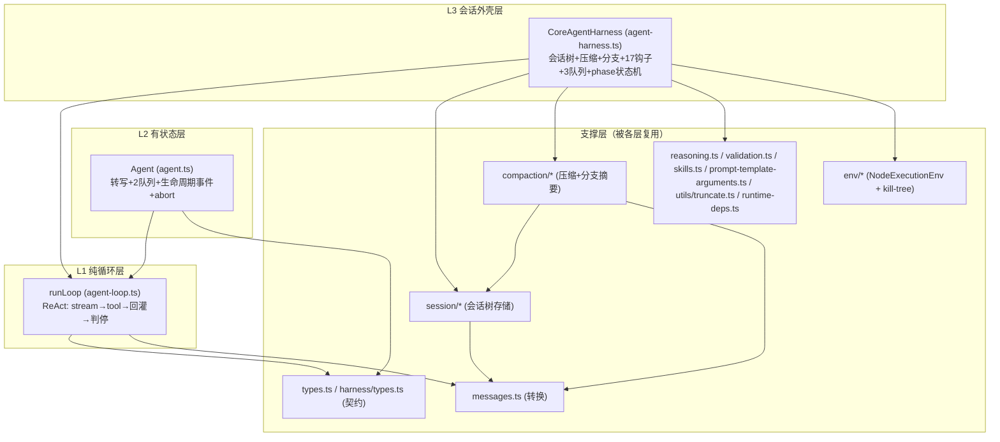
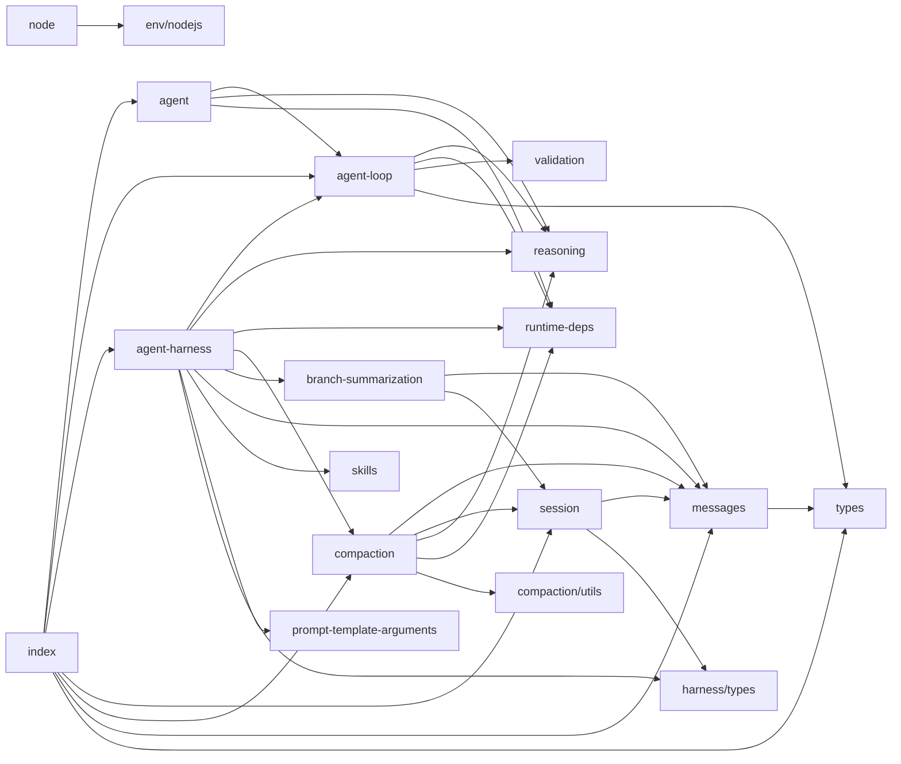

# 04 · 内部架构

## 4.1 三层结构

agent-core 内部分三层，由简到繁，下层不依赖上层：

- **L1（runLoop）**：纯函数，无状态。输入 context + config + emit 回调，跑循环。**所有 I/O 经注入**（streamFn、工具 execute、钩子）。
- **L2（Agent）**：在 L1 外加内存转写、两个队列、事件订阅、abort 控制、状态归约。
- **L3（CoreAgentHarness）**：在 L1 外加会话树持久化、压缩、分支导航、17 类钩子、资源管理、phase 串行化。**注意 L3 不经 L2**，它直接调 `runAgentLoop`（L1）。

## 4.2 文件职责表

| 文件 | 行数 | 职责 |
|---|---|---|
| `agent-loop.ts` | 1043 | **L1 循环引擎**：runLoop/runAgentLoop(Continue)/agentLoop(Continue)、streamAssistantResponse、executeToolCalls（串行/并行）、prepareToolCall（校验+beforeToolCall）、finalizeExecutedToolCall（afterToolCall） |
| `agent.ts` | 621 | **L2 Agent 类** + PendingMessageQueue + 状态归约 processEvents + 生命周期 runWithLifecycle |
| `harness/agent-harness.ts` | 1211 | **L3 CoreAgentHarness**：turnState 构建、createStreamFn（叠加 auth/钩子）、createLoopConfig（钩子转发）、handleAgentEvent（落盘）、compact/navigateTree、emitHook/emitOwn |
| `types.ts` | 533 | L1/L2 类型：AgentLoopConfig/AgentTool/AgentToolResult/AgentEvent/AgentMessage/AgentState/AgentContext/ThinkingLevel/各回调上下文 |
| `harness/types.ts` | 842 | L3 类型：Session 相关、SessionTreeEntry 联合、SessionStorage、ExecutionEnv/FileSystem/Shell、AgentHarnessOptions、17 钩子事件 + AgentHarnessEventResultMap、各 Error 类、Result |
| `harness/session/session.ts` | 290 | Session 类 + buildSessionContext（压缩重放逻辑） |
| `harness/session/storage-base.ts` | 283 | 存储基类（共享树遍历/路径计算逻辑） |
| `harness/session/jsonl-storage.ts` | 285 | JSONL 文件存储实现 |
| `harness/session/memory-storage.ts` | 24 | 内存存储实现 |
| `harness/session/uuid.ts` | 59 | uuidv7 生成 |
| `harness/session/timestamps.ts` | 17 | 时间戳解析/校验 |
| `harness/compaction/compaction.ts` | 882 | 压缩算法：shouldCompact/prepareCompaction/findCutPoint/compact/generateSummary/estimateTokens 等 |
| `harness/compaction/branch-summarization.ts` | 324 | 分支摘要算法 |
| `harness/compaction/utils.ts` | 168 | 文件操作提取/serializeConversation |
| `harness/messages.ts` | 179 | convertToLlm + harness 消息工厂/前后缀 |
| `harness/env/nodejs.ts` | 619 | NodeExecutionEnv（FS+Shell 的 Node 实现） |
| `harness/env/kill-tree.ts` | 138 | 进程树终止 |
| `harness/skills.ts` | 14 | formatSkillInvocation |
| `harness/prompt-template-arguments.ts` | 88 | formatPromptTemplateInvocation |
| `harness/utils/truncate.ts` | 371 | 文本截断 |
| `reasoning.ts` | 37 | resolveAgentReasoningOption（thinking 级别 → provider reasoning 选项） |
| `runtime-deps.ts` | 45 | AgentCoreRuntimeDeps + resolve 函数（注入点） |
| `validation.ts` | 2 | re-export llm-core 校验 |
| `llm.ts` | 2 | re-export llm-core |
| `node.ts` | 3 | Node 专用入口（导出 NodeExecutionEnv + index） |
| `index.ts` | 49 | 公开导出聚合 |

## 4.3 内部依赖图

无循环依赖。`types.ts`/`harness/types.ts` 是叶子契约；`reasoning`/`runtime-deps`/`messages` 是共享工具；`agent-loop` 是被 `agent` 与 `harness` 复用的引擎核心。

## 4.4 关键设计模式

| 模式 | 应用 |
|---|---|
| **依赖倒置（DIP）** | `AgentCoreRuntimeDeps` —— agent-core 定义接口，外部注入 LLM 实现 |
| **策略 + 回调钩子** | `AgentLoopConfig` 的 `convertToLlm`/`transformContext`/`beforeToolCall`/`afterToolCall`/`prepareNextTurn`/`shouldStopAfterTurn`/`getSteeringMessages`/`getFollowUpMessages`/`resolveDeferredTool`/`getApiKey` 全是注入策略 |
| **状态机** | Agent 的 isStreaming/run 生命周期；Harness 的 phase（idle/turn/compaction/branch_summary/retry） |
| **事件流（观察者）** | `EventStream<AgentEvent>` + `subscribe` |
| **判别联合** | `AgentEvent`/`AgentMessage`/`SessionTreeEntry`/`AssistantMessageEvent` 全用 `type` 判别 |
| **Result 类型** | 压缩/分支摘要用 `Result<T, E>` 而非抛异常（`ok`/`err`） |
| **模板方法** | 存储 `storage-base.ts` 共享树遍历，子类填具体存取 |
| **门面（Facade）** | `index.ts` 聚合导出；`llm.ts`/`validation.ts` re-export llm-core |
| **不可变归约** | Agent `processEvents` 用新 Set/数组拷贝更新 pendingToolCalls |

## 4.5 错误处理哲学

1. **循环内不抛**：`streamFn` 契约要求把失败编码进事件流（`stopReason: error/aborted`），不抛异常。`agentLoop`/`agentLoopContinue` 用 `pushLoopFailure` 把异常转成正常事件序。
2. **钩子契约**：`convertToLlm`/`transformContext`/`getSteeringMessages` 等注释明确「must not throw or reject，返回安全兜底值」。
3. **压缩用 Result**：压缩/摘要返回 `Result<T, CompactionError>`，调用方判 `ok`。
4. **Harness 归一化错误**：`normalizeHarnessError`/`normalizeHookError` 把各类错误归一成带 code 的 `AgentHarnessError`（busy/invalid_state/session/hook/auth/compaction/branch_summary/unknown）。
5. **abort 是一等公民**：`signal?.aborted` 在循环多个检查点检测，持久化 aborted 助手消息以防后处理误续。
