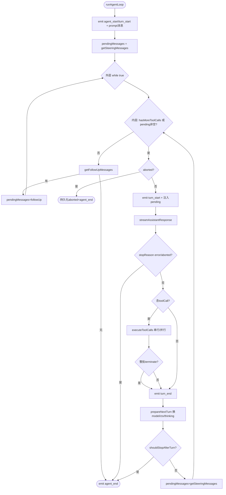

# 06 · ReAct 循环引擎算法（runLoop）

来源：`agent-loop.ts`。这是 agent-core 的核心算法，重写时须逐步等价复刻。

## 6.1 入口与包装

四个公开入口：
- `agentLoop(prompts, ...)` / `agentLoopContinue(...)`（`:87/:126`）：返回 `EventStream<AgentEvent, AgentMessage[]>`，内部 `void runAgentLoop(...).then(end).catch(pushLoopFailure)`。
- `runAgentLoop(prompts, context, config, emit, signal?, streamFn?, runtime?)`（`:164`）：以新 prompt 启动。
- `runAgentLoopContinue(context, config, emit, ...)`（`:191`）：从现有 context 续跑。

`runAgentLoop` 序：
```
newMessages = [...prompts]
currentContext = { ...context, messages: [...context.messages, ...prompts] }
emit agent_start; emit turn_start
for each prompt: emit message_start; emit message_end
await runLoop(currentContext, newMessages, config, signal, emit, streamFn, runtime)
return newMessages
```
`runAgentLoopContinue` 校验：messages 非空、末条非 assistant（否则抛），不重复注入 prompt。

## 6.2 runLoop 主算法（`:258`）

伪代码（忠实于源码）：
```
runLoop(initialContext, newMessages, initialConfig, signal, emit, streamFn?, runtime?):
  currentContext = initialContext; config = initialConfig
  firstTurn = true; turnOpen = true
  pendingMessages = (await config.getSteeringMessages?.()) || []   # 开局先取 steering

  while (true):                          # 外层：follow-up 循环
    hasMoreToolCalls = true
    while (hasMoreToolCalls || pendingMessages.length > 0):   # 内层：turn 循环
      if (await stopIfAborted()) return

      if (!firstTurn) { emit turn_start; turnOpen = true } else firstTurn = false

      # 注入 pending（steering 或上一轮 follow-up）
      for msg in pendingMessages:
        emit message_start(msg); emit message_end(msg)
        currentContext.messages.push(msg); newMessages.push(msg)

      if (await stopIfAborted()) return

      message = await streamAssistantResponse(currentContext, config, signal, emit, streamFn, runtime)
      newMessages.push(message)

      if (message.stopReason in {error, aborted}):
        emit turn_end(message, []); emit agent_end(newMessages); return

      toolCalls = message.content.filter(c => c.type === "toolCall")
      toolResults = []
      hasMoreToolCalls = false
      if (toolCalls.length > 0):
        batch = await executeToolCalls(currentContext, message, config, signal, emit)
        toolResults.push(...batch.messages)
        hasMoreToolCalls = !batch.terminate     # 整批 terminate → 不再继续
        for r in toolResults: currentContext.messages.push(r); newMessages.push(r)

      emit turn_end(message, toolResults); turnOpen = false
      if (await stopIfAborted()) return

      # 下一 turn 准备：可换 context/model/thinking
      snapshot = await config.prepareNextTurn?.({message, toolResults, context, newMessages})
      if (snapshot):
        currentContext = snapshot.context ?? currentContext
        nextModel = snapshot.model ?? config.model
        nextThinking = snapshot.thinkingLevel ?? config.thinkingLevel
        # 重算 reasoning（见 reasoning.ts）
        config = { ...config, model: nextModel, thinkingLevel: nextThinking, reasoning: ... }
      if (await stopIfAborted()) return

      if (await config.shouldStopAfterTurn?.({message, toolResults, context, newMessages})):
        emit agent_end(newMessages); return

      pendingMessages = (await config.getSteeringMessages?.()) || []
      if (await stopIfAborted()) return

    # 内层退出：无更多工具调用与 steering
    followUp = (await config.getFollowUpMessages?.()) || []
    if (followUp.length > 0): pendingMessages = followUp; continue   # 外层续跑
    break

  emit agent_end(newMessages)
```

### stopIfAborted（`:273`）
若 `signal.aborted`：构造 aborted 助手消息（`createLoopFailureMessage(config, reason, true)`）push 进 newMessages；若 turn 未开则补 emit turn_start；emit message_start/end + turn_end + agent_end；返回 true。**目的**：持久化 aborted 结果，防止会话后处理从 toolUse 消息误续或误压缩。

## 6.3 streamAssistantResponse（`:438`）

```
messages = context.messages
if config.transformContext: messages = await config.transformContext(messages, signal)   # 上下文改写钩子
llmMessages = await config.convertToLlm(messages)                                          # AgentMessage→Message
llmContext = { systemPrompt: context.systemPrompt, messages: llmMessages, tools: context.tools }
streamFunction = resolveAgentCoreStreamFn(runtime, streamFn)
apiKey = (config.getApiKey ? await config.getApiKey(model.provider) : undefined) || config.apiKey  # 动态 key
response = await streamFunction(config.model, llmContext, { ...config, apiKey, signal })

partialMessage = null; addedPartial = false
for await event of response:
  switch event.type:
    case "start":
      partialMessage = event.partial; context.messages.push(partialMessage); addedPartial = true
      emit message_start({...partialMessage})
    case text_start|text_delta|text_end|thinking_*|toolcall_*:
      if partialMessage:
        message = resolveAssistantMessageUpdate(event, partialMessage)   # 应用增量
        partialMessage = message; context.messages[last] = message
        emit message_update({assistantMessageEvent: event, message: {...message}})
    case "done"|"error":
      finalMessage = await response.result()
      context.messages[last|push] = finalMessage
      if !addedPartial: emit message_start({...finalMessage})
      emit message_end(finalMessage); return finalMessage
# 流自然结束兜底
finalMessage = await response.result(); ...; emit message_end; return finalMessage
```
`resolveAssistantMessageUpdate`（`:70`）：若 event 带 `partial` 用之；否则 `text_delta` 时把 delta 追加到对应 contentIndex 的 text 块（`appendTextDeltaToAssistantMessage`）。

## 6.4 工具执行（`executeToolCalls`，`:540`）

### 串行 vs 并行决策
```
toolCalls = assistantMessage.content.filter(toolCall)
if config.toolExecution !== "sequential":
  # 预解析，发现任一 tool.executionMode==="sequential" → 整批转串行
  for tc in toolCalls:
    res = await resolveToolCallTool(...)   # 缓存进 resolvedToolCalls Map
    if res.kind==="resolved" && res.tool?.executionMode==="sequential": hasSequential=true; break
    if signal.aborted: break
if config.toolExecution==="sequential" || hasSequential: executeToolCallsSequential(...)
else: executeToolCallsParallel(...)
```

### 单个工具的处理流水线
1. **resolveToolCallTool（`:789`）**：先在 `context.tools` 找；找不到调 `config.resolveDeferredTool`（延迟工具水合，名字须匹配否则抛；水合后加入 `context.tools` 供后续续写可见）。结果缓存。
2. **prepareToolCall（`:833`）**：
   - resolve 失败 → immediate 错误结果。
   - tool 不存在 → immediate「Tool X not found」。
   - `prepareArguments`（兼容 shim）→ `validateToolArguments`（TypeBox 校验）。
   - `config.beforeToolCall`：若 `signal.aborted` → immediate「Operation aborted」；若返回 `{block:true}` → immediate 错误（reason）。
   - 否则返回 `{kind:"prepared", toolCall, tool, args}`。
3. **executePreparedToolCall（`:921`）**：`tool.execute(id, args, signal, onUpdate)`；`onUpdate` 推 `tool_execution_update` 事件（收集成 promise 数组，最后 await）。异常 → 错误结果。
4. **finalizeExecutedToolCall（`:958`）**：`config.afterToolCall` 可改写 content/details/isError/terminate（异常 → 错误结果）。
5. **emit tool_execution_end** + 构造 `ToolResultMessage`（`:1025`）+ emit message_start/message_end。

### 串行实现（`:600`）
按序对每个 toolCall：emit tool_execution_start → prepare → (immediate 或 execute+finalize) → emit tool_execution_end → 构造 result message → emit。`signal.aborted` 则中断。

### 并行实现（`:665`）
- 先按序 emit tool_execution_start + prepare（preflight 串行，保证 beforeToolCall 顺序与 abort 检查）。
- immediate 的直接 finalize；prepared 的包成 thunk（`async () => execute+finalize+emit end`）。
- `Promise.all(thunks)` 并发执行。
- 然后**按 assistant 源序**构造 result message + emit（`tool_execution_end` 是完成序，result message 是源序）。

### 早停（`shouldTerminateToolBatch`，`:768`）
```
finalizedCalls.length > 0 && finalizedCalls.every(f => f.result.terminate === true)
```
整批工具结果都标 `terminate:true` 才返回 `terminate:true`，使 runLoop 停止继续。

## 6.5 失败消息（`createLoopFailureMessage`，`:224`）
构造 `stopReason: aborted|error` 的空 assistant 消息（带 model 身份 + 空 usage + errorMessage），用于 abort/异常时持久化终态。

## 6.6 循环算法流程图



## 6.7 reasoning 解析（`reasoning.ts`）
`resolveAgentReasoningOption(model, thinkingLevel)`：
- `thinkingLevel !== "off"` → 直接返回该级别（若是 enabled 级别）。
- `"off"` → 看 `model.thinkingLevelMap?.off`；或 Anthropic/Bedrock 的 Fable5 模型回退 `"low"`；否则 `undefined`。
循环在 `prepareNextTurn` 换模型/thinking 时重算此值。
