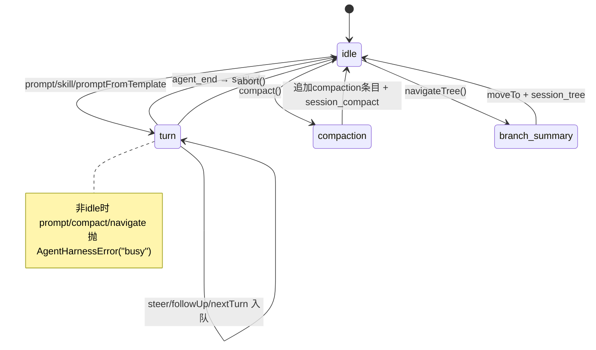

# 07 · CoreAgentHarness（会话外壳）

来源：`harness/agent-harness.ts`（1211 行）。L3 层，直接驱动 `runAgentLoop`（不经 L2 Agent）。

## 7.1 职责

把纯循环包装成「会话化助理」：会话树持久化、上下文压缩、分支导航、17 类外部钩子、资源（技能/模板）、三类队列、phase 串行化、provider 请求钩子叠加。

## 7.2 内部状态（`:222`）

```
env: ExecutionEnv; session: Session; phase: AgentHarnessPhase = "idle"
runAbortController?; runPromise?
pendingSessionWrites: PendingSessionWrite[]    # 运行中累积，turn 边界 flush
model; thinkingLevel; systemPrompt(字符串|回调); streamOptions; getApiKeyAndHeaders?; runtime?
resources: {skills, promptTemplates}
tools: Map<name, TTool>; activeToolNames: string[]
steerQueue/followUpQueue/nextTurnQueue: 消息数组 + 各自 QueueMode
handlers: Map<eventType, Set<handler>>          # 钩子注册表
```

## 7.3 phase 状态机



## 7.4 一次 prompt 的执行（`prompt → executeTurn`）

```
prompt(text, {images?}):
  if phase!=="idle": throw busy
  phase = "turn"; finishRunPromise = startRunPromise()
  try:
    turnState = await createTurnState()      # 快照：上下文+系统提示+工具+streamOptions+sessionId+model
    return await executeTurn(turnState, text, options)
  catch: phase="idle"; throw normalizeHarnessError
  finally: finishRunPromise()
```

### createTurnState（`:385`）
```
context = await session.buildContext()                 # 会话树 → messages
resources = getResources()
sessionMetadata = await session.getMetadata()
tools = [...this.tools.values()]
activeTools = activeToolNames.map(name => tools.get(name)).filter(defined)
systemPrompt = string | await systemPromptCallback({env, session, model, thinkingLevel, activeTools, resources})
return { messages, resources, streamOptions(clone), sessionId, systemPrompt, model, thinkingLevel, tools, activeTools }
```

### executeTurn（`:629`）
```
messages = [createUserMessage(text, images)]
if nextTurnQueue 非空: 取出并前置（emit queue_update）
beforeResult = await emitHook(before_agent_start {prompt, images, systemPrompt, resources})  # 可改 messages/系统提示
if beforeResult.messages: messages = [...messages, ...beforeResult.messages]
abortController = new; runAbortController = abortController
runResult = runAgentLoop(
   messages,
   createContext(turnState, beforeResult?.systemPrompt),
   createLoopConfig(getTurnState, setTurnState),
   event => handleAgentEvent(event, signal),
   abortController.signal,
   createStreamFn(getTurnState))
# 失败时 emitRunFailure（构造 failure 消息走完整事件序）
newMessages = await runResult
返回最后一条 assistant 消息（否则抛 invalid_state）
finally: flushPendingSessionWrites(); runAbortController=undefined
```

## 7.5 createLoopConfig（钩子转发，`:486`）

把 harness 钩子接到循环 config：
- `convertToLlm` = 模块级 `convertToLlm`（harness 消息转换）。
- `transformContext` = `emitHook(context {messages})` → 返回改写后的 messages。
- `beforeToolCall` = `emitHook(tool_call {toolCallId,toolName,input})` → `{block, reason}`。
- `afterToolCall` = `emitHook(tool_result {...content,details,isError})` → patch。
- `prepareNextTurn` = `flushPendingSessionWrites()` → `createTurnState()`（重建）→ `setTurnState` → 返回新 context/model/thinkingLevel。**这是 harness 每 turn 重新从会话树构上下文的关键**。
- `getSteeringMessages` = `drainQueuedMessages(steerQueue, mode)`。
- `getFollowUpMessages` = `drainQueuedMessages(followUpQueue, mode)`。

## 7.6 createStreamFn（provider 请求钩子叠加，`:430`）

包装注入的 `runtime.streamSimple`，在调用前后叠加：
1. `getApiKeyAndHeaders(model)` 解析 auth + headers，merge 进 streamOptions。
2. `emitBeforeProviderRequest`（before_provider_request 钩子）patch 请求选项（transport/timeout/retries/headers/metadata/cacheRetention）。
3. `onPayload` = `emitBeforeProviderPayload`（before_provider_payload 钩子改 payload）。
4. `onResponse` = emit `after_provider_response`（status + headers）。
5. 传 `reasoning`/`signal`/`sessionId` 给底层 stream。

## 7.7 handleAgentEvent（事件 → 落盘，`:581`）

```
message_end → session.appendMessage(message); emitAny(event)
turn_end    → emitAny(event)（捕获错误）→ flushPendingSessionWrites() → emitOwn(save_point {hadPendingMutations})
agent_end   → flushPendingSessionWrites() → phase="idle" → emitAny(event) → emitOwn(settled {nextTurnCount})
其他        → emitAny(event)
```
`flushPendingSessionWrites`（`:552`）：把运行中累积的 `pendingSessionWrites`（message/model_change/thinking_level_change/custom/custom_message/label/session_info/leaf）依次落盘。

## 7.8 钩子发射机制

- `emitAny`/`emitOwn`（`:280/:267`）：广播给 `*` 订阅者（subscribe 注册的），异常归一成 hook 错误抛出。
- `emitHook<TType>`（`:293`）：调特定 type 的 handler（on 注册的），返回最后一个非 undefined 结果（带类型）。
- `emitBeforeProviderRequest`（`:314`）：链式 patch streamOptions。
- `emitBeforeProviderPayload`（`:342`）：链式改 payload。

## 7.9 compact（`:808`）

```
if phase!=="idle": throw busy; phase="compaction"
auth = await getApiKeyAndHeaders(model)（无则抛 auth）
branchEntries = await session.getBranch()
prep = prepareCompaction(branchEntries, DEFAULT_COMPACTION_SETTINGS)（无内容则抛）
hookResult = emitHook(session_before_compact {preparation, branchEntries, customInstructions, signal})
  if hookResult.cancel: throw "Compaction cancelled"
  compactResult = hookResult.compaction ?? await compact(prep, model, auth.apiKey, auth.headers, customInstructions, undefined, thinkingLevel, undefined, runtime)
entryId = await session.appendCompaction(summary, firstKeptEntryId, tokensBefore, details, fromHook)
emitOwn(session_compact {compactionEntry, fromHook})
return result
finally: phase="idle"
```

## 7.10 navigateTree（分支导航，`:887`）

```
if phase!=="idle": throw busy; phase="branch_summary"
oldLeafId = session.getLeafId(); if ===targetId: return {cancelled:false}
targetEntry = session.getEntry(targetId)（无则抛）
{entries, commonAncestorId} = collectEntriesForBranchSummary(session, oldLeafId, targetId)
preparation = {targetId, oldLeafId, commonAncestorId, entriesToSummarize, userWantsSummary, ...}
hookResult = emitHook(session_before_tree {preparation, signal}); if cancel: return {cancelled:true}
summaryText = hookResult.summary?.summary
if !summaryText && summarize && entries.length>0:
   auth = getApiKeyAndHeaders(model)
   branchSummary = await generateBranchSummary(entries, {model, apiKey, headers, signal, runtime, customInstructions, replaceInstructions})
   summaryText = branchSummary.value.summary; summaryDetails = {readFiles, modifiedFiles}
# 目标若是 user/custom_message 消息：newLeafId=parentId 并回填 editorText（用于"编辑重跑"）；否则 newLeafId=targetId
summaryId = await session.moveTo(newLeafId, summaryText ? {summary, details, fromHook} : undefined)
emitOwn(session_tree {newLeafId, oldLeafId, summaryEntry, fromHook})
return {cancelled:false, editorText, summaryEntry}
finally: phase="idle"
```

## 7.11 队列与设置方法

- `steer/followUp`：非 idle 才允许，入队 + emit queue_update。`nextTurn`：任何时候可入队（下个 prompt 前置）。
- `drainQueuedMessages(queue, mode)`：`all` 全取 / `one-at-a-time` 取一条；失败回滚。
- `setModel/setThinkingLevel`：idle 时直接落盘 model_change/thinking_level_change；运行中入 pendingSessionWrites；emit model_select/thinking_level_select。
- `setActiveTools/setTools`：校验名字存在（否则 invalid_argument）。
- `abort`：清两队列 + `runAbortController.abort()` + emit queue_update + waitForIdle + emit abort。

## 7.12 与 OpenClaw 实际用法的关系
OpenClaw 主体**不用** CoreAgentHarness，而用 `AgentSession`（L2 Agent + 自有持久化）。CoreAgentHarness 是 agent-core 提供的完整参考外壳，被部分外部/特定场景使用。重写时两条路径都要保留：L2（Agent，供 AgentSession 用）与 L3（CoreAgentHarness，供独立用）。
