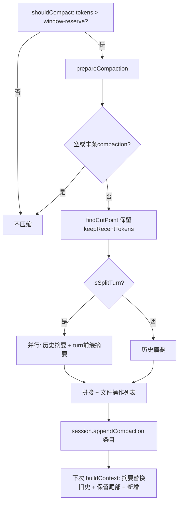

# 09 · 压缩与分支摘要算法

来源：`harness/compaction/compaction.ts`（882 行）、`branch-summarization.ts`、`compaction/utils.ts`。

## 9.1 何时压缩（shouldCompact，`compaction.ts:236`）

```
shouldCompact(contextTokens, contextWindow, settings):
  if (!settings.enabled) return false
  return contextTokens > contextWindow - settings.reserveTokens
```
默认 `reserveTokens=16384`：当上下文 token 超过 `窗口 - 16384` 即触发。`reserveTokens` 为摘要 prompt + 输出预留空间。

## 9.2 Token 估算

### estimateTokens（单消息，`:262`）—— 字符启发式
按 role 累计字符数，再 `Math.ceil(chars/4)`：
- `user`：content 字符（string 或块数组，图片块按 `IMAGE_BLOCK_CHARS=4800` 计）。
- `assistant`：text.length + thinking.length + toolCall(name + JSON(arguments)).length。
- `custom`/`toolResult`：content 字符。
- `bashExecution`：command.length + output.length。
- `branchSummary`/`compactionSummary`：summary.length。

### estimateContextTokens（消息列表，`:205`）—— 优先真实 usage
```
usageInfo = 最后一条成功 assistant 消息的 usage（getLastAssistantUsageInfo）
if 无 usage:
  return { tokens: Σ estimateTokens, usageTokens:0, trailingTokens:Σ, lastUsageIndex:null }
usageTokens = calculateContextTokens(usage)   # = totalTokens || input+output+cacheRead+cacheWrite
trailingTokens = Σ estimateTokens(该usage之后的消息)
return { tokens: usageTokens + trailingTokens, usageTokens, trailingTokens, lastUsageIndex }
```
**精妙处**：用 provider 报告的真实 usage 作为「截至最后一次回复」的准确基线，只对其后的新消息做字符估算，避免全程估算误差累积。

`getAssistantUsage`（`:152`）：只取 stopReason 非 aborted/error 且有 usage 的 assistant 消息。

## 9.3 切点选择（findCutPoint，`:388`）

目标：保留约 `keepRecentTokens`（默认 20000）的近期上下文，其余压缩。

```
findCutPoint(entries, startIndex, endIndex, keepRecentTokens):
  cutPoints = findValidCutPoints(entries, startIndex, endIndex)   # 合法切点
  if cutPoints 空: return {firstKeptEntryIndex: startIndex, turnStartIndex:-1, isSplitTurn:false}

  accumulatedTokens = 0; cutIndex = cutPoints[0]
  # 从尾向前累加 token，到达 keepRecentTokens 时定位切点
  for i in [endIndex-1 .. startIndex]:
    if entries[i].type !== "message": continue
    accumulatedTokens += estimateTokens(entries[i].message)
    if accumulatedTokens >= keepRecentTokens:
      cutIndex = cutPoints[last]
      for cp in cutPoints: if cp >= i: cutIndex = cp; break   # 吸附到 >= i 的最近切点
      break
  # 回退：切点前若是非 message/非 compaction 条目则继续前移（避免切在状态标记中间）
  while cutIndex > startIndex:
    prev = entries[cutIndex-1]
    if prev.type==="compaction" || prev.type==="message": break
    cutIndex--

  cutEntry = entries[cutIndex]
  isUserMessage = cutEntry.type==="message" && role==="user"
  turnStartIndex = isUserMessage ? -1 : findTurnStartIndex(entries, cutIndex, startIndex)
  return { firstKeptEntryIndex: cutIndex, turnStartIndex, isSplitTurn: !isUserMessage && turnStartIndex!==-1 }
```

### findValidCutPoints（`:313`）—— 合法切点规则
只有这些条目可作切点：message 中 role ∈ {user, assistant, bashExecution, custom, branchSummary, compactionSummary}，以及 branch_summary / custom_message 条目。**toolResult 绝不可作切点**（不能把工具调用与其结果切散）。

### findTurnStartIndex（`:357`）—— turn 起点
从某条目向前找该 turn 的起点（user 消息 / bashExecution / branch_summary / custom_message）。用于「split turn」判定：当切点落在一个 turn 中间（非 user 消息处），需把该 turn 的前缀单独摘要。

## 9.4 压缩准备（prepareCompaction，`:634`）

```
if pathEntries 空 || 末条是 compaction: return ok(undefined)   # 无需压缩
prevCompactionIndex = 最后一个 compaction 条目的下标
previousSummary = prevCompaction?.summary
boundaryStart = prevCompaction ? firstKeptEntryId 的下标(或 prevCompactionIndex+1) : 0
boundaryEnd = pathEntries.length
tokensBefore = estimateContextTokens(buildSessionContext(pathEntries).messages).tokens
cutPoint = findCutPoint(pathEntries, boundaryStart, boundaryEnd, keepRecentTokens)
firstKeptEntryId = pathEntries[cutPoint.firstKeptEntryIndex].id  # 无 id 则 invalid_session

historyEnd = isSplitTurn ? turnStartIndex : firstKeptEntryIndex
messagesToSummarize = [boundaryStart..historyEnd) 的可摘要消息
turnPrefixMessages = isSplitTurn ? [turnStartIndex..firstKeptEntryIndex) 的消息 : []
fileOps = extractFileOperations(messagesToSummarize, entries, prevCompactionIndex)
            + (isSplitTurn 时再并入 turnPrefix 的文件操作)
return ok({firstKeptEntryId, messagesToSummarize, turnPrefixMessages, isSplitTurn, tokensBefore, previousSummary, fileOps, settings})
```
**增量压缩**：若已有前次压缩，从上次 `firstKeptEntryId` 起算 boundaryStart，并把 `previousSummary` 传给摘要器做增量更新（保留旧摘要信息）。

## 9.5 文件操作保留（compaction/utils.ts）
`extractFileOpsFromMessage` 从消息中提取读/写/编辑的文件路径（识别 read/write/edit 工具调用），累计进 `FileOperations{read, written, edited}`。压缩时 `computeFileLists` + `formatFileOperations` 把这些追加到摘要末尾，确保**文件上下文跨压缩不丢**。前次压缩的 details.readFiles/modifiedFiles 也并入（非 fromHook 时）。

## 9.6 生成摘要（compact + generateSummary，`:730/:549`）

```
compact(preparation, model, apiKey, headers?, customInstructions?, signal?, thinkingLevel?, streamFn?, runtime?):
  if isSplitTurn && turnPrefixMessages 非空:
    [historyResult, turnPrefixResult] = await Promise.all([
       generateSummary(messagesToSummarize, ...) ,   # 历史摘要（含 previousSummary 增量）
       generateTurnPrefixSummary(turnPrefixMessages, ...)  # turn 前缀单独摘要
    ])
    summary = `${history}\n\n---\n\n**Turn Context (split turn):**\n\n${turnPrefix}`
  else:
    summary = generateSummary(messagesToSummarize, ...)
  {readFiles, modifiedFiles} = computeFileLists(fileOps)
  summary += formatFileOperations(readFiles, modifiedFiles)
  return ok({summary, firstKeptEntryId, tokensBefore, details:{readFiles, modifiedFiles}})
```

### generateSummary（`:549`）
```
maxTokens = min(floor(0.8 * reserveTokens), model.maxTokens>0 ? model.maxTokens : ∞)
basePrompt = previousSummary ? UPDATE_SUMMARIZATION_PROMPT : SUMMARIZATION_PROMPT
if customInstructions: basePrompt += "\n\nAdditional focus: " + customInstructions
llmMessages = convertToLlm(currentMessages)
conversationText = serializeConversation(llmMessages)
promptText = `<conversation>\n${conversationText}\n</conversation>\n\n`
             + (previousSummary ? `<previous-summary>\n${previousSummary}\n</previous-summary>\n\n` : "")
             + basePrompt
response = await completeSummarization(model, {systemPrompt: SUMMARIZATION_SYSTEM_PROMPT, messages:[user(promptText)]}, options, streamFn, runtime)
if stopReason aborted → err(aborted); if error → err(summarization_failed)
return ok(textContent)
```
`completeSummarization`：有 `streamFn` 则 `streamFn(...).result()`，否则用注入的 `resolveAgentCoreCompleteFn(runtime)`（completeSimple）。

### 摘要结构（SUMMARIZATION_PROMPT，`:445`）
固定模板：`## Goal / ## Constraints & Preferences / ## Progress(Done/In Progress/Blocked) / ## Key Decisions / ## Next Steps / ## Critical Context`。强调保留精确文件路径、函数名、错误信息。UPDATE 版本（增量）规则：保留旧信息、追加新进展、把 In Progress 移到 Done。
turn 前缀用单独的 `TURN_PREFIX_SUMMARIZATION_PROMPT`（Original Request / Early Progress / Context for Suffix），maxTokens = `floor(0.5 * reserveTokens)`。

## 9.7 分支摘要（branch-summarization.ts）

`navigateTree` 切换到另一历史分支时，对被放弃分支生成摘要。
- `collectEntriesForBranchSummary(session, oldLeafId, targetId)`：找 oldLeaf 与 target 的公共祖先，收集被放弃路径上的条目（`{entries, commonAncestorId}`）。
- `generateBranchSummary(entries, options)`：用注入运行时（或 streamFn）生成摘要，返回 `Result<{summary, readFiles, modifiedFiles}, BranchSummaryError>`；`replaceInstructions` 控制是否替换默认指令；`reserveTokens` 默认 16384；aborted → `cancelled`。
- 摘要作为 `branch_summary` 条目挂在新叶上（`session.moveTo(newLeafId, {summary, details, fromHook})`），下次 buildContext 时作为 user 消息回放（`BRANCH_SUMMARY_PREFIX`/`SUFFIX` 包裹）。

## 9.8 压缩流程图



## 9.9 消息转换（convertToLlm，messages.ts:123）
压缩与循环都依赖此函数把 harness 消息转成 LLM Message：
- `bashExecution` → user 消息（`bashExecutionToText` 渲染命令+输出+退出码+截断提示）；`excludeFromContext` 则丢弃。
- `custom` → user 消息（content 字符串化）。
- `branchSummary` → user 消息（`BRANCH_SUMMARY_PREFIX + summary + SUFFIX`）。
- `compactionSummary` → user 消息（`COMPACTION_SUMMARY_PREFIX + summary + SUFFIX`）。
- `user`/`assistant`/`toolResult` → 原样透传。
- 其他 → 过滤掉。
