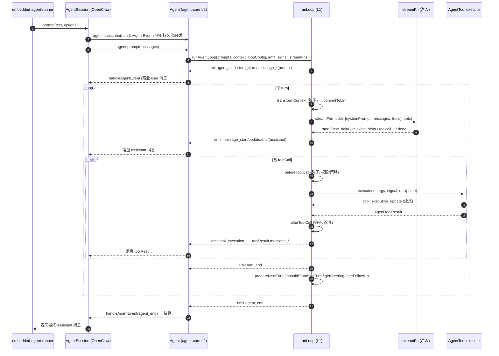
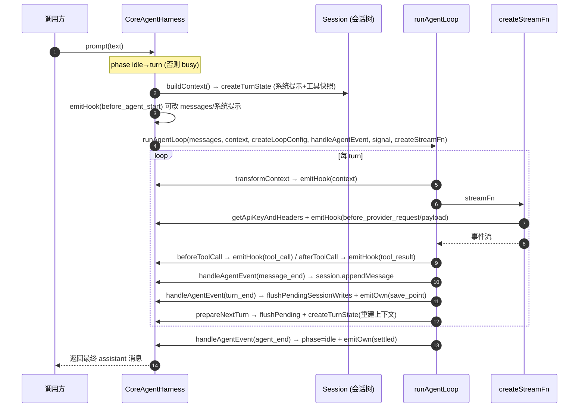
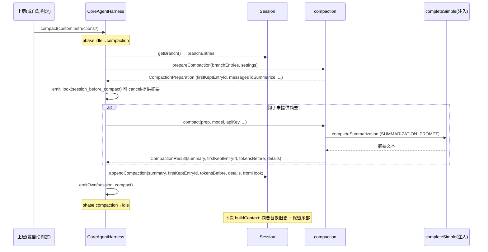

# 10 · 端到端流程与时序

## 10.1 L2 路径：AgentSession 驱动一次对话（OpenClaw 实际路径）

## 10.2 L3 路径：CoreAgentHarness.prompt

## 10.3 压缩触发流程（在 harness 中）

## 10.4 状态转换汇总

| 实体 | 状态 | 触发转换 |
|---|---|---|
| Agent run | idle → streaming → idle | prompt()/continue() → agent_end + 监听器结算 |
| Agent 内 | streaming ↔ toolExecuting | 助手消息含/不含 toolCall |
| Harness phase | idle/turn/compaction/branch_summary | prompt/compact/navigateTree |
| 会话树 leaf | 移动 | appendMessage（指向新条目）/ moveTo（分支） |
| 上下文 | 增长 → 压缩 | shouldCompact 触发 → appendCompaction |

## 10.5 关键不变量（流程级）

1. **事件成对**：每个 message_start 必有 message_end；每个 tool_execution_start 必有 tool_execution_end。
2. **turn 包裹**：turn_start...turn_end 包裹一次 assistant 响应 + 其工具批。
3. **agent_end 唯一终态**：每次 run 恰好一个 agent_end，携带本次 newMessages。
4. **toolResult 紧跟其 toolCall**：工具结果消息在对应 assistant 消息之后，且压缩切点不切散二者。
5. **abort 持久化**：中止时持久化 aborted 助手消息，事件序仍完整（补 turn_start/message/turn_end/agent_end）。
6. **会话写在 turn 边界 flush**：运行中的 model_change/thinking_change 等累积在 pendingSessionWrites，turn_end 时落盘（保证会话树时序正确）。
