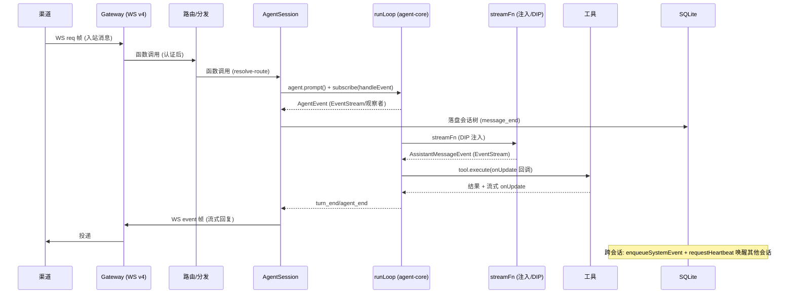

# OpenClaw 通信机制 与 容器/沙箱模型分析

> 两个问题的源码级解答：(1) 各模块/子系统/层级如何通信；(2) OpenClaw 进程与容器/沙箱的关系、哪些任务进容器、有哪些容器/沙箱。
> 证据以仓库根相对 `file:line` 标注（均直接核实）。

---

# 一、层间/模块间通信机制

OpenClaw **不是单一消息总线**，而是按「进程内 / 跨进程 / 跨会话」分场景使用 6 种机制。

## 1.1 进程内：注入回调 + 函数调用（主力）

绝大多数「上层驱动下层」是同进程 TypeScript 函数调用 + 依赖注入的回调：
- **循环引擎 ← 上层**：`AgentLoopConfig` 把回调注入 `runLoop`（`agent-loop.ts:258`）—— `convertToLlm`/`transformContext`/`beforeToolCall`/`afterToolCall`/`prepareNextTurn`/`shouldStopAfterTurn`/`getSteeringMessages`/`getFollowUpMessages`。层间通信 = 上层通过钩子参与下层循环。
- **依赖倒置（DIP）—— 最关键解耦点**：agent-core **不直接知道 LLM**，通过注入的 `AgentCoreRuntimeDeps.streamSimple`/`completeSimple`（`runtime-deps.ts:5`）。facade `src/agents/runtime/index.ts` 把 OpenClaw 的 LLM 实现注入。
- **工具执行回调**：`tool.execute(id, args, signal, onUpdate)` 的 `onUpdate` 把流式进度传回循环。

## 1.2 进程内：EventStream（异步事件流）

`class EventStream<T,R> implements AsyncIterable<T>`（`packages/llm-core/src/utils/event-stream.ts:9`），`push()`/`end()` + 异步迭代队列。用于**下层向上层流式推事件**：
- provider adapter → 循环：`AssistantMessageEvent`（start/text_delta/thinking_delta/toolcall_*/done/error）。
- 循环 → Agent：`AgentEvent`（agent_start/turn_start/message_*/tool_execution_*/turn_end/agent_end）。

## 1.3 进程内：观察者模式（subscribe）

`Agent.subscribe(listener)`（`agent.ts:278`）+ `CoreAgentHarness.on(type, handler)`（17 类钩子 `AgentHarnessEventResultMap`）。**AgentSession 靠 `agent.subscribe(handleAgentEvent)` 监听循环事件做持久化**（`agent-session.ts:427`）。

## 1.4 跨进程：Gateway Protocol v4（WebSocket + JSON-RPC）

外部客户端（CLI/UI/App/SDK/渠道）↔ Gateway 的唯一跨进程 wire 协议。三种帧（`gateway-protocol/src/schema/frames.ts`）：
- `type:"req"`（`:153`）请求 → `type:"res"`（`:164`）响应
- `type:"event"`（`:176`）服务端推送（订阅/流式）
- TypeBox schema 校验 + 惰性编译 + 版本协商（PROTOCOL_VERSION=4）。

## 1.5 跨会话：system-events + heartbeat 唤醒

不同 agent 会话之间**不直接调用**，而是「写留言 + 唤醒」：
- `enqueueSystemEvent(text, opts)`（`infra/system-events.ts:135`）→ 写入 SQLite 事件队列。
- `requestHeartbeat(...)`（`infra/heartbeat-wake.ts:318`）→ 唤醒目标会话处理。
- **典型**：子代理完成 → announce-dispatch 写事件 + 请求 heartbeat → 唤醒父会话带回结果；A2A `sessions_send` 同理。

## 1.6 共享状态：SQLite（间接通信）

子系统通过读写同一 SQLite 库间接通信（SQLite-only 策略）：
- 共享库 `state/openclaw.sqlite`：插件 KV、cron、节点注册、system-events 队列。
- 每 Agent 库：会话树、记忆索引、子代理登记、沙箱注册。

## 1.7 并发协调：SessionActorQueue

`SessionActorQueue`（KeyedAsyncQueue，按会话键）串行化同会话操作，避免并发写会话树 —— 通信的排队保证。

## 通信机制总表

| 机制 | 场景 | 方向 | 证据 |
|---|---|---|---|
| 注入回调 + 函数调用 | 上层驱动下层（主力） | 上→下 | `AgentLoopConfig` |
| 依赖注入（DIP） | 循环↔LLM 解耦 | 横向 | `runtime-deps.ts:5` |
| EventStream | 流式事件 | 下→上 | `event-stream.ts:9` |
| subscribe 观察者 | 生命周期事件 | 下→上 | `agent.ts:278` |
| Gateway Protocol v4 | 客户端↔Gateway | 跨进程双向 | `frames.ts:153` |
| system-events + heartbeat | 跨会话/子代理唤醒 | 跨会话 | `system-events.ts:135` |
| SQLite 共享状态 | 子系统间接 | 间接 | `src/infra/` |
| SessionActorQueue | 会话内并发串行 | 排队 | `session-actor-queue.ts` |

## 1.8 端到端通信时序（一条入站消息）

---

# 二、OpenClaw 进程 vs 容器/沙箱

## 2.0 先澄清：hermes 不是容器/沙箱组件

`extensions/migrate-hermes`（`openclaw.plugin.json:6` "Hermes Migration"）是把**旧产品 Hermes** 的配置/记忆/技能/凭证**迁移进 OpenClaw** 的插件（`docs/install/migrating-hermes.md`）。**Hermes 是被迁移的前身/来源产品，不是运行时的容器或沙箱**。故「hermes 中如何用容器」前提不成立 —— 它只是迁移来源。

## 2.1 OpenClaw 主进程默认**不在容器/沙箱里跑**

**关键区分**：
- **OpenClaw 进程本身**（Gateway + Agent 运行时 + 循环 + 记忆 + 插件）**直接跑在宿主机**（Node 进程）。
- Dockerfile 存在（`ENTRYPOINT ["tini","-s","--"]` + `CMD ["node","openclaw.mjs","gateway"]`，`Dockerfile:343-344`；`USER node`，`:327`）是**可选的部署打包** —— 把 Gateway 装进容器方便部署（Docker/Fly/Render/K8s），是「部署容器」**不是执行沙箱**。用户也可 `npx openclaw` 裸跑。
- 沙箱默认 **`mode: "off"`**（`sandbox/config.ts:255`）、默认后端 `"docker"`（`:256`）—— 即默认连工具执行都不沙箱化。

**结论**：OpenClaw = 宿主进程编排，按需把**部分工具执行**下放容器/沙箱，而非整个 OpenClaw 跑沙箱里。

## 2.2 沙箱隔离的是「agent 工具执行」，不是 OpenClaw 自身

当 `sandbox.mode` 开启（`non-main`=除主会话外都隔离 / `all`=全隔离）：

| 会在容器/沙箱里跑 ✅ | 始终在宿主跑（不进容器）❌ |
|---|---|
| `exec` / `process`（shell 命令） | Agent 循环本身（runLoop） |
| `read` / `write` / `edit`（文件操作，sandboxed 变体） | LLM provider 调用 |
| `apply_patch` | Gateway 控制平面 |
| 浏览器工具（独立容器，见 2.3） | 记忆索引 / 检索 |
| | 插件加载 / cron 调度 |
| | 系统提示装配 / 上下文压缩 |

**原则**：**「编排/思考/模型调用」永远在宿主，只有「执行副作用（shell/文件）」可下放容器**。

**机制**：宿主 OpenClaw 进程通过 `docker exec -i ... container /bin/sh -lc <cmd>` 把命令送进已创建的容器（`buildDockerExecArgs`，`bash-tools.shared.ts:72`；调用于 `bash-tools.exec-runtime.ts:745`）；文件操作经 Python mutation helper 通过 `docker exec` 在容器内执行。SSH 后端则通过 `ssh` 进程送到远程。

## 2.3 有哪些容器和沙箱（4 类）

| # | 容器/沙箱 | 用途 | 隔离机制 | 证据 |
|---|---|---|---|---|
| **1** | **Docker 沙箱容器** | agent 工具执行（exec/文件）隔离 | 真容器：`no-new-privileges`(始终)+`cap-drop ALL`+`--read-only`+`--network none`（默认全开） | `sandbox/docker.ts:470,467,441,447` |
| **2** | **Docker 沙箱化浏览器容器** | 浏览器工具（CDP/VNC/noVNC），独立镜像 | 独立容器 + 专用 bridge 网络 + CDP token 认证 + loopback 端口 + noVNC 单次 token | `sandbox/browser.ts` |
| **3** | **SSH「沙箱」** | 工具执行下放远程受信任主机 | **非容器** —— 远程目录隔离（登录用户权限，无 namespace/cgroup），FS 经远程 bridge | `sandbox/ssh.ts` |
| **4** | **OpenClaw 部署容器** | 把 Gateway 进程打包部署（可选，非沙箱） | 常规容器 `node:24-bookworm-slim`，`USER node`，tini init | `Dockerfile:343` |

后端可插拔：`registerSandboxBackend("docker")` / `("ssh")`（`backend.ts:108,114`），默认 docker，插件可注册自定义后端。

## 2.4 容器复用粒度（scope）

`resolveSandboxScopeKey(scope, sessionKey)`（`sandbox/shared.ts:32`）：
- **`session`**：每会话一个容器。
- **`agent`**：每 agent 一个（`agent:<id>`）。
- **`shared`**：全局共享一个（`"shared"`）。

Docker 后端用 config-hash 检测配置漂移决定复用/重建；idle(默认24h)/age(默认7d) 剪枝。

## 2.5 进程/容器关系图

```mermaid
graph TB
  subgraph Host["宿主机 (Node 进程 — OpenClaw 本体, 默认裸跑)"]
    GW["Gateway 控制平面"]
    RT["Agent 运行时 + 循环引擎"]
    MEM["记忆索引/检索"]
    PLUG["插件加载"]
    CRON["cron 调度"]
    LLMCALL["LLM provider 调用"]
    ORCH["工具编排 (决定调哪个工具)"]
  end
  subgraph SbxD["Docker 沙箱容器 (mode!=off 时, 按需)"]
    EXEC["exec/process shell 命令"]
    FILE["read/write/edit 文件操作"]
  end
  subgraph SbxB["Docker 浏览器容器 (browser.enabled)"]
    BROWSER["浏览器工具 CDP/VNC"]
  end
  subgraph SSH["SSH 远程主机 (backend=ssh)"]
    REMOTE["远程 shell/文件 (非容器)"]
  end
  subgraph Deploy["OpenClaw 部署容器 (可选打包)"]
    GWPKG["整个 Gateway 进程"]
  end

  ORCH -->|docker exec| EXEC
  ORCH -->|docker exec + Python helper| FILE
  ORCH -->|CDP over bridge net| BROWSER
  ORCH -->|ssh 进程| REMOTE
  LLMCALL -.宿主直连.-> EXT["外部 LLM API"]
  Deploy -.可选: 把 Host 整体装进容器部署.-> Host
  style Host fill:#1e3a5f
  style Deploy fill:#334155
```

---

# 三、一句话总结

1. **通信**：6 种机制分场景 —— 进程内以「注入回调(DIP) + EventStream + subscribe」为主，跨进程用 Gateway Protocol v4(WebSocket)，跨会话用 system-events+heartbeat 唤醒，子系统间用 SQLite 共享状态间接通信，SessionActorQueue 做并发串行。
2. **容器/沙箱**：**OpenClaw 主进程默认裸跑在宿主**；Dockerfile 只是可选部署打包（部署容器 ≠ 执行沙箱）；沙箱默认 `off`，开启后只隔离 **agent 工具执行**（exec/文件/浏览器），**编排/思考/模型调用永远在宿主**；共 4 类容器/沙箱（Docker 沙箱、Docker 浏览器、SSH 远程、部署容器）；后端可插拔。**hermes 是被迁移的前身产品，与容器/沙箱无关**。
