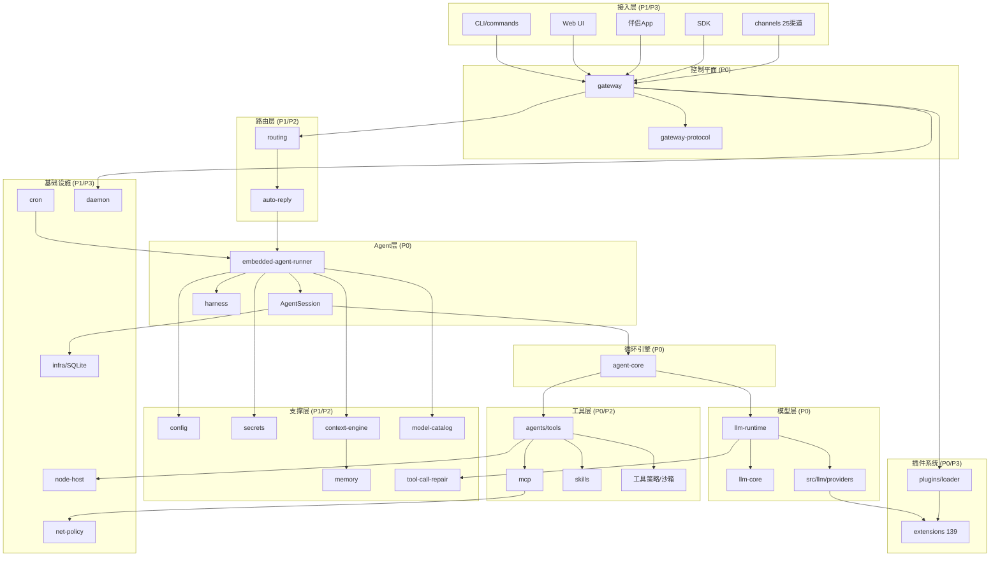

# OpenClaw 功能模块梳理（代码对应 · 重要等级 · 依赖关系）

> 数据来源：直接 LOC 统计 + 源码阅读。LOC 为非测试 `.ts` 行数。
> 重要等级：P0=系统骨架（缺则不可运行）、P1=核心能力、P2=重要支撑、P3=可选/扩展。

---

## 一、模块全景（按重要等级 + 规模排列）

| 等级 | 模块 | 代码位置 | LOC | 文件 | 职责一句话 |
|---|---|---|---:|---:|---|
| **P0** | Agent 运行时 | `src/agents/` | 278278 | 989 | 真正干活的层：循环编排、会话、工具、子代理、系统提示、重试/压缩 |
| **P0** | 核心循环引擎 | `packages/agent-core/` | 8129 | 26 | provider-agnostic ReAct 循环 + 会话树 + 压缩（详见 ccdocs/agent-core） |
| **P0** | Gateway 控制平面 | `src/gateway/` | 114587 | 393 | WebSocket 控制平面：连接/认证/RPC 分发/会话方法/热重载 |
| **P0** | 网关协议 | `packages/gateway-protocol/` | 8428 | — | Protocol v4 wire 契约（TypeBox schema + 惰性编译） |
| **P0** | 插件加载器 | `src/plugins/` | 93662 | 364 | manifest-first 插件发现/激活规划/动态加载/注册表 |
| **P0** | LLM 契约 + 分发 | `packages/llm-core/` + `packages/llm-runtime/` + `src/llm/` | 1238+184+13594 | — | 消息/模型/事件流契约 + api-id 分发 + 内置 provider adapter |
| **P1** | 入站分发/自动回复 | `src/auto-reply/` | 71192 | 343 | 入站消息→门控→去抖→分发→回复投递 |
| **P1** | 渠道抽象 | `src/channels/` | 38334 | 224 | transport-only 渠道适配契约 + 可移植动作词表 + 入站事件归一化 |
| **P1** | 配置系统 | `src/config/` | 55728 | 232 | 配置 schema/校验/类型/默认值（canonical-only） |
| **P1** | 基础设施 | `src/infra/` | 95040 | 419 | SQLite 状态库、system-events、heartbeat-wake、状态迁移、KV |
| **P1** | CLI | `src/cli/` + `src/commands/` | 60493+87401 | 271+388 | Commander 入口 + 各命令（onboard/doctor/configure/gateway/mcp） |
| **P1** | 记忆系统 | `packages/memory-host-sdk/` + `extensions/active-memory` 等 | 8574 | — | embedding/FTS/sqlite-vec 引擎 + 记忆插件槽 |
| **P2** | ACP（外部 agent 后端） | `src/acp/` + `packages/acp-core/` | 11747+1434 | 55 | Agent Client Protocol：驱动 Codex 等外部后端 |
| **P2** | 路由 | `src/routing/` | 1784 | 10 | 入站→agentId/sessionKey 解析、绑定规则 |
| **P2** | 上下文引擎 | `src/context-engine/` | 2060 | 9 | 可插拔上下文管理引擎 + 注册表 + quarantine 容错 |
| **P2** | 调度（cron） | `src/cron/` | 19183 | 106 | SQLite 定时唤醒（避开整点） |
| **P2** | 技能系统 | `src/skills/` | 15049 | 68 | SKILL.md 加载/广告/分发 |
| **P2** | MCP | `src/mcp/` + bundle-mcp(in agents) | 1474 | 8 | MCP 双向（server + client/runtime） |
| **P2** | 凭证/密钥 | `src/secrets/` | 14142 | 69 | provider/渠道凭证管理 |
| **P2** | 模型目录 | `src/model-catalog/` + `packages/model-catalog-core/` | 800+1525 | — | 模型目录合并权威（config>manifest>cache>index） |
| **P2** | 工具调用修复 | `packages/tool-call-repair/` | 2320 | — | 修复文本泄漏的工具调用 |
| **P2** | onboard 向导 | `src/wizard/` | 7142 | 19 | 终端优先 setup 向导（Clack） |
| **P3** | 守护进程 | `src/daemon/` | 9440 | 44 | launchd/systemd/schtasks 服务管理 |
| **P3** | Node Host | `src/node-host/` | 4080 | 10 | 跨设备命令执行 |
| **P3** | SDK | `packages/sdk/` + `packages/gateway-client/` | 1906+2068 | — | 公开编程式客户端 |
| **P3** | 终端渲染 | `packages/terminal-core/` | 1688 | — | ANSI/表格/进度/prompt 原语 |
| **P3** | 媒体/语音 | `packages/media-*` + `packages/speech-core/` + `src/media-*` | — | — | 媒体生成/理解/语音契约 |
| **P3** | 网络策略 | `packages/net-policy/` | 596 | — | SSRF 防护 |
| **P3** | 启动 | `src/bootstrap/` + `src/entry.ts` + `src/index.ts` | 132+ | — | 进程入口/启动序列 |
| **P3** | 扩展（插件） | `extensions/` (139) | 179883 | — | 70 provider + 25 channel + 2 memory + 38 其他 |
| **P3** | Web UI | `ui/` | — | — | Lit 3 控制台 + Canvas |
| **P3** | 伴侣 App | `apps/` | — | — | macOS/iOS/Android/Windows 原生客户端 |

---

## 二、P0 骨架模块详解（代码对应）

### 2.1 `src/agents/`（278K LOC，最大）—— Agent 运行时
最重的模块。关键子结构：
- `embedded-agent-runner/`：运行编排。`run.ts`(4191行,跨attempt重试/压缩/auth轮换状态机)、`run/attempt.ts`(5804行,单次尝试)、`compact*.ts`、`context-engine-maintenance.ts`、`run/failover-policy.ts`。
- `runtime/index.ts`：`class Agent extends CoreAgent`（注入 OpenClaw LLM 运行时）—— **agent-core 的注入点 facade**。
- `sessions/agent-session.ts`：`AgentSession`（持久化/写锁/压缩/工具钩子，持有 CoreAgent 实例）。
- `harness/`：可插拔 harness 契约（`builtin-openclaw`/`selection`/`context-engine-lifecycle`）。
- `tools/`：70 个产品工具（`sessions-spawn-tool`/`cron-tool`/`message-tool`/...）。
- `acp-spawn.ts`/`subagent-spawn.ts`/`subagent-registry.ts`：子代理派生与登记。
- `system-prompt.ts`：系统提示装配（缓存稳定前缀 + 动态后缀）。

### 2.2 `src/gateway/`（114K LOC）—— 控制平面
- `server/`：WS 连接/握手/分发（`ws-connection.ts`）。
- `methods/`：方法注册表（`registry.ts`，O(1) byName）+ descriptors。
- `server-methods/`：handler（`chat.ts`/`agent.ts`/`channels.ts`/`artifacts.ts`）。
- `auth*.ts`/`chat-abort.ts`/`session-compaction-checkpoints.ts`/`config-reload*.ts`/`node-registry.ts`。

### 2.3 `src/plugins/`（93K LOC）—— 插件加载器
- `manifest.ts`(`PluginManifest`)、`loader.ts`(`loadOpenClawPlugins`)、`activation-planner.ts`(零运行时导入激活规划)、`config-activation-shared.ts`(激活决策)、`registry.ts`(`OpenClawPluginApi` ~60 register)、`slots.ts`(memory/context-engine 单槽)。

### 2.4 `packages/agent-core/`（8K LOC）—— 循环引擎
`agent-loop.ts`(runLoop)、`agent.ts`(Agent)、`harness/agent-harness.ts`(CoreAgentHarness)、会话树、压缩。详见 `ccdocs/agent-core/`。

### 2.5 LLM 层
- `packages/llm-core/`：`Message`/`Model`/`Context`/`EventStream`/`StreamFn` 契约。
- `packages/llm-runtime/`：`stream.ts` 按 `model.api` 分发到 adapter。
- `src/llm/`：8 内置 API 家族 adapter（`providers/anthropic.ts` 等）+ `register-builtins.ts`。

---

## 三、模块依赖关系（分层 + 调用方向）

### 3.1 依赖层次（自顶向下，上层依赖下层）

```
[接入层]   CLI / Web UI / 伴侣App / SDK / 23+渠道
              ↓ 调用
[控制平面] Gateway(server/methods) ← gateway-protocol(契约)
              ↓ 路由
[路由层]   routing(resolve-route) → auto-reply(dispatch)
              ↓ 驱动
[Agent层]  embedded-agent-runner → AgentSession → harness选择
              ↓ 包装
[循环引擎] agent-core(Agent/runLoop/CoreAgentHarness)
              ↓ 注入                    ↓ 调用
[模型层]   llm-runtime → llm-core    [工具层] tools/MCP/skills
              ↓ adapter                   ↓ 策略
[Provider] src/llm/providers + extensions/<provider>  权限/沙箱管线
              ↓ 消费                    
[支撑层]   config / secrets / context-engine / memory / model-catalog / tool-call-repair
              ↓ 持久化
[基础设施] infra(SQLite/Kysely) / cron / node-host / net-policy / daemon
              ↓ 扩展
[插件系统] plugins(loader) → extensions/* (manifest-first)
```

### 3.2 关键依赖边（实测）

| 模块 | 依赖（向下/被调用） | 被依赖（向上调用方） |
|---|---|---|
| `agent-core` | llm-core, typebox | `src/agents/runtime` facade（注入）→ AgentSession → embedded-agent-runner；~25 扩展 import type |
| `embedded-agent-runner` | AgentSession, harness, context-engine, model-catalog, agent-core, plugins | auto-reply/dispatch, cron, gateway/chat |
| `gateway` | gateway-protocol, plugins, channels, routing, infra, secrets | CLI(gateway run), daemon, 所有客户端 |
| `plugins` | manifest, config, agent-core(类型), channels(契约) | gateway, embedded-runner, 几乎所有需要扩展能力处 |
| `auto-reply` | routing, channels, embedded-runner | gateway(入站), channels(inbound event) |
| `channels` | plugin-sdk/channel-*, gateway-protocol | gateway, auto-reply；extensions/<channel> 实现 |
| `context-engine` | agent-core(delegate压缩), memory | embedded-runner |
| `memory(host-sdk)` | sqlite-vec, node-llama-cpp | memory 插件（extensions），context-engine |
| `llm-runtime` | llm-core | agent-core(注入的streamSimple), src/plugin-sdk/llm |
| `config` | zod/typebox | 几乎所有模块（读配置） |
| `infra` | kysely, node:sqlite | gateway, agents, cron, plugins（状态持久化） |

### 3.3 核心数据流的模块串联

```
渠道消息 → channels(inbound-event) → auto-reply(门控/去抖/dispatch)
  → routing(resolve-route: agentId+sessionKey)
  → embedded-agent-runner(run.ts: 模型/auth/harness)
  → AgentSession(sessions/) → agent-core(runLoop)
    → llm-runtime → src/llm/providers/extensions(真实LLM)
    → tools/ + MCP + skills(策略管线)
    → context-engine + memory(上下文/召回)
    → infra(SQLite 持久化会话树)
  → 回复 → channels(turn/kernel: 投递) → 渠道
```

---

## 四、重要等级判定依据

- **P0（不可运行则系统死）**：agent-core（循环）、agents（运行时）、gateway（控制平面）、gateway-protocol（通信契约）、plugins（能力加载）、llm（模型调用）。缺任一，OpenClaw 无法启动或无法处理一条消息。
- **P1（核心产品能力）**：auto-reply（消息处理主链）、channels（接入）、config（配置）、infra（持久化）、CLI（用户入口）、memory（长期记忆）。缺则核心场景断裂。
- **P2（重要支撑）**：ACP/routing/context-engine/cron/skills/MCP/secrets/model-catalog/tool-call-repair/wizard。增强能力或特定场景必需。
- **P3（可选/扩展/外围）**：daemon/node-host/SDK/terminal-core/媒体/net-policy/启动入口/extensions/UI/apps。可裁剪或按需启用。

---

## 五、模块依赖图（Mermaid，供文档内查看）



> 配套交付：分层完整架构 **SVG 图**见 [architecture.svg](architecture.svg)（浏览器直接打开）。
