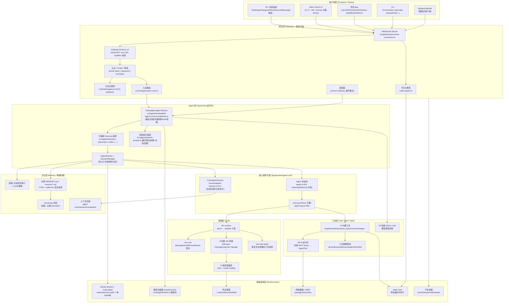

# 第二部分：整体架构分析

## 2.1 完整分层架构图（Mermaid）



## 2.2 各层职责

### Frontend / Clients（客户端层）
不是单一前端，而是**多形态接入面**：
- **消息渠道**：每个渠道是一个 transport-only 适配器（`src/channels/**` + `extensions/<channel>`），负责把原生消息事件归一化、把可移植呈现/动作渲染为原生形态。**不拥有产品命令树或提供商策略**（`src/channels/AGENTS.md`）。
- **Web Control UI**：Lit 3 + Vite 8 的控制台（`ui/`），含会话管理、Agent 活动审视、渠道配置、日志、cron。Canvas 是受沙箱 iframe 渲染面（`ui/src/ui/canvas-url.ts`，白名单 `/__openclaw__/canvas` 等）。
- **伴侣 App**：iOS/Android 是「节点客户端」（不托管 Gateway）；macOS/Windows 可**托管** Gateway；共享 Swift `OpenClawKit`（`apps/shared`）。
- **CLI / SDK**：终端入口与编程式入口。

### Gateway（网关层 = 控制平面）
**「Gateway is just the control plane — the product is the assistant.」**（README）。它拥有：连接生命周期、认证与 scope、RPC 分发、会话方法、订阅/在线状态、渠道健康、配置热重载、节点配对/注册、限流、调度（cron）。它**委派**：消息收发给渠道插件、Agent 执行给运行时、持久化给会话存储、密钥给 secrets。

协议为 **Gateway Protocol v4**（`packages/gateway-protocol/src/version.ts:2`），WebSocket 帧 + TypeBox 校验、惰性编译（`lazyCompile`）。

### Agent 层（OpenClaw 运行时）
**Embedded Agent Runner** 是真正干活的层（`src/agents/embedded-agent-runner/`）：解析模型、构建 auth 计划与失败转移、装配工具、构建系统提示、驱动上下文引擎、管理重试/压缩/auth 轮换。它通过**可插拔 Harness 契约**（`src/agents/harness/`）选择内置 `openclaw` harness 或外部 harness（如 Codex）。

### 核心循环引擎（`@openclaw/agent-core`）
provider-agnostic 的纯循环原语：`runLoop`（ReAct 引擎）+ `Agent`（状态机 + 队列）+ `CoreAgentHarness`（会话/压缩/分支/钩子）。这一层不依赖 OpenClaw，可独立复用。

### Tool 层
70 内置工具 + 外部 MCP server 物化的工具 + 52 技能（SKILL.md，模型按需 read）。所有工具经**策略管线**（profile/allow/deny/sandbox/subagent/inherited）过滤。

### Memory 层
**单插件槽**：同时只有一个 `kind: "memory"` 插件激活（默认 `memory-core`）。三级记忆：短期（会话转写索引）/ 工作（dreaming 临时态）/ 长期（`MEMORY.md` + FTS5+sqlite-vec 混合检索）。上下文压缩独立于记忆插件，属 agent-core。

### Model 层
`llm-core`（契约）/ `llm-runtime`（按 `model.api` 分发到 adapter）/ 8 内置 API 家族 / 70 提供商插件（仅 ~8 个自带 adapter，其余复用 OpenAI-completions/Anthropic-messages + `compat` 开关）/ tool-call-repair（修复文本泄漏的工具调用）。

### Infrastructure 层
SQLite（Kysely 运行时 + `node:sqlite` 用于记忆索引）、manifest-first 插件加载器、凭证管理、网络/SSRF 策略、Node Host（跨设备执行）、守护进程（launchd/systemd/schtasks）。

## 2.3 层间调用关系（控制流）

```
入站消息 → Gateway(WS/auth) → 路由(resolve-route) → Embedded Runner
  → 选 Harness → 创建/加载 AgentSession → 装配工具+系统提示
  → AgentSession.prompt() → CoreAgent.prompt() → runLoop
    ↺ 每 turn: streamAssistantResponse → convertToLlm → streamFn(llm-runtime → provider adapter)
            → executeToolCalls(beforeToolCall策略 → tool.execute → afterToolCall)
            → prepareNextTurn / shouldStopAfterTurn / getSteering / getFollowUp
  → 回复经 onBlockReply 流式投递 → 渠道 dispatcher.deliver → 原生渠道
```

## 2.4 数据流向

- **转写数据**：每条消息以 `SessionTreeEntry`（append-only JSONL，含 `parentId`）写入会话树（`harness/types.ts:443`）；`message_end` 事件触发 `session.appendMessage`（`agent-harness.ts:582`）。
- **上下文数据**：会话树 → `session.buildContext()` → 上下文引擎 `assemble`（在 token 预算内）→ `convertToLlm` → provider 的 `Context{systemPrompt, messages, tools}`。
- **记忆数据**：会话转写被记忆插件索引进 SQLite（FTS5 + 向量）；recall 频次高的短期片段被 promotion 到 `MEMORY.md`。
- **压缩数据**：超过 `contextWindow - reserveTokens(16384)` 时，旧历史被结构化摘要替换为一条 `compactionEntry`，保留最近 `keepRecentTokens(20000)`。

## 2.5 控制流的三个关键「面」

1. **控制平面（Gateway）**：进程稳定的元数据（安装、清单、目录、路由），变更需重启或显式 reload。
2. **数据平面（Agent 循环）**：每 turn 携带「已备妥事实」（provider id、model ref、channel id、capability family）向前传递，避免热路径重复发现。
3. **设备平面（Node Host）**：单 Gateway 连接多设备节点，Agent 集中运行，节点只是远程执行器（非 Agent 对等网格）。
