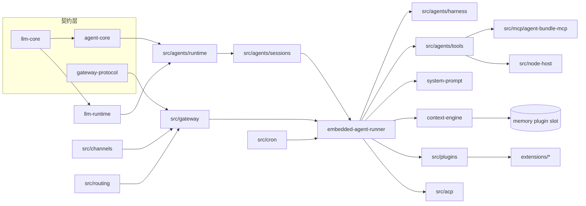

# 第三部分：代码目录逆向分析

## 3.1 顶层目录树

```
openclaw/
├── src/                      # 核心 TS (≈36.5 万行，202 子目录)
├── packages/                 # 21 个内部包 (≈4.6 万行) — 可独立复用的契约/引擎
├── extensions/               # 139 个插件 (≈18 万行) — 70 提供商 + 25 渠道 + 其余能力
├── skills/                   # 52 个 SKILL.md 技能包
├── ui/                       # Web Control UI (Lit 3 + Vite)
├── apps/                     # 伴侣 App: android/ios/macos/macos-mlx-tts/swabble/shared
├── docs/                     # 源文档 (发布到 docs.openclaw.ai)
├── qa/                       # YAML 场景测试
├── scripts/                  # 大量工程脚本 (committer/pr/crabbox...)
├── config/ deploy/ security/ # 配置/部署/安全
├── openclaw.mjs              # bin 入口
├── package.json              # version 2026.6.9, pnpm, Node>=22.19
└── AGENTS.md (=CLAUDE.md)    # 仓库硬策略
```

## 3.2 `packages/` 逐包分析（契约与引擎层）

| 包 | 作用 | 核心导出 |
|---|---|---|
| **agent-core** | provider-agnostic ReAct 循环 + Agent 状态机 + Harness | `runLoop`(`agent-loop.ts:258`)、`Agent`(`agent.ts:204`)、`CoreAgentHarness`(`harness/agent-harness.ts:217`) |
| **llm-core** | LLM 基础契约（纯类型 + EventStream） | `Message`/`AssistantMessage`/`Model`/`Context`/`Tool`/`StreamFunction`/`AssistantMessageEvent`(`src/types.ts`)、`EventStream`(`utils/event-stream.ts:9`) |
| **llm-runtime** | api-id → adapter 分发引擎 | `registerApiProvider`/`getApiProvider`(`api-registry.ts`)、`stream`/`complete`(`stream.ts`) |
| **model-catalog-core** | 模型目录契约 | `ModelCatalog`/`ModelCatalogModel`(`model-catalog-types.ts`) |
| **tool-call-repair** | 修复文本泄漏的工具调用 | `normalizePlainTextToolCallStreamEvents`(`stream-normalizer.ts:1055`)、`grammar.ts`(bracketed/XML/Harmony) |
| **gateway-protocol** | 网关 wire 协议 v4 | `PROTOCOL_VERSION`(`version.ts:2`)、帧 schema(`schema/frames.ts`) |
| **gateway-client** | 网关客户端 | `GatewayClient`(`client.ts`)、device-auth |
| **sdk** | 公开编程式 SDK `@openclaw/sdk` | `OpenClaw` 客户端 + agents/sessions/runs/tasks 命名空间(`client.ts:330`) |
| **acp-core** | Agent Client Protocol 契约 | 会话/lineage/interaction-mode(`src/index.ts`) |
| **memory-host-sdk** | 记忆主机引擎（embedding/FTS/sqlite-vec/批处理） | `embeddings*.ts`、`memory-schema.ts`、`sqlite-vec.ts` |
| **terminal-core** | 终端渲染原语 | ansi/theme/table/progress/prompt-select、`restoreTerminalState` |
| **media-core / media-generation-core / media-understanding-common / speech-core** | 媒体/语音契约 | — |
| **markdown-core / web-content-core / normalization-core / net-policy / plugin-package-contract / plugin-sdk** | markdown/网页抓取/归一化/网络策略/插件契约 | — |

**依赖方向**：`llm-core`（无依赖）← `llm-runtime`/`agent-core` ← `src/agents/runtime`（OpenClaw 注入运行时）。`agent-core` 不反向依赖 `src/`，可被外部项目独立使用。

## 3.3 `src/` 关键目录逐一分析

### `src/agents/` — Agent 运行时的心脏（最大、最重）
- **作用**：把 agent-core 的纯循环包装成 OpenClaw 的生产运行时。
- **核心子结构**：
  - `embedded-agent-runner/` — 运行编排。`run.ts`(4191 行，`runEmbeddedAgent`/跨 attempt 重试压缩状态机)、`run/attempt.ts`(5804 行，单次尝试)、`compact*.ts`、`context-engine-maintenance.ts`、`run/failover-policy.ts` 等。
  - `runtime/index.ts` — `class Agent extends CoreAgent`，注入 plugin-SDK LLM 运行时。
  - `sessions/agent-session.ts` — `AgentSession`：写锁/持久化/压缩/`beforeToolCall`/`afterToolCall` 钩子。
  - `harness/` — **可插拔 harness 契约**（`types.ts` 的 `AgentHarness` 接口、`builtin-openclaw.ts`、`selection.ts`、`context-engine-lifecycle.ts`）。
  - `tools/` — 70 个产品工具（`sessions-spawn-tool.ts`、`cron-tool.ts`、`message-tool.ts`…）。
  - `acp-spawn.ts` / `subagent-spawn.ts` / `subagent-registry.ts` — 子代理派生与登记（SQLite）。
  - `system-prompt.ts` — 系统提示装配（`buildAgentSystemPrompt:682`）。
- **核心设计模式**：模板方法（harness 契约）、策略（工具策略管线）、状态机（run 循环 + attempt）、注册表（subagent registry）。

### `src/gateway/` — 控制平面
- `server/`（WS 连接/握手/分发）、`methods/`（方法注册表 + descriptors）、`server-methods/`（chat/agent/channels/artifacts 等 handler）、`auth*.ts`、`chat-abort.ts`（运行取消）、`session-compaction-checkpoints.ts`（checkpoint）、`config-reload*.ts`（热重载）、`node-registry.ts`。
- **设计模式**：注册表（method registry, O(1) byName）、命令（RPC handler）、观察者（事件订阅）。

### `src/context-engine/` — 可插拔上下文引擎
- `types.ts:298`（`ContextEngine` 接口：`ingest`/`assemble`/`compact`/`maintain`）、`registry.ts`（注册 + quarantine 容错 + session-key 兼容代理）、`init.ts`（始终注册 legacy 作为安全兜底）、`delegate.ts`（第三方引擎复用内置压缩）。
- **设计模式**：策略 + 注册表 + 装饰器（兼容代理）+ 熔断（quarantine）。

### `src/channels/` — 渠道抽象（transport-only）
- `plugins/types.plugin.ts:66`（`ChannelPlugin` 组合契约）、`plugins/message-action-names.ts`（~60 可移植动作词表）、`registry.ts`（轻量 facade，不导入渠道运行时）、`inbound-event/`（入站事件归一化与分类）、`turn/kernel.ts`（回复装配投递）。
- **设计模式**：适配器（每渠道）、组合（多个可选 adapter 拼装）、命令（动作词表）。

### `src/plugins/` — manifest-first 插件加载器
- `manifest.ts:297`（`PluginManifest`）、`loader.ts:1821`（`loadOpenClawPlugins`）、`activation-planner.ts:74`（仅凭清单做懒激活规划，零运行时导入）、`config-activation-shared.ts:128`（激活决策）、`registry.ts`（`OpenClawPluginApi` ~60 register 方法）、`slots.ts`（memory/context-engine 单槽）、`bundle-manifest.ts`（codex/claude/cursor 外部 bundle）。

### `src/mcp/` — MCP 双向
- `channel-server.ts`（OpenClaw 作 MCP server 暴露渠道会话）、`plugin-tools-serve.ts`（暴露插件工具）、`tools-stdio-server.ts`。客户端侧在 `src/agents/agent-bundle-mcp-*.ts`。

### `src/acp/` — Agent Client Protocol（驱动外部 Agent 后端）
- `control-plane/manager.core.ts:65`（`AcpSessionManager`）、`session-actor-queue.ts`（每会话串行化）、`manager.turn-runner.ts`（turn 执行 + 后端失败转移）、`translator.ts`（harness 事件 ↔ ACP wire）。

### `src/routing/` 与 `src/auto-reply/` — 入站路由与分发
- `resolve-route.ts:611`（入站 → `{agentId, sessionKey,...}`）、`session-key.ts`（会话键构造）、`bindings.ts`（绑定规则）、`auto-reply/inbound-debounce.ts`（去抖）、`auto-reply/dispatch.ts:501`（分发）。

### 其他重要目录
- `src/llm/` — 内置 provider adapter（`providers/anthropic.ts` 等）+ `register-builtins.ts`。
- `src/model-catalog/` — 模型目录合并权威（`authority.ts`：config>manifest>cache>provider-index）。
- `src/skills/` — 技能加载（`loading/local-loader.ts`、`frontmatter.ts`）与运行时分发（`runtime/tool-dispatch.ts`）。
- `src/memory/` — 仅 `root-memory-files.ts`（其余在记忆插件与 host-sdk）。
- `src/cron/` — 调度（`service.ts`、`service/timer.ts`、SQLite 存储）。
- `src/node-host/` — 跨设备命令执行（`runner.ts`、`invoke.ts`、exec 审批策略）。
- `src/cli/` — Commander CLI（`run-main.ts:610`、`command-catalog.ts`、help fast-path）。
- `src/commands/` — 各命令实现（`onboard.ts`、`doctor.ts`、`configure.ts`…）。
- `src/wizard/` — onboard 向导（Clack prompter，`setup.ts`）。
- `src/config/` — 配置类型（`types.mcp.ts`、`types.skills.ts`…）与校验。
- `src/secrets/` / `src/infra/` — 凭证与基础设施（system-events、heartbeat-wake、state-migrations）。
- `src/bootstrap/` `src/daemon/` `src/entry.ts` `src/index.ts` — 启动与守护进程。

## 3.4 模块依赖图（高层）



**关键架构约束（来自 AGENTS.md）**：
- 插件只能经 `openclaw/plugin-sdk/*`、manifest 元数据、注入的运行时 helper、文档化 barrel 跨入核心；不得 deep import 核心 `src/**` 或其他插件内部。
- 核心运行时只消费当前 canonical 配置/数据形态；遗留形态只在 doctor/migration 归一化。
- 存储默认 SQLite；不为运行时状态新增 JSON/JSONL sidecar。
- 无静态+动态同模块 import；用 `*.runtime.ts` 懒边界；保持 `pnpm check:import-cycles` 绿。
