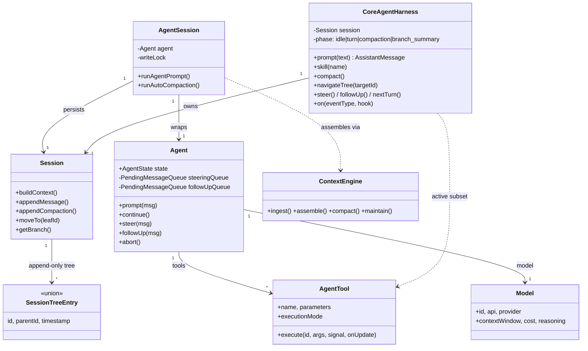
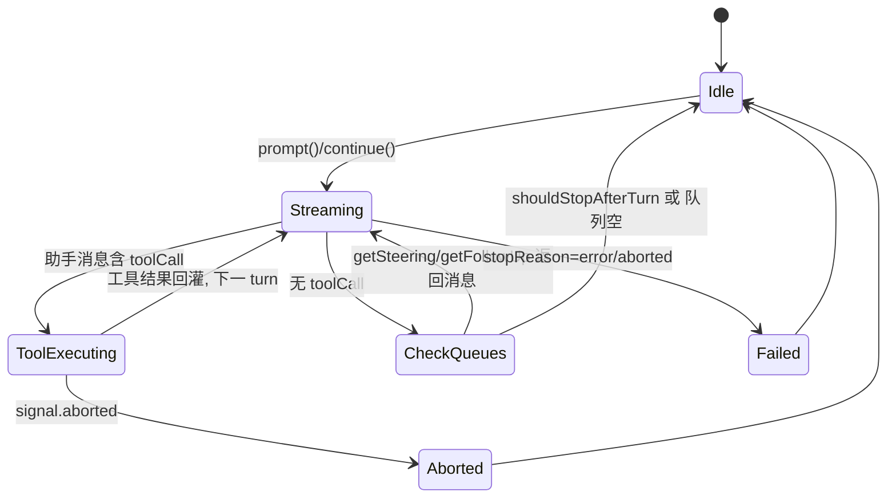

# 第四部分：核心对象模型分析

## 4.1 核心对象清单

| 对象 | 定义位置 | 角色 |
|---|---|---|
| **Agent**（core） | `packages/agent-core/src/agent.ts:204` | 状态机：持有转写/工具/模型 + steering/followUp 队列 |
| **CoreAgentHarness** | `packages/agent-core/src/harness/agent-harness.ts:217` | 会话/压缩/分支/钩子的有状态外壳 |
| **AgentSession**（OpenClaw） | `src/agents/sessions/agent-session.ts` | 持久化 + 写锁 + 压缩 + OpenClaw 钩子 |
| **Session（树）** | `harness/types.ts` + `session/session.ts` | append-only 树形会话存储 |
| **SessionTreeEntry** | `harness/types.ts:443` | 持久化条目联合（消息/压缩/分支摘要/标签/leaf…） |
| **AgentMessage** | `agent-core/src/types.ts:393` | LLM 消息 ∪ 自定义消息（bash/custom/branchSummary/compactionSummary） |
| **Message / AssistantMessage / ToolResultMessage** | `llm-core/src/types.ts:317/287/306` | LLM wire 消息 |
| **AgentTool** | `agent-core/src/types.ts:459` | 工具定义（schema + execute + executionMode） |
| **AgentEvent** | `agent-core/src/types.ts:504` | 循环生命周期事件 |
| **Model** | `llm-core/src/types.ts:582` | 模型元数据（window/cost/reasoning/compat） |
| **Skill / PromptTemplate** | `harness/types.ts:48/64` | 技能/提示模板（harness resources） |
| **ContextEngine** | `src/context-engine/types.ts:298` | 可插拔上下文管理引擎 |
| **PluginManifest** | `src/plugins/manifest.ts:297` | 插件清单 |
| **SubagentRun** | `src/agents/subagent-registry.ts` | 子代理运行登记 |
| **CronJob** | `src/cron/service/state.ts` | 定时任务 |
| **ResolvedAgentRoute** | `src/routing/resolve-route.ts:47` | 入站消息 → Agent 路由结果 |

注意：OpenClaw **没有显式的 `Task` / `Plan` / `Workflow` 一级对象**。「计划」内化在 LLM 的 ReAct 推理与系统提示中；「任务」体现为 SubagentRun / CronJob / 会话；「工作流」由 Agent 自身决策驱动，不存在编排引擎对象（与 LangGraph 的 Graph 对象形成对比）。这是其「无重编排层」定位的直接体现（`VISION.md:122-124`）。

## 4.2 对象关系图（ER / 类图）

## 4.3 关键对象的职责、生命周期、状态变化

### Agent（agent-core 状态机）
- **职责**：拥有当前转写、发射生命周期事件、执行工具、暴露 steering/follow-up 队列。
- **生命周期**：构造（`createMutableAgentState`）→ `prompt()` 启动 `runWithLifecycle`（建 `AbortController`、`isStreaming=true`）→ 循环结束 `finishRun()`（清 pending、resolve）。一次只允许一个 active run（`prompt` 时若有 activeRun 抛错）。
- **状态字段**（`AgentState`，`types.ts:401`）：`isStreaming`、`streamingMessage`、`pendingToolCalls: ReadonlySet<string>`、`errorMessage`。状态在 `processEvents`（`agent.ts:568`）中按事件归约：`message_start/update` 设流式消息、`message_end` push 转写、`tool_execution_start/end` 增删 pendingToolCalls。

### Session（会话树）—— 本项目最精妙的对象
- **职责**：append-only 的**树形**转写存储。条目类型见 `SessionTreeEntry`（`harness/types.ts:443`）：`message`、`thinking_level_change`、`model_change`、`compaction`、`branch_summary`、`custom`、`custom_message`、`label`、`session_info`、`leaf`。
- **关键设计**：
  - 每条目有 `parentId`，构成树；`leaf` 条目标记当前可见叶子；`appendMode:"side"` 支持旁路游标。
  - **压缩**不删历史，而是追加一条 `compaction` 条目（含 `summary`/`firstKeptEntryId`/`tokensBefore`），`buildContext` 时用摘要替换被压缩区间。
  - **分支导航**（`navigateTree`）：切换叶子到任意历史条目，可对被放弃分支生成 `branch_summary`。这让会话天然支持「编辑历史消息后重跑」「探索多分支」。
- **生命周期**：条目只增不改（标签/leaf 用 append 覆盖语义），保证 prompt cache 字节稳定与可审计。

### CoreAgentHarness 的 phase 状态机
`phase: "idle" | "turn" | "compaction" | "branch_summary" | "retry"`（`harness/types.ts:491`）。`prompt/skill/promptFromTemplate` 要求 `idle`，否则抛 `busy`；`compact()`/`navigateTree()` 同样要求 `idle`。这把「运行/压缩/分支」串行化，杜绝并发写会话树。

### AgentMessage 的角色扩展机制
`AgentMessage = Message ∪ CustomAgentMessages[keyof ...]`（`types.ts:393`）。通过**声明合并**（declaration merging）让应用扩展自定义消息类型。内置自定义消息：`BashExecutionMessage`（shell 转写，可 `excludeFromContext`）、`CustomMessage`、`BranchSummaryMessage`、`CompactionSummaryMessage`。`convertToLlm` 负责把这些过滤/转换为 LLM 可理解的消息。

## 4.4 对象状态变化图（Agent 一次运行）

