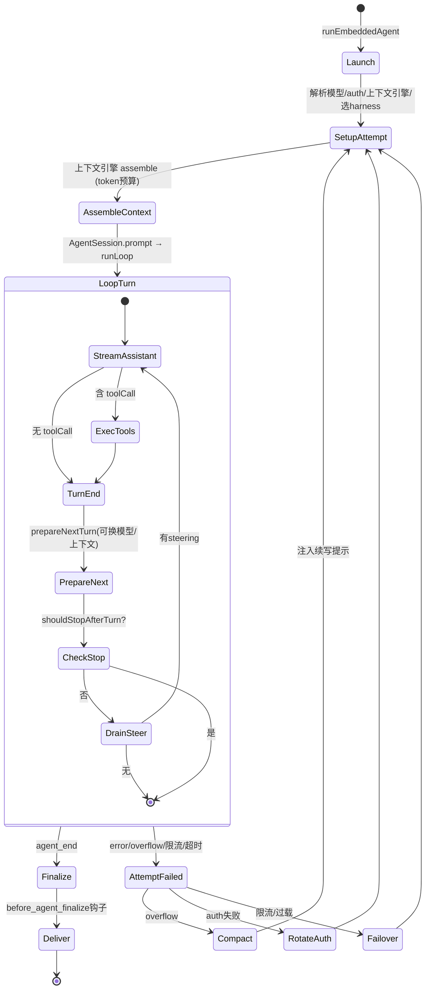
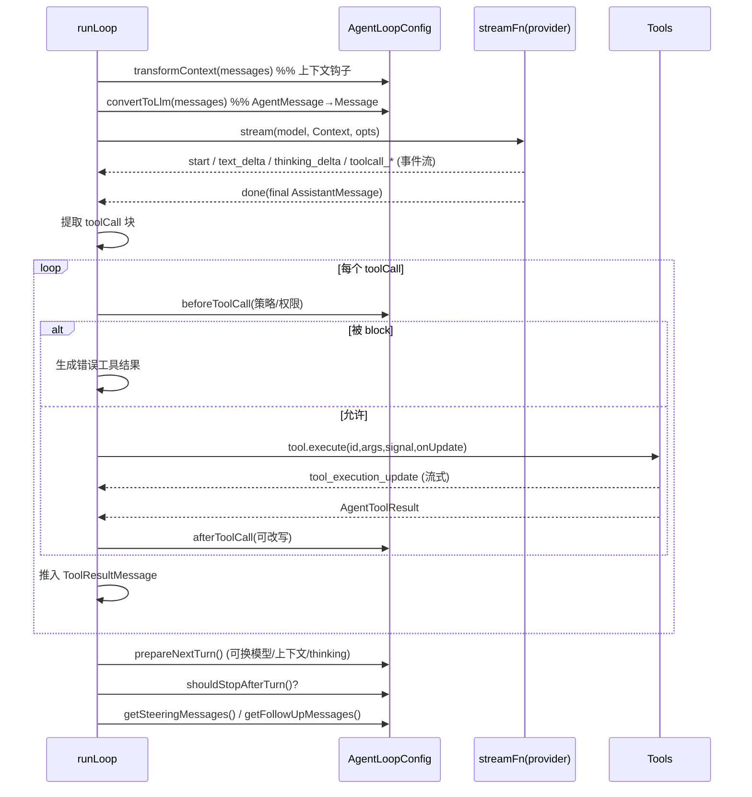

# 第五部分：Agent 运行机制分析

## 5.1 Agent 如何启动

入站消息经 Gateway → 路由 → `runEmbeddedAgent`（`src/agents/embedded-agent-runner/run.ts:597`）→ `runEmbeddedAgentInternal`。启动序列：
1. **占用 lane**：在命令队列 lane 中认领，登记到 active-run registry（支持后续 steer/abort/queue）。
2. **初始化上下文引擎**：`ensureContextEnginesInitialized()` → `resolveContextEngine(config)`（`registry.ts`）。
3. **解析模型**：`resolveModelAsync`（`model.ts`），含别名索引与默认模型。
4. **构建 auth 计划与失败转移**：`buildAgentRuntimeAuthPlan`、`resolveAuthProfileOrder`。
5. **选 Harness**：`selectAgentHarness`（`harness/selection.ts`）→ 内置 `openclaw` 或外部（Codex）。
6. **进入 attempt**：`runEmbeddedAttemptWithBackend` → `runEmbeddedAttempt`（`run/attempt.ts:837`），构建工具 + 系统提示 + 创建 `AgentSession`，调用 `activeSession.prompt()`。

## 5.2 如何接收任务 / 规划 / 推理

OpenClaw **不是显式 Plan-Execute 架构**，而是 **ReAct（Reasoning + Acting）单循环**：
- **接收任务**：用户消息装进 `UserMessage` 推入会话树，成为下一次 LLM 请求的最后一条消息。
- **规划**：没有独立 planner 对象。规划完全内化于 LLM 推理 —— 系统提示（`system-prompt.ts`）给出工具清单、技能扫描指引、执行偏置（Execution Bias）、子代理委派偏好等，由模型自行决定下一步。支持 reasoning 模型的 thinking（`ThinkingLevel: off|minimal|low|medium|high|xhigh|max`，`types.ts:311`），thinking 内容作为 `ThinkingContent` 块流式产出。
- **推理→行动**：模型在一个 assistant 消息里同时产出 thinking + text + toolCall 块；循环检测 toolCall 并执行。

## 5.3 如何调用工具 / 执行

见 `agent-loop.ts` 的 `executeToolCalls`（`:540`）：
1. **预解析**（parallel 模式下）：先解析每个 toolCall 对应的 tool（`resolveToolCallTool`），若发现 `executionMode:"sequential"` 的工具则整批转串行。
2. **prepare**：`prepareToolCall`（`:833`）—— `prepareArguments` 兼容 → `validateToolArguments`（TypeBox 校验）→ `beforeToolCall` 钩子（可 `block`，OpenClaw 在此挂权限/策略）。
3. **execute**：`tool.execute(id, args, signal, onUpdate)`，`onUpdate` 流式发 `tool_execution_update`。
4. **finalize**：`afterToolCall` 钩子可改写 content/details/isError/terminate。
5. **回灌**：工具结果 `ToolResultMessage` 推入上下文 + newMessages，成为下一 turn 输入。

并行模式（默认）：preflight 串行、执行并发、`tool_execution_end` 按完成序、工具结果消息按 assistant 源序（`types.ts:35` 注释）。

## 5.4 如何反思 / 结束

- **反思**：无独立 reflection 阶段；模型读到工具结果后在下一 turn 自行修正。失败时由 OpenClaw 运行时层（`run.ts`）做工程化「反思」——分类错误（overflow/限流/auth/空响应）并重试或转移。
- **结束**：满足以下任一即 `agent_end`：
  - 助手消息无 toolCall 且两个队列空。
  - `shouldStopAfterTurn` 返回 true（如即将超窗）。
  - 整批工具结果都 `terminate=true`（早停，`shouldTerminateToolBatch`，`:768`）。
  - `stopReason` 为 error/aborted。

## 5.5 范式归属

| 范式 | OpenClaw 支持情况 |
|---|---|
| **ReAct** | ✅ 核心范式。`runLoop` 即 reason→act→observe 循环 |
| **Plan-Execute** | ⚠️ 非显式。规划内化于提示+推理，无 planner 对象 |
| **Reflection** | ⚠️ 隐式（模型读结果自纠）+ 工程化失败重试，无显式 critic |
| **Tree Search** | ⚠️ 有「会话树 + 分支导航」，但是**人/应用驱动的探索树**，非自动 MCTS/ToT 搜索 |
| **Multi-Step Reasoning** | ✅ 多 turn + thinking 级别 + steering 中途纠偏 |
| **Loop Engineering** | ✅✅ 这是其真正强项，见第八部分（重试/压缩/失败转移/断路器/守卫） |

## 5.6 Agent 运行状态机

## 5.7 一次 turn 的时序图（核心循环内）

