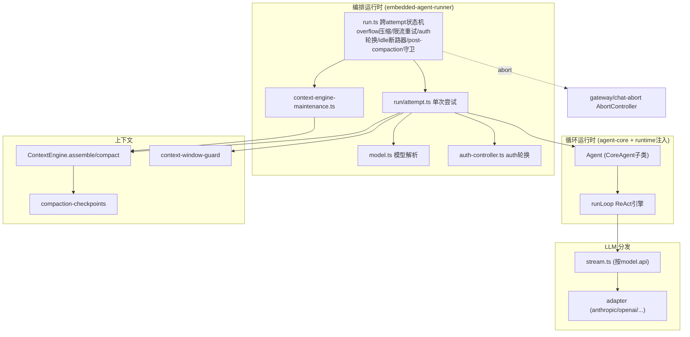

# 第六部分：Runtime 分析

「Runtime」在 OpenClaw 有两层含义，需区分：
- **循环运行时**（`@openclaw/agent-core` + `src/agents/runtime/index.ts`）：纯 ReAct 引擎 + OpenClaw 注入的 LLM streamFn。
- **编排运行时**（`src/agents/embedded-agent-runner/`）：包裹循环、负责模型/auth/工具/压缩/重试的生产层。
- 另注：`src/runtime.ts` 是**终端 IO 运行时**（stdout/stderr/exit + EPIPE 处理），与上述无关。

## 6.1 Runtime 职责

| 职责 | 实现位置 |
|---|---|
| 模型解析与默认 | `embedded-agent-runner/model.ts`（`resolveModelAsync`） |
| auth 计划/轮换/失败 | `run/auth-controller.ts`、`model-auth.ts`、`auth-profiles/sqlite.ts` |
| 工具装配与策略 | `agent-tools.ts:394`（`createOpenClawCodingTools`）+ 策略管线 |
| 系统提示装配 | `system-prompt.ts:682` |
| 上下文引擎驱动 | `harness/context-engine-lifecycle.ts`、`context-engine-maintenance.ts` |
| 重试/压缩/失败转移状态机 | `run.ts`（跨 attempt 计数器） |
| 单次尝试执行 | `run/attempt.ts`（`runEmbeddedAttempt`） |
| LLM 分发 | `llm-runtime/stream.ts`（按 `model.api` 找 adapter） |

## 6.2 上下文管理

**会话树 → 上下文窗口**的转换由**可插拔上下文引擎**（`ContextEngine`，`src/context-engine/types.ts:298`）负责：
- `assemble(tokenBudget)` 在预算内构建有序 messages + `estimatedTokens`，返回 `promptAuthority`（`"assembled"` 或 `"preassembly_may_overflow"`，决定超窗预检如何比较）与 `contextProjection`（`per_turn` vs `thread_bootstrap`，适配有持久线程后端的宿主）。
- `maintain` 可重写转写条目；`ingest`/`ingestBatch` 摄入消息；`compact` 由宿主用 `compaction-safety-timeout.ts` 加超时与 abort 包裹。
- **容错（quarantine）**：自定义引擎 `assemble`/`compact` 抛错会被记录并降级为 legacy 引擎（`registry.ts`，abort 不触发 quarantine）。`init.ts` 始终注册 legacy 作兜底。
- 第三方引擎可 `delegateCompactionToRuntime`（`delegate.ts`）复用 OpenClaw 内置压缩。

## 6.3 Token 管理

- **窗口解析**：`resolveContextWindowInfo`（`context-window-guard.ts:54`，config → 模型元数据 → 默认，硬下限 4000）；`evaluateContextWindowGuard`（`:202`）标记低于阈值的上下文。
- **预算**：`MIN_PROMPT_BUDGET_TOKENS = 8000`、比例 `0.5`（`agent-compaction-constants.ts`）；config → `contextTokenBudget` → 上下文引擎 `tokenBudget`。
- **估算**：优先用 provider 真实 usage（`calculateContextTokens`）；无则用 char/4 启发式（`estimateTokens`，`compaction.ts:262`），图片按 `IMAGE_BLOCK_CHARS=4800` 计。`estimateMessagesTokens`（`compaction-planning.ts:51`）在计数前**清洗 tool-result details**（安全：绝不进 LLM）。
- **工具结果截断**：`tool-result-truncation.ts`（1118 行）缩减超大工具输出。
- 模型可声明 `contextTokens`（运行时有效窗，小于物理 `contextWindow`）用于压缩预算。

## 6.4 模型调用

`llm-runtime/stream.ts` 纯按 `model.api` 在进程级 `Map<apiId, RegisteredApiProvider>`（`api-registry.ts`）中查 adapter 并委派。8 个内置 API 家族（`anthropic-messages`、`openai-completions`、`openai-responses`、`azure-openai-responses`、`openai-chatgpt-responses`、`mistral-conversations`、`google-generative-ai`、`google-vertex`）用 `createLazyStream` 懒加载（`register-builtins.ts:342`），懒加载失败转为正常 `error` 事件而非抛出。StreamFn 契约（`llm-core/src/types.ts:201`）硬约束：**一旦调用，请求/模型/运行时失败必须编码进返回流，不得抛出**，终态产出 `stopReason error/aborted` 的 AssistantMessage。

## 6.5 事件循环

核心事件循环即 `runLoop`（`agent-loop.ts:258`）的外层（follow-up）+ 内层（toolCall+steering）双循环。事件经 `EventStream<AgentEvent, AgentMessage[]>`（`event-stream.ts:9`）异步迭代发布，`agent_end` 为终态事件并携带最终 messages。

## 6.6 任务调度与并发

- **每会话串行**：ACP 侧 `SessionActorQueue`（`session-actor-queue.ts`，`KeyedAsyncQueue` 按会话键），保证一个会话同时只有一个 in-flight 操作；`actorQueue.run(key, ...)` 暴露 `queueDepth`。
- **lane 机制**：`embedded-agent-runner/lanes.ts` 区分 global lane 与 session lane；子代理走 `AGENT_LANE_SUBAGENT`（`src/agents/lanes.ts`）。
- **并发上限**：子代理 `DEFAULT_SUBAGENT_MAX_CONCURRENT = 8`、每 Agent `DEFAULT_SUBAGENT_MAX_CHILDREN_PER_AGENT = 5`（`src/config/agent-limits.ts`）。
- **cron**：单 timer，`MIN_REFIRE_GAP_MS=2000` 防自旋、`MAX_TIMER_DELAY_MS=60000` 钳制，mutating 操作经 `op: Promise` 串行化（`src/cron/service/state.ts`、`timer.ts`）。

## 6.7 取消机制

- **运行级**：`src/gateway/chat-abort.ts` 每运行一个 `AbortController`；`abortChatRunById`（`:367`）调用 `controller.abort(createChatAbortSignalReason(stopReason))`，restart/timeout 映射为特定错误并广播生命周期事件。
- **turn 级**：`AbortSignal.any` 合并 caller + internal 信号（`manager.turn-runner.ts:220`）。
- **工具级**：信号经 `tool.execute(..., signal, ...)` 透传；`src/agents/agent-tools.abort.ts` 做中继。
- **循环级**：`runLoop` 在每个关键点调用 `stopIfAborted()`（`agent-loop.ts:273`），持久化一条 aborted 助手消息防止后处理从 toolUse 继续。

## 6.8 恢复 / Checkpoint 机制

- **压缩前快照**：`src/gateway/session-compaction-checkpoints.ts` —— 每会话最多 25 个、128MB 上限，newest-first 裁剪；`CapturedCompactionCheckpointSnapshot` 含 `sessionId/sessionFile/leafId/entryId`；`readTranscriptEntriesForForkAsync`（`:213`）流式读到 `stopAfterEntryId` 以 fork/恢复。
- **续写而非重启**：压缩后注入续写提示「Continue from the compacted transcript…」（`run.ts:252`），而非重跑。
- **终态优先级**：`mergeAgentRunTerminalOutcome`（`agent-run-terminal-outcome.ts:196`）使 `hard_timeout` 与 `cancelled` 黏性，优先级 hard_timeout > cancelled > completed。
- **状态持久**：会话树本身是 append-only JSONL/SQLite，进程重启后可从叶子恢复；子代理登记表持久于 SQLite。

## 6.9 运行时架构图

