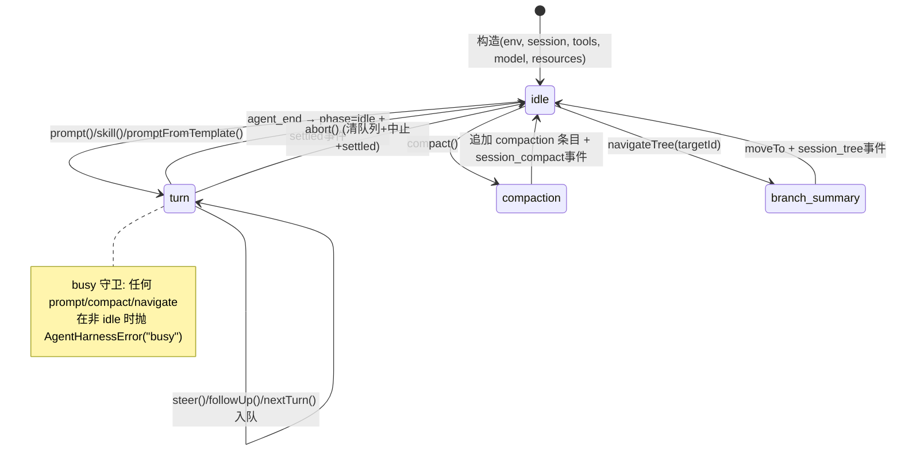
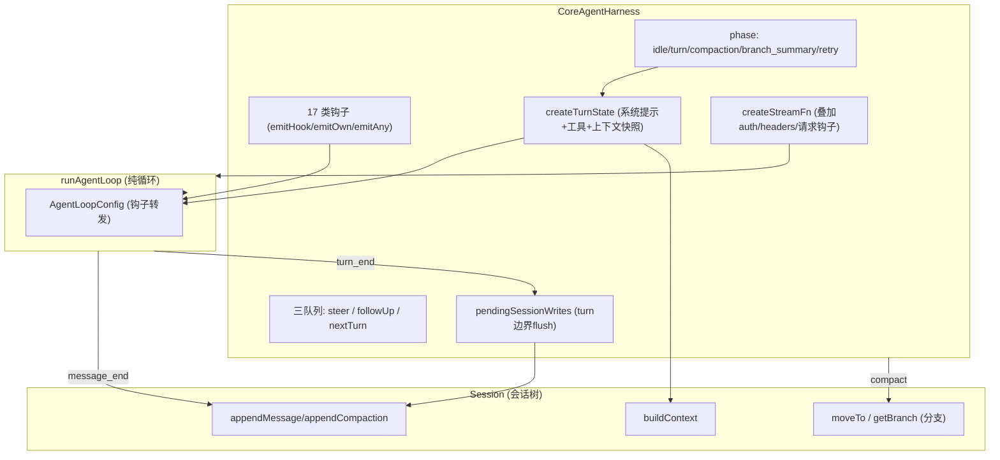

# 第七部分：Harness 分析

OpenClaw 中「Harness」出现在**两个不同层**，这是理解全系统的关键，必须区分：

| 层 | 名称 | 位置 | 含义 |
|---|---|---|---|
| **核心库层** | `CoreAgentHarness` | `packages/agent-core/src/harness/agent-harness.ts:217` | 围绕纯循环的「会话 + 压缩 + 分支 + 钩子 + 资源」有状态外壳 |
| **OpenClaw 运行时层** | `AgentHarness`（契约） | `src/agents/harness/types.ts` | **可插拔运行时适配器**：选择用哪种引擎跑一次 attempt（`openclaw` / `codex` / …） |

## 7.1 Harness 是什么

**核心库层的 CoreAgentHarness** 是「会话化的 Agent 外壳」：它在 `runAgentLoop`（纯函数循环）之上，叠加了一个真实助理需要的所有有状态能力 —— 会话持久化、上下文压缩、会话树导航、provider 请求钩子、工具调用钩子、技能/提示模板资源、steering/follow-up/nextTurn 三类队列。

**运行时层的 AgentHarness** 是一个**策略接口**：`{ id, label, contextEngineHostCapabilities, supports(), runAttempt(), classify?, compact?, reset?, dispose? }`。内置 `openclaw` harness（`harness/builtin-openclaw.ts`）把 `runAttempt` 映射到 `runEmbeddedAttempt`；外部 harness（如 `extensions/codex` 注册的 `codex` harness）则把整个 attempt 委派给 Codex app-server。这让 OpenClaw 能**用同一套渠道/会话/路由基础设施，驱动完全不同的 Agent 执行后端**。

## 7.2 为什么需要 Harness

1. **分离「循环算法」与「会话/资源管理」**：`runLoop` 保持 provider-agnostic、可测试、可被外部项目复用；会话/压缩/钩子等「脏」状态集中在 harness。
2. **统一钩子面**：harness 暴露 17 种带类型返回值的钩子（`AgentHarnessEventResultMap`，`harness/types.ts:705`），如 `before_agent_start`（改 prompt/系统提示）、`context`（改上下文）、`before_provider_request`（patch 请求选项）、`before_provider_payload`（改 payload）、`tool_call`（拦截）、`tool_result`（改写）、`session_before_compact`（取消/替换压缩）、`session_before_tree`（分支前）。OpenClaw 在这些钩子上挂载权限、记忆、缓存、审计、媒体等横切逻辑。
3. **可插拔执行后端**（运行时层）：把 Codex、未来的其他 agent 运行时作为可选 harness，而非硬编码。这是「能把 Codex 当后端」的架构基础。

## 7.3 Harness 与 Agent 的关系

```
CoreAgentHarness.prompt(text)
  → createTurnState()  (从 session.buildContext() 取 messages + 系统提示 + 工具)
  → executeTurn()
    → runAgentLoop(messages, context, loopConfig, handleAgentEvent, signal, streamFn)
        loopConfig 的钩子全部转发到 harness 的 emitHook(...)
        streamFn = createStreamFn() (叠加 auth/headers/before_provider_request 钩子)
  → handleAgentEvent: message_end→session.appendMessage; turn_end→flush写入+save_point; agent_end→phase=idle+settled
```

CoreAgentHarness **不直接持有 `Agent` 类**，而是直接驱动 `runAgentLoop` 函数；`Agent` 类是另一条更轻的封装路径。OpenClaw 运行时实际用的是 `AgentSession`（持有 `CoreAgent` 实例）这条路径，而非 `CoreAgentHarness`（后者更像 agent-core 提供的「参考实现/可选外壳」）。

## 7.4 Harness 与 Runtime 的关系

运行时层 `selectAgentHarness`（`harness/selection.ts`）在每次 run 时选 harness；内置 harness 的 `runAttempt → runEmbeddedAttempt` 内部再创建 `AgentSession` → `CoreAgent` → `runLoop`。所以调用栈是：

```
Embedded Runner (run.ts)
  → selectAgentHarness → AgentHarness.runAttempt
      → [openclaw] runEmbeddedAttempt → AgentSession → CoreAgent → runLoop
      → [codex]   委派 Codex app-server (stdio/ws)，事件经 ACP translator 归一化
```

## 7.5 Harness 管理哪些资源

CoreAgentHarness 集中管理（`agent-harness.ts`）：

| 资源 | 管理方式 |
|---|---|
| **Prompt（系统提示）** | `systemPrompt` 可为字符串或回调（接收 env/session/model/activeTools/resources），每 turn 在 `createTurnState` 解析 |
| **Tool** | `Map<name, TTool>` + `activeToolNames`；`setActiveTools`/`setTools`；每 turn 取 active 子集放入 `AgentContext.tools` |
| **Memory（会话历史）** | `Session` 抽象（`buildContext`/`appendMessage`/`getBranch`/`moveTo`）；压缩 `compact()`；分支 `navigateTree()` |
| **Context** | `transformContext` 经 `context` 钩子；上下文从会话树构建 |
| **Model** | `model` + `thinkingLevel`；`setModel`/`setThinkingLevel`（idle 时写会话，运行中入 `pendingSessionWrites`） |
| **Session** | `Session` 对象 + `flushPendingSessionWrites`（把运行中累积的写在 turn 边界落盘） |
| **资源** | `AgentHarnessResources{skills, promptTemplates}`，`setResources`/`getResources` |

## 7.6 Harness 生命周期



## 7.7 Harness 架构图



## 7.8 与「Claude Code Harness」概念对照

OpenClaw 的 harness 工程与 Claude Code / Codex 的「agent harness」是同一思想谱系：把「上下文窗口管理、压缩、steering、工具循环、会话持久化」做成可复用基座。OpenClaw 的独到之处是把它**双层化**：agent-core 的 `CoreAgentHarness`（库级参考外壳）+ 运行时的 `AgentHarness` 契约（可插拔后端），后者使其能把 Codex 本身当作一个 harness 后端来驱动（`extensions/codex` 的 `onAgentHarnesses: ["codex"]`）。
