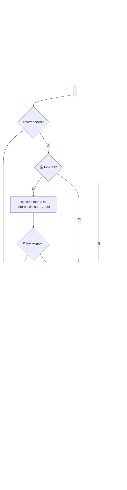
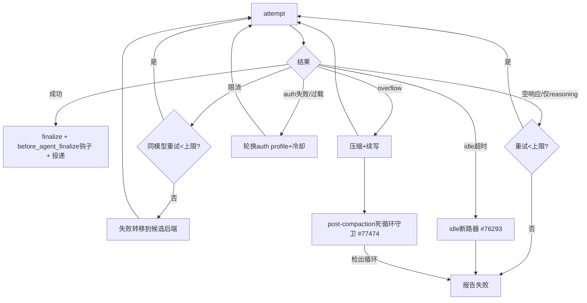

# 第八部分：Loop Engineering 分析

Loop Engineering 是 OpenClaw 最具工程深度、最难复刻的部分。它分**两层循环**：
- **微观循环**（`agent-core` 的 `runLoop`）：单次 run 内的 ReAct turn 循环。
- **宏观循环**（`embedded-agent-runner` 的 `run.ts`）：跨多次 attempt 的可靠性状态机（重试/压缩/失败转移）。

## 8.1 微观 Loop 结构（runLoop，`agent-loop.ts:258`）

```
runLoop:
  pendingMessages = getSteeringMessages() || []   # 开局先看是否有 steering
  while (true):                                    # 外层: follow-up 循环
    hasMoreToolCalls = true
    while (hasMoreToolCalls || pendingMessages.length > 0):   # 内层: turn 循环
      stopIfAborted()
      turn_start
      注入 pendingMessages 到上下文
      message = streamAssistantResponse(...)       # 调 LLM，流式
      if stopReason in {error, aborted}: turn_end + agent_end; return
      toolCalls = message.content.filter(toolCall)
      if toolCalls: 
        batch = executeToolCalls(...)
        toolResults = batch.messages
        hasMoreToolCalls = !batch.terminate          # 整批 terminate 则停
        回灌 toolResults 到上下文
      turn_end(message, toolResults)
      nextTurnSnapshot = prepareNextTurn(...)         # 可换模型/上下文/thinking
      if shouldStopAfterTurn(...): agent_end; return
      pendingMessages = getSteeringMessages() || []
    followUp = getFollowUpMessages() || []
    if followUp: pendingMessages = followUp; continue # 续跑
    break                                            # 无更多消息，退出
  agent_end
```

**三个队列在循环中的注入点**：
- **steering**：每个 turn 执行完工具后注入（除非 `shouldStopAfterTurn` 先退出）——「Agent 工作中途纠偏」。
- **follow-up**：Agent 本会停下时（无 toolCall 无 steering）才注入——「等它干完再追加」。
- **nextTurn**（仅 CoreAgentHarness）：下一个 prompt turn 开头注入。
- 队列 drain 模式：`all`（全注入）或 `one-at-a-time`（每次一条），默认后者（`agent.ts:259`）。

## 8.2 循环触发条件

| 触发 | 来源 |
|---|---|
| 用户消息 | 入站渠道 → `prompt()` |
| 工具结果回灌 | `executeToolCalls` 后 `hasMoreToolCalls=true` |
| steering 消息 | `getSteeringMessages()` 非空 |
| follow-up 消息 | `getFollowUpMessages()` 非空 |
| cron 唤醒 | `src/cron` → `runIsolatedAgentJob` |
| 子代理完成唤醒 | `enqueueSystemEvent` + `requestHeartbeat` |
| 压缩后续写 | `run.ts` 注入「Continue from compacted transcript」 |

## 8.3 终止条件

1. 助手消息无 toolCall **且** steering/follow-up 队列空。
2. `shouldStopAfterTurn()` 返回 true（典型：即将超窗，提前优雅停）。
3. 整批工具结果都 `terminate=true`（`shouldTerminateToolBatch`，`agent-loop.ts:768`）—— 工具可主动早停。
4. `stopReason` 为 `error` / `aborted`。
5. `signal.aborted`（任意检查点，`stopIfAborted`）。

## 8.4 失败重试（宏观循环，`run.ts`）

`run.ts` 维护一组**跨 attempt 的计数器与守卫**（约在 `run.ts:1554+` 初始化）：

| 计数器 | 作用 |
|---|---|
| `overflowCompactionAttempts` | 上下文溢出 → 触发压缩重试 |
| `autoCompactionCount` | 自动压缩次数 |
| `compactionContinuationRetryAttempts` | 压缩后续写重试 |
| `overloadProfileRotations` | 过载 → 轮换 auth profile |
| `consecutiveSameModelRateLimitRetries` | 同模型连续限流重试 |
| `reasoningOnlyRetryAttempts` | 只有 reasoning 无输出 → 重试 |
| `emptyResponseRetryAttempts` | 空响应重试 |
| `sameModelIdleTimeoutRetries` | 同模型 idle 超时重试 |
| `beforeAgentFinalizeRevisionAttempts` | 终态投递前修订 |

**错误分类器**（`embedded-agent-helpers.ts`）：`isLikelyContextOverflowError`、`isRateLimitAssistantError`、`isAuthAssistantError`、`extractObservedOverflowTokenCount`。决策由 `resolveRunFailoverDecision`/`mergeRetryFailoverReason`（`run/failover-policy.ts`）做出。

## 8.5 错误恢复策略矩阵

| 失败类型 | 恢复动作 |
|---|---|
| 上下文溢出 | 触发压缩（overflow 模式）→ 注入续写提示 → 重跑 |
| 限流 | 同模型有界重试 → 否则失败转移到候选后端/模型 |
| 过载 | 轮换 auth profile（`auth-controller.ts`，含冷却 `markAuthProfileFailure`） |
| auth 失败 | 轮换 auth profile，按 `auth-profile-failure-policy.ts` |
| 空响应 / 仅 reasoning | 有界重试 |
| idle 超时（流卡住） | `run/llm-idle-timeout.ts` 中止；`run/idle-timeout-breaker.ts` 成本失控断路器（issue #76293） |
| post-compaction 死循环 | `post-compaction-loop-guard.ts` 守卫（issue #77474） |
| 后端失败 | `manager.turn-runner.ts` 候选后端依次尝试，每个 2 次 |

## 8.6 反思机制

OpenClaw **无显式 LLM critic/reflection 阶段**。其「反思」体现为两种：
1. **隐式模型自纠**：工具结果回灌后，模型在下一 turn 看到结果自行修正。
2. **工程化反思**：`run.ts` 的分类-决策-重试本质上是确定性的「失败反思」，把不可靠的 LLM/网络/限流抽象成可恢复状态机。

## 8.7 长任务机制

- **压缩**：超 `window - reserveTokens(16384)` 触发，保留 `keepRecentTokens(20000)`，旧史结构化摘要（Goal/Constraints/Progress）替换为一条 compaction 条目。文件读写列表跨压缩保留。
- **分支摘要**：被放弃分支生成 `branch_summary`。
- **steering**：长任务中途可注入纠偏消息而不打断。
- **子代理**：长任务可派生子代理并行，主代理 `sessions_yield` 让出，子代理完成后 heartbeat 唤醒主代理汇总。
- **cron**：可定时唤醒做周期性长任务。
- **checkpoint**：压缩前快照支持 fork/恢复。

## 8.8 计划更新机制

无显式 Plan 对象，「计划更新」通过：
- `prepareNextTurn`：turn 间换模型（如降级到便宜模型）/换上下文/换 thinking 级别。
- steering 消息：用户/系统中途改变任务方向。
- 系统提示的动态后缀：每 turn 重建（在缓存边界以下），注入最新运行时状态。

## 8.9 Loop 流程图



## 8.10 宏观可靠性状态机（跨 attempt）


