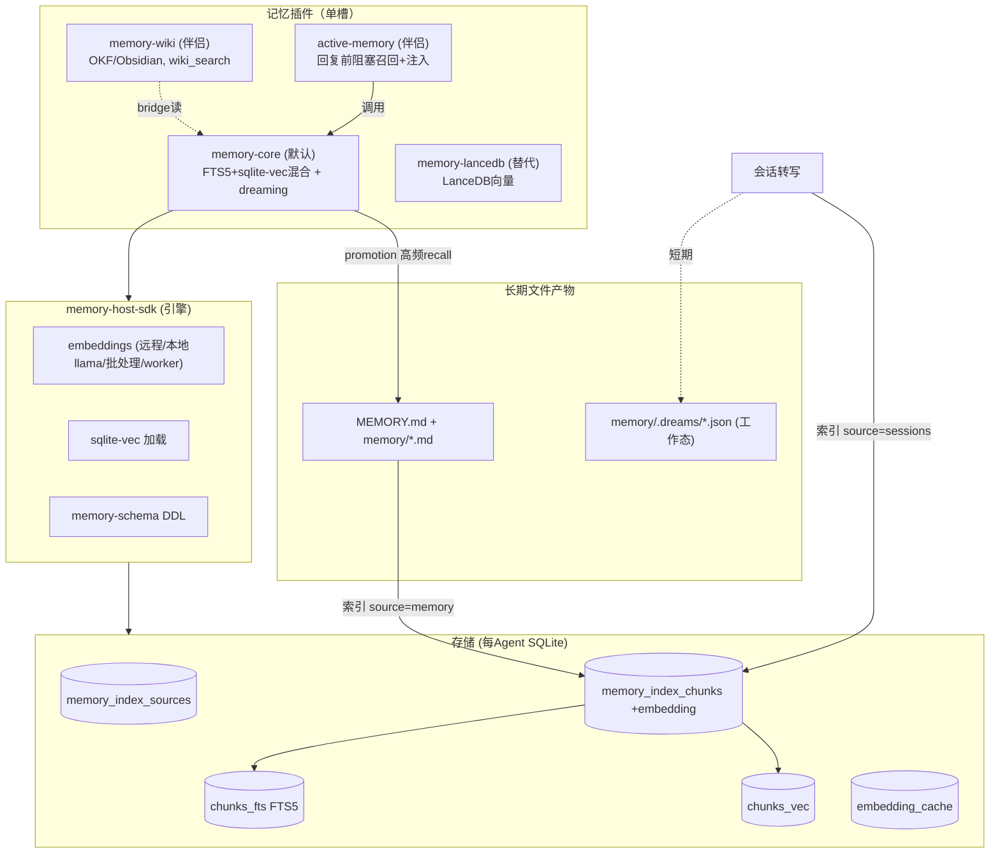
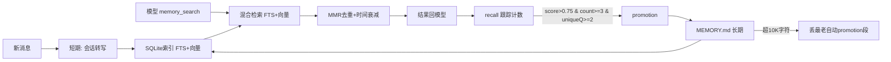

# 第九部分：Memory 系统分析

## 9.1 总体设计：记忆是「插件槽」，不是核心

OpenClaw 的记忆子系统是**插件拥有**的。核心仅提供：
- 一个种子文件定位器 `src/memory/root-memory-files.ts`（`MEMORY.md`，拒绝符号链接）。
- 一个**主机 SDK** `packages/memory-host-sdk`（embedding/FTS/sqlite-vec/批处理引擎），供记忆插件经 `openclaw/plugin-sdk/*` 消费。
- 一个**单记忆槽**：同时只有一个 `kind:"memory"` 插件激活，由 `plugins.slots.memory` 选定（默认 `memory-core`）。

上下文压缩（live transcript 摘要）**独立于记忆插件**，属 agent-core（见第八部分）。

## 9.2 三级记忆的区分

记忆分级不靠枚举，而靠**存储位置 + 路径约定 + 生命周期归属**：

| 级别 | 内容 | 存储 | 归属 |
|---|---|---|---|
| **短期** | 会话转写（按日的 session-corpus）+ recall 跟踪 | SQLite 索引（`source=sessions`）+ `memory/.dreams/short-term-recall.json` | `memory-core` |
| **工作** | dreaming/promotion 临时态、锁、phase 信号 | SQLite KV 命名空间（`SHORT_TERM_*_NAMESPACE`） | `memory-core` |
| **长期** | `MEMORY.md` + `memory/*.md`（`# Long-Term Memory`） | 磁盘文件 + SQLite 索引（FTS5 + sqlite-vec） | `memory-core` |

**短→长的桥（promotion）**：`applyShortTermPromotions`（`extensions/memory-core/src/short-term-promotion.ts`）把高频 recall 的短期片段提升到 `MEMORY.md`。门槛：`DEFAULT_PROMOTION_MIN_SCORE=0.75`、`MIN_RECALL_COUNT=3`、`MIN_UNIQUE_QUERIES=2`。

## 9.3 存储机制

**SQLite 为正统存储**（符合 AGENTS.md「SQLite only」）。记忆索引用 `node:sqlite`（`DatabaseSync`）+ 原始 DDL（被归为 schema/低层原语豁免），**而非 Kysely**。库为**每 Agent 库** `agents/<agentId>/agent/openclaw-agent.sqlite`。

Schema（`packages/memory-host-sdk/src/host/memory-schema.ts`）：
- `memory_index_sources`（`path, source, hash, mtime, size`）
- `memory_index_chunks`（`id, path, source, start_line, end_line, hash, model, text, embedding TEXT, updated_at`）
- `memory_index_state`（单行 revision 计数器，触发器在增删改时自增 —— 廉价的「索引是否变化」信号）
- `memory_embedding_cache`（provider/model/hash → embedding）
- `memory_index_chunks_fts`（**FTS5 虚拟表**，unicode61 或 trigram）
- `memory_index_chunks_vec`（**sqlite-vec 向量表**）

**LanceDB 替代**：`extensions/memory-lancedb` 用 `@lancedb/lancedb` 存向量（`~/.openclaw/memory/lancedb`），暴露 `memory_recall`/`memory_store`/`memory_forget`。

唯一的非 SQLite 运行时状态是 dreaming 的 `.dreams/*.json` 临时工作文件，以及 `MEMORY.md`/`memory/*.md`（用户可见的命名产物，允许）。

## 9.4 压缩策略（live context，agent-core）

`DEFAULT_COMPACTION_SETTINGS`（`packages/agent-core/src/harness/compaction/compaction.ts:142`）：
```ts
{ enabled: true, reserveTokens: 16384, keepRecentTokens: 20000 }
```
- **触发**：`shouldCompact`（`:236`）—— `contextTokens > contextWindow - reserveTokens`。
- **保留**：`findCutPoint`（`:388`）向后累加 token 到 `keepRecentTokens` 再吸附到合法切点（user/assistant/bash/custom/branch-summary 边界，**绝不切在 toolResult 中间**，`findValidCutPoints:313`）。
- **摘要**：切点前全部用结构化模板摘要（Goal / Constraints & Preferences / Progress→Done/…，`SUMMARIZATION_SYSTEM_PROMPT:441`）替换为一条 compaction 消息。文件读写列表跨压缩保留（`extractFileOperations`）。
- **分支摘要**（`branch-summarization.ts`）：摘要被放弃的树分支。

## 9.5 记忆淘汰 / 裁剪

| 机制 | 参数/位置 |
|---|---|
| 长期文件预算 | `DEFAULT_MEMORY_FILE_MAX_CHARS=10000`（`memory-budget.ts`）；优先丢最老的自动 promotion 段，保留用户手写内容 |
| 时间衰减（排名，非删除） | `halfLifeDays=30`（`temporal-decay.ts`）；recall promotion 用 `RECENCY_HALF_LIFE_DAYS=14` |
| recall 跟踪上限 | `MAX_ENTRIES=512`、`MAX_RECALL_DAYS=16`、`MAX_QUERY_HASHES=32` |
| MMR 去重 | `mmr.ts` 查询时去近重 |
| active-memory 缓存 | TTL 15s、最多 1000 条，1s 清扫 |
| reindex 孤儿 GC | `ORPHAN_MIN_AGE_MS=24h` |

## 9.6 RAG / Embedding / 向量支持

**RAG 一等公民，完整实现**：
- **Embedding**（host SDK）：远程 HTTP provider、本地 llama.cpp（`node-llama.ts`）、批处理任务（`batch-*.ts`）、worker 线程隔离（`embeddings-worker*.ts`）。
- **向量**：sqlite-vec（`sqlite-vec.ts`，平台变体解析）或 LanceDB。
- **混合检索**（memory-core）：`MemoryIndexManager.search`（`manager.ts:599`）合并 FTS5 关键词（`searchKeyword:879`）+ 向量（`searchVector:849`），`mergeHybridResults:960` 融合，再 MMR + 时间衰减重排。向量不可用时优雅降级为纯关键词。
- **知识/wiki 层**：`extensions/memory-wiki`（OKF 格式、Obsidian/ChatGPT 导入、`wiki_search`/`wiki_get`）。
- **主动记忆**：`extensions/active-memory`（回复前的有界阻塞记忆子代理，把召回片段注入提示）。

## 9.7 单槽强制（only one active）

`resolveMemorySlotDecisionShared`（`src/plugins/config-activation-shared.ts:342`）：
- 任何 `kind:"memory"` 且非选定槽 id 的插件被**禁用**（reason: "memory slot already filled by …"）。
- 双 kind 插件（如 `["memory","context-engine"]`）失去 memory 槽仍保持启用（履行其他角色）。
- dreaming 旁车例外：`memory-core` 允许与其他选定槽插件（如 LanceDB）共存，使 dreaming 仍运行。
- 选定的记忆插件即使不在 `plugins.allow` 也强制启用（auto-enable reason `selected-memory-slot`）。

## 9.8 Memory 架构图



## 9.9 Memory 数据流图


