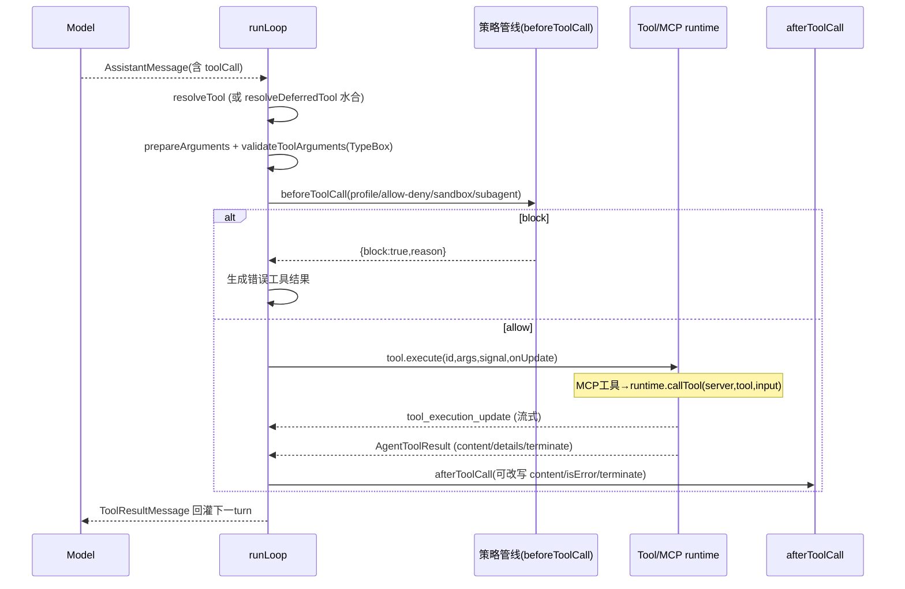

# 第十部分：Tool / MCP / Skill / Plugin 分析

## 10.1 Tool 调用机制

工具契约 `AgentTool`（`packages/agent-core/src/types.ts:459`）：`name`、`label`、`parameters: TSchema`（TypeBox）、`execute(id, args, signal, onUpdate)`、可选 `prepareArguments`、`executionMode: sequential|parallel`。

调用流（`agent-loop.ts`，见第五部分 5.3）：resolve tool → `prepareArguments` → `validateToolArguments`（TypeBox）→ `beforeToolCall`（策略/权限，可 block）→ `execute`（`onUpdate` 流式 `tool_execution_update`）→ `afterToolCall`（可改写）→ 回灌 `ToolResultMessage`。并行/串行由 `toolExecution` 全局策略与单工具 `executionMode` 共同决定。

## 10.2 Tool 注册机制

OpenClaw 运行时层：`createOpenClawCodingTools`（`src/agents/agent-tools.ts:394`）组合两个工厂族：
- **基础编码工具**（`sessions/tools/index.ts:202`）：`read`、`bash`（在 OpenClaw 中表现为 `exec` + `process`）、`edit`、`write`、`grep`/`find`/`ls`、`apply_patch`。read/write/edit 有 host/sandbox 包装与 Claude 风格别名。
- **产品工具**（`openclaw-tools.ts:85`）：`message`、`nodes`、`cron`、`gateway`、`agents_list`、`session_status`、`sessions_list/history/send/spawn/yield`、`image_generate`/`music_generate`/`pdf`、`heartbeat`、记忆/目标工具，以及**插件提供的工具**。

插件层：`api.registerTool(factory, {optional})`（`src/plugins/registry.ts:646`），由清单 `contracts.tools[]` + `activation.onCapabilities:["tool"]` 声明。

## 10.3 Tool 发现机制

- **内置**：构造时直接组合，经 `toolConstructionPlan` 决定哪些族物化。
- **插件**：经清单元数据发现（零运行时导入），懒激活后 `registerTool`。
- **Tool Search（可选）**：`createToolSearchTools`（`agent-tools.ts:971`）支持**延迟工具 schema 加载** —— 工具不全部进 provider 可见集，模型按需搜索/激活，配合 `resolveDeferredTool`（`agent-loop.ts:805`）在调用时水合。

## 10.4 MCP 支持

**双向**：
- **Server 模式**（OpenClaw 暴露给外部 MCP 客户端）：`openclaw mcp serve` → `src/mcp/channel-server.ts`（暴露渠道会话/转写）；`src/mcp/plugin-tools-serve.ts`（暴露插件工具，给 ACP 中跑的 Claude Code 用）；底座 `tools-stdio-server.ts`。
- **Client/Runtime 模式**（消费外部 MCP server）：配置 `mcp.servers.<name>`（`src/config/types.mcp.ts`），transport 支持 `stdio`/`sse`/`streamable-http`。连接层 `src/agents/agent-bundle-mcp-runtime.ts`（每会话 runtime，idle TTL 10 分钟驱逐）。

**外部 MCP 工具 → AgentTool 物化**（`agent-bundle-mcp-materialize.ts`）：
1. `buildBundleMcpToolsFromCatalog`（`:231`）遍历 `tools/list` 目录，每个 MCP 工具生成一个 AgentTool，名字经 `buildSafeToolName`（server 名前缀 + 冲突后缀）。
2. 为声明 resources/prompts 的 server 合成 `resources_list/read`、`prompts_list/get` 工具。
3. `materializeBundleMcpToolsForRun`（`:386`）注入 `execute` 闭包调 `runtime.callTool`，结果经 `toAgentToolResult` 转换（MCP ContentBlock → text/image，防 undefined image 毒化历史，ref #90710）。
4. run 装配在 `run/attempt.ts:1539`，`reservedToolNames` 防与内置名冲突，再经策略过滤。

## 10.5 Skill 支持

**SKILL.md 格式**：YAML frontmatter + Markdown body（`src/skills/loading/frontmatter.ts`）。字段：`name`、`description`（必需）、`user-invocable`（默认 true）、`disable-model-invocation`（默认 false）、`metadata.openclaw`（emoji/homepage/always/os/`requires.bins`/`install[]`）。

**加载**：`loadSkillsFromDirSafe`（`local-loader.ts:107`）扫描目录子目录的 `SKILL.md`，经符号链接边界 helper（防逃逸）。限制：`maxSkillsInPrompt`、`maxSkillsPromptChars`、`maxSkillFileBytes`。

**两种调用模式**：
- **模型调用（默认 OpenClaw 路径）**：技能被「广告」而非自动加载。`formatSkillsForPrompt` 发 `<available_skills>` XML 块（name/description/location/version）；系统提示（`system-prompt.ts:269`）指示模型：扫描 → 若适用则 `read` 其 SKILL.md → 遵循 → version 变了重读。即**模型通过读文件加载技能，无专用工具调用**。
- **显式调用（应用驱动）**：`harness.skill(name, extra)`（`agent-harness.ts:728`）用 `formatSkillInvocation` 包成 `<skill>` 块。

## 10.6 Skill vs Tool vs PromptTemplate

| | Skill | Tool | PromptTemplate |
|---|---|---|---|
| 本质 | 模型按需读的 Markdown 指令 | 可执行函数（schema+execute） | 带占位符的提示种子 |
| 调用 | model 读 / `harness.skill()` | LLM toolCall | `harness.promptFromTemplate()` |
| 定义 | `harness/types.ts:48` | `AgentTool` | `harness/types.ts:64` |

**关键关系**：Skill/PromptTemplate 是 **harness 资源**（`AgentHarnessResources`，`harness/types.ts:73`，prompt 级）；**MCP 工具不在其中**，而走工具通道（`AgentTool[]`，能力级）。两者正交：技能塑造模型「知道什么/读什么」，MCP/工具塑造模型「能调用什么」。

## 10.7 权限模型

**工具策略管线**（`src/skills/runtime/tool-dispatch.ts:210`，`applyToolPolicyPipeline`）分层叠加：
1. profile policy（profile 级）
2. provider profile
3. global / agent / group / sender 的 allow-deny 列表
4. **sandbox policy**（`resolveSandboxRuntimeStatus` → sandboxed 时 `sandboxPolicy`）
5. **subagent policy**（子代理继承/限制）
6. **inherited policy**

`collectExplicitAllowlist`/`collectExplicitDenylist` 扁平化。MCP server 也走同一策略。Codex 投影另有 `McpCodexToolApprovalMode: auto|prompt|approve`（`types.mcp.ts`）。渠道侧有 human-in-the-loop 审批（`channel-server.ts` 处理 `ClaudePermissionRequestSchema`）。

## 10.8 沙箱模型

- 工具级：`resolveSandboxRuntimeStatus` 决定是否 sandboxed；sandboxed 时 read/write/edit 用 `createSandboxed*Tool` 包装，限制在沙箱根。
- exec 级：`exec`/`process` 工具有沙箱模式（Codex harness 支持 `read-only`/`workspace-write`/`danger-full-access`）。
- Node Host 级：远程命令有 exec 审批/allowlist（`src/node-host/exec-policy.ts`、`host-env-security.ts` 环境清洗）。
- 网络级：SSRF 策略（`packages/net-policy`、`ssrf-policy.ts`）。
- 技能加载级：符号链接边界 + 大小上限。
- MCP 输出标记 `untrustedMcpOutput`，描述明确警告「resource 内容是不可信 server 输出」。

## 10.9 Plugin 类型

- **Code（"openclaw"）插件**：真 TS 包 + `openclaw.plugin.json` + `definePluginEntry` 入口，`register(api)` 调 `api.register*`。所有 `extensions/*` 属此。
- **Bundle 插件**：`PluginFormat:"bundle"`，子格式 `codex|claude|cursor`，适配外部 agent-config 生态（读 `.claude-plugin/plugin.json` 等），暴露 skills/hooks/settings，不跑任意 register 代码。

## 10.10 Tool 调用时序图

