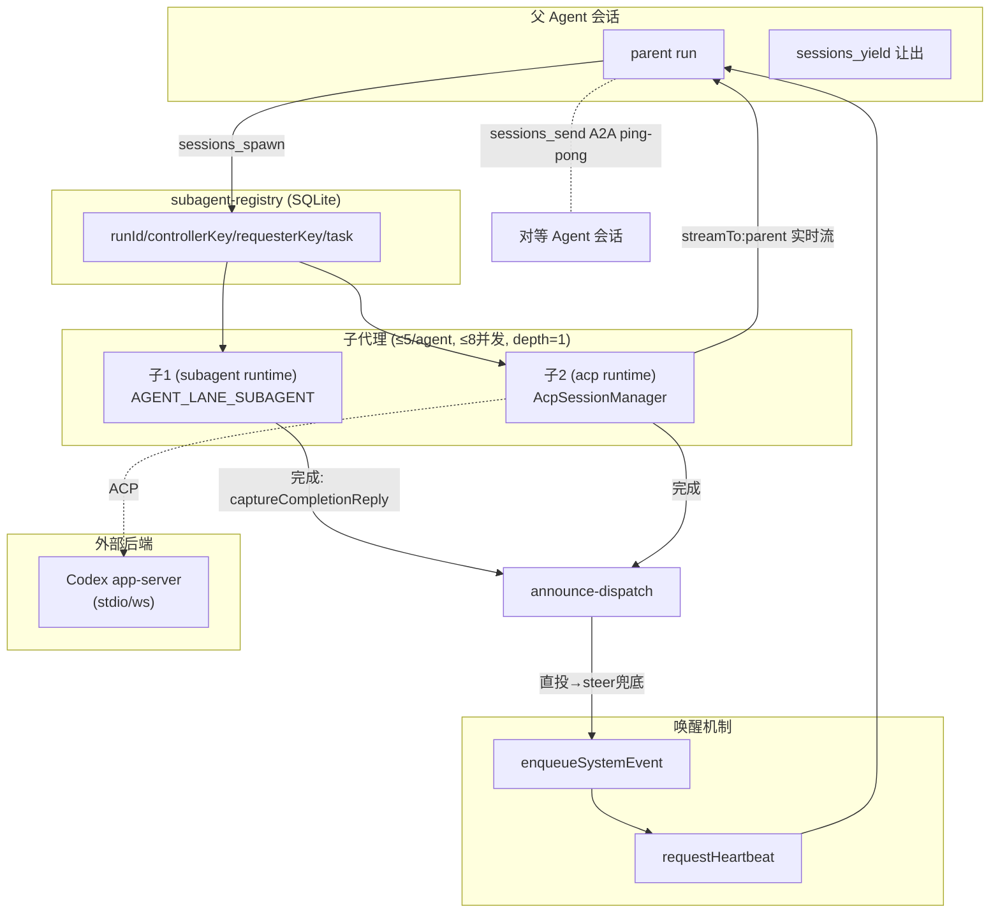

# 第十一部分：多 Agent 分析

## 11.1 是否支持 Multi-Agent —— 精确结论

**支持「单层 parent-spawns-child 子代理」 + 「有界 A2A 消息」 + 「ACP 驱动外部 Agent 后端」**；**不支持 manager-of-managers / 嵌套规划树 / swarm / 中心化任务池调度器**。

VISION.md 明确排除：「Agent-hierarchy frameworks (manager-of-managers / nested planner trees) as a default architecture」（`VISION.md:122`）。这通过 `DEFAULT_SUBAGENT_MAX_SPAWN_DEPTH = 1`（`src/config/agent-limits.ts:13`）具体落地：子代理默认是叶子，除非配置显式开启嵌套。

## 11.2 支持的模式矩阵

| 模式 | 状态 | 证据 |
|---|---|---|
| 动态委派（父派生临时 worker 子代理） | ✅ | `sessions_spawn` → `spawnSubagentDirect`/`spawnAcpDirect`，≤5 子/8 并发 |
| Manager-Worker（单层） | ✅ 部分 | 父 run 经 `controllerSessionKey` 管理子代理，一层 |
| Agent-to-Agent 消息（有界 ping-pong） | ✅ | `sessions_send` A2A，`maxPingPongTurns` 上限 |
| 驱动外部 Agent 后端（ACP/Codex） | ✅ | `AcpSessionManager` + `acpx` + Codex harness |
| Planner-Executor（显式） | ❌ | 无 planner/executor 分离对象 |
| Manager-of-managers / 嵌套规划树 | ❌ 默认禁止 | `VISION.md:122` + depth=1 |
| Swarm / 对等自协调 / 共享黑板 | ❌ | 无共享状态协调原语 |
| 中心化调度器分发到 worker 池 | ❌ | 无任务队列→worker池分发器，派生是 tool-call 时 agent 驱动 |

精确读法：**单编排者 + 叶子 worker 模型** + 与外部 Agent 对话的传输层。

## 11.3 ACP 是什么

ACP = **Agent Client Protocol**：OpenClaw 作为 client/host 驱动外部 agent backend（如 Codex/Gemini，经 `acpx` 插件）的 JSON-RPC 式会话协议。它**不是 OpenClaw-Agent 间总线**，而是把外部 agent 运行时当作一个 OpenClaw 会话来跑的适配器。
- 契约：`packages/acp-core/`（会话/lineage/interaction-mode）。
- 控制平面：`src/acp/control-plane/manager.core.ts:65`（`AcpSessionManager`，持有每会话元数据 + runtime handle 缓存 + `SessionActorQueue` 每会话串行化）。
- turn 执行：`runManagerTurn`（`manager.turn-runner.ts:52`），含后端失败转移、超时清理、后台任务进度镜像。
- translator：`src/acp/translator.ts` 在 harness 事件模型 ↔ ACP wire 协议间映射。
- 后端实现是**插件拥有**：bundled `acpx`（`@openclaw/acpx`，`enabledByDefault`+`onStartup`）。无 ACP 后端则 `runtime="acp"` 不可用。

## 11.4 子代理派生：父→子 + 结果回流

入口工具 `sessions_spawn`（`src/agents/tools/sessions-spawn-tool.ts:253`）。两种 runtime：
- `subagent` → `spawnSubagentDirect`（`subagent-spawn.ts:1080`）：在 `AGENT_LANE_SUBAGENT` lane 跑 OpenClaw 子会话，准备会话、暂存附件、继承/过滤工具策略。
- `acp` → `spawnAcpDirect`（`acp-spawn.ts:1258`）：经 `AcpSessionManager` 创建 ACP 会话，设置 parent-stream relay。

**限制**：每 Agent 活跃子 ≤5（`acp-spawn.ts:845`）、depth 默认 1（`agent-limits.ts:13`）、并发 ≤8。

**运行登记**：`registerSubagentRun`（`subagent-registry.ts:1247`）记 `{runId, childSessionKey, controllerSessionKey, requesterSessionKey, task, spawnMode, expectsCompletionMessage}`，**持久于 SQLite**（`subagent-registry.store.sqlite.ts`）。

**结果回流两路**：
1. **实时流（仅 ACP）**：`startAcpSpawnParentStreamRelay`（`acp-spawn-parent-stream.ts`）订阅子事件，缓冲/刷新（`DEFAULT_STREAM_FLUSH_MS=2500`），经 `enqueueSystemEvent`+`requestHeartbeat` 注入父会话。由 `streamTo:"parent"` 触发。
2. **完成交接（两 runtime 都有）**：子完成时 `captureSubagentCompletionReply`（`subagent-registry-lifecycle.ts:407`）捕获子最终回复，经 `runSubagentAnnounceDispatch`（`subagent-announce-dispatch.ts:63`）投递父（先直投、后 steer）。父通常 `sessions_yield` 让出 turn，子完成后**唤醒**父会话为新消息。

## 11.5 Agent 间通信协议与消息格式

**无自定义二进制/RPC A2A 协议**。通信经 Gateway + 会话/heartbeat：
- `sessions_send`（`sessions-send-tool.a2a.ts:75`）：`requesterSessionKey` 与 `targetSessionKey` 间**有界 ping-pong**，每 turn 调 `runAgentStep`，loop 数受 `maxPingPongTurns` 上限。回复可带控制 token（`ANNOUNCE_SKIP`/`REPLY_SKIP`）。投递经 `callGateway({method:"send"})` + idempotencyKey。
- **唤醒机制**：`enqueueSystemEvent`（`src/infra/system-events.ts`）+ `requestHeartbeat`（`src/infra/heartbeat-wake.ts`）恢复让出/暂停的会话。
- 「消息格式」本质是**按会话键路由的 OpenClaw 消息/系统事件**，唯一的类型化 wire envelope 是 ACP 协议（用于外部后端）。

## 11.6 Codex 集成

- **`extensions/codex`**：模型提供商 + **agent harness** 插件。注册 `codex` provider、Codex GPT 目录、媒体理解/web-search provider、**app-server harness**（经 stdio/websocket 连 Codex app-server，含 sandbox 模式与审批策略）。`onAgentHarnesses:["codex"]` —— 当 agent 用 Codex harness 时即此后端。**不是编排层**，是把 Codex 当执行后端。
- **`extensions/codex-supervisor`**：对**已运行的** Codex app-server 会话的只读监控 + 轻控制（`codex_sessions_list/read/send/interrupt`，`onStartup:false` 选用）。最接近「supervisor」模式，但监督的是**外部 Codex 线程**，非嵌套 OpenClaw 规划者。

## 11.7 Node 模式：跨设备

`src/node-host/` 是**分布式命令执行**，非分布式 agent 推理：
- `runner.ts`：远程设备作为 Gateway client 连接，注册设备身份，广告能力/命令。
- `invoke.ts`/`invoke-system-run.ts`：在远程机器执行 `system.run`/exec，含 exec 审批/allowlist（`exec-policy.ts`）+ 环境清洗（`host-env-security.ts`），输出限流流式回 Gateway 事件。
- **协调模型**：单 Gateway（agent 宿主）连多 node-host（设备）。**Agent 集中运行**，node-host 是远程执行器/工具运行器。**无 node-host 间 A2A**，只与 Gateway 通信。

## 11.8 任务分发与结果汇总

- **分发**：无调度器/工作队列分配到 worker 池。分发是 **agent 在 tool-call 时发起**（`sessions_spawn` 一任务一子 / `sessions_send` 消息对等）。每次派生建独立会话 + run 记录。fan-out 有界（≤5 子/8 并发）。
- **跟踪**：subagent-registry（SQLite）为正统 run 账本。
- **汇总**：**无自动 merge/reduce**。每个子完成独立投递父（直投→steer 兜底），**唤醒父会话**带子的最终消息。ACP 子加 `streamTo:"parent"` 可增量流式。**汇总由父 Agent 自身在下一 turn 决定如何合并** —— 无编排引擎做结构化 reduce/join。

## 11.9 多 Agent 架构图

**一句话**：OpenClaw 的多 Agent 是「一个 agent 能委派给短命子代理、能与对等 agent 有界对话、能驱动外部 agent 后端」，**不是「规划者管理规划者的树」**。这是产品定位上的刻意克制。
