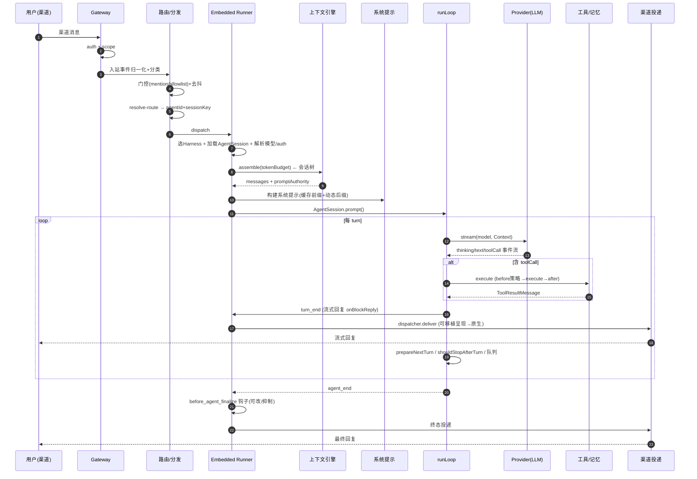

# 第十二部分：数据流分析

## 12.1 从用户输入到结果的完整链路

```
User Input (渠道消息)
  → Gateway (WS 接入 + auth + scope)
  → 入站事件归一化 + 分类 (user_request vs room_event)
  → 门控 (mention/command/allowlist) + 去抖
  → 路由 (resolve-route → agentId + sessionKey)
  → 分发 (dispatch → Embedded Runner)
  → 选 Harness + 创建/加载 AgentSession
  → 上下文引擎 assemble (会话树 → token预算内的 messages)
  → 系统提示装配 (缓存稳定前缀 + 动态后缀)
  → runLoop:
      transformContext → convertToLlm → streamFn(provider)
      → 工具调用 (before→execute→after)
      → 记忆检索 (memory_search 工具)
  → 回复流式投递 (onBlockReply → 渠道 dispatcher.deliver)
  → 原生渠道
```

## 12.2 逐步数据结构变化

| 阶段 | 数据结构 | 变化 |
|---|---|---|
| 渠道原生消息 | 渠道 SDK 对象 | 各渠道异构 |
| 入站事件 | `ChannelInboundEventContext`（RouteFacts/SenderFacts/ConversationFacts/MessageFacts，`inbound-event/context.ts:459`） | 归一化为统一事实集 |
| 路由结果 | `ResolvedAgentRoute{agentId, accountId, sessionKey, ...}`（`resolve-route.ts:47`） | 解析出目标 Agent + 会话键 |
| 包裹用户消息 | `UserMessage`，含 `[channel from +elapsed ...]` 信封头（`envelope.ts:171`，防注入） | 加 sanitized 渠道头 |
| 会话条目 | `MessageEntry`（`SessionTreeEntry`，含 parentId） | append 进会话树 |
| 上下文 | `AgentContext{systemPrompt, messages, tools}` | 引擎 assemble + convertToLlm |
| provider 请求 | `Context{systemPrompt, messages: Message[], tools: Tool[]}` | AgentMessage→Message |
| 流式事件 | `AssistantMessageEvent`（start/text_delta/thinking_delta/toolcall_*/done） | provider SSE → 归一化事件 |
| 助手消息 | `AssistantMessage`（content: text/thinking/toolCall 块 + usage + stopReason） | 累积 |
| 工具结果 | `ToolResultMessage` | 回灌上下文 |
| 回复呈现 | 可移植 presentation/action → 渠道原生 | `adaptMessagePresentationForChannel` |

## 12.3 上下文变化（一次多 turn 运行）

```
turn 1: [系统提示] + [user: 任务]
        → 助手: thinking + "我需要读文件" + toolCall(read)
turn 1 工具: + [toolResult: 文件内容]
turn 2: [系统提示] + [user] + [助手 turn1] + [toolResult]
        → 助手: toolCall(edit)
turn 2 工具: + [toolResult: 编辑成功]
turn 3: ... 
        → 助手: "完成了" (无 toolCall) → agent_end
若中途超窗:
  compaction → [系统提示] + [compactionSummary(Goal/Progress)] + [最近20K tokens] + 续写提示
```

## 12.4 Prompt 变化

系统提示分两段（`system-prompt.ts`）：
- **缓存稳定前缀**（`SYSTEM_PROMPT_CACHE_BOUNDARY` 以上，按 `hashStablePromptInput` 哈希）：身份、工具清单、子代理委派、安全、技能、记忆、工作区、文档、授权发送者、当前时间、项目上下文。**逐 turn 字节稳定**以命中 prompt cache。
- **动态后缀**（边界以下，逐 turn 重建）：动态项目上下文、Control UI 嵌入、消息提示、语音、群组/子代理上下文、reactions、provider 动态后缀、heartbeats、运行时行（模型身份/活跃进程会话/reasoning 级别）。

## 12.5 状态变化

- **Agent 状态**：`isStreaming`、`streamingMessage`、`pendingToolCalls`、`errorMessage`（`processEvents` 按事件归约）。
- **Harness phase**：idle→turn→idle（或 compaction/branch_summary）。
- **会话树**：每条消息/压缩/分支 append 新条目，leaf 指针移动。
- **运行时计数器**：`run.ts` 的重试/压缩/轮换计数跨 attempt 累积。

## 12.6 完整端到端时序图



## 12.7 数据流的安全控制点

1. **入站信封**：`[channel from +elapsed]` sanitized 头防 prompt 注入（`envelope.ts:60`）。
2. **工具结果 details 清洗**：token 计数前清洗，绝不进 LLM（`compaction-planning.ts:72`）。
3. **MCP 输出标记** `untrustedMcpOutput`。
4. **工具策略**：`beforeToolCall` 在执行前做 allow/deny/sandbox 决策。
5. **回复门控**：`before_agent_finalize` 可抑制/修订终态投递（如静默回复 `SILENT_REPLY_TOKEN`）。
