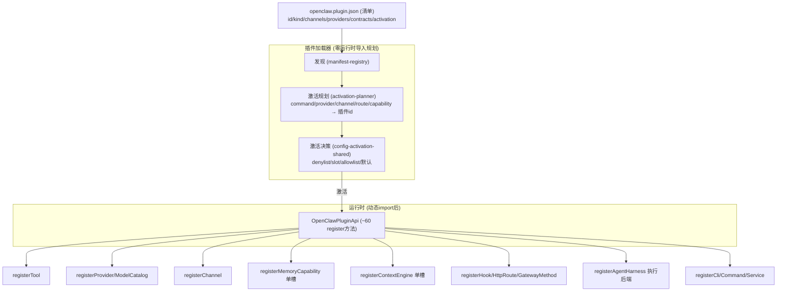

# 第十三部分：扩展机制分析

OpenClaw 的扩展性建立在 **manifest-first 插件架构** 上：核心仅凭 `openclaw.plugin.json` 清单元数据完成发现/配置校验/激活规划，**零运行时导入**；只有激活时才动态 import 入口模块并调 `register(api)`。

## 13.1 扩展点矩阵

| 要添加… | 清单声明 | 运行时调用 | 证据 |
|---|---|---|---|
| **Tool** | `contracts.tools:[...]`, `activation.onCapabilities:["tool"]` | `api.registerTool(factory,{optional})` | `registry.ts:646` |
| **Provider（LLM）** | `providers:[...]`, `providerCatalogEntry`, `modelSupport`, `modelCatalog`, `setup.providers`, `activation.onProviders` | `api.registerProvider(p)` + `registerModelCatalogProvider` | `registry.ts:1052`；`extensions/anthropic` |
| **Channel** | `channels:[...]`, `channelConfigs`, `channelEnvVars`, `activation.onChannels` | `defineChannelPluginEntry` + `api.registerChannel(reg)` | `loader.ts:3231`；`extensions/telegram` |
| **Memory** | `kind:"memory"`（单槽） | `api.registerMemoryCapability({runtime,promptBuilder})` | `slots.ts:13`；默认 `memory-core` |
| **Context-Engine** | `kind:"context-engine"`（单槽） | `registerContextEngine(factory)` | `context-engine/init.ts`；默认 `legacy` |
| **Hook** | `hooks:[...]`, `activation.onCapabilities:["hook"]` | `api.registerHook(...)` | `registry.ts:658` |
| **HTTP route / Gateway method** | `contracts.gatewayMethodDispatch:[...]` | `api.registerHttpRoute` / `registerGatewayMethod` | `extensions/browser:210` |
| **Speech/Media/Image/Video/Music/WebFetch/WebSearch provider** | 对应 `contracts.*Providers[]` + `*Metadata` | `api.registerSpeechProvider` 等 | `types.ts:2719-2737` |
| **CLI 命令 / Service** | `commandAliases`, `activation.onCommands` | `api.registerCli` / `registerCommand` / `registerService` | `types.ts:2666` |
| **Agent Harness（执行后端）** | `activation.onAgentHarnesses:[...]` | `api.registerAgentHarness(...)` | `extensions/codex` |
| **Skill** | `skills:["./skills"]`（或 ClawHub 发布） | 文件系统加载，无 register | `extensions/browser` |
| **MCP server（消费）** | 配置 `mcp.servers.<name>` | 运行时物化为 AgentTool | `agent-bundle-mcp-materialize.ts` |
| **Config migration** | — | `api.registerConfigMigration` / `registerMigrationProvider` | doctor 契约 |

## 13.2 如何新增 Tool

1. 写工具工厂返回 `AgentTool`（`name`/`parameters: TSchema`/`execute`）。
2. 清单声明 `contracts.tools:["myTool"]` + `activation.onCapabilities:["tool"]`。
3. 入口 `register(api)` 中 `api.registerTool(() => myTool, {optional: false})`。
4. 工具自动经策略管线（allow/deny/sandbox）过滤后进运行时。

## 13.3 如何新增 Provider

参考 `extensions/anthropic`：
- 清单：`providers:["x"]`、`modelCatalog`（内嵌模型）、`modelSupport.modelPrefixes`、`modelIdNormalization.aliases`、`providerEndpoints`、`setup`/`providerAuthChoices`（cli/setup-token/api-key）。
- 若复用现有 API 家族（OpenAI-completions 兼容）：仅需 catalog + auth，靠 `compat` 开关。
- 若需自定义 wire：`register.runtime.ts` 注册 API adapter（`registerApiProvider`），实现 `stream`，把原生 SSE 翻译为 `AssistantMessageEvent` 协议。

## 13.4 如何新增 Channel

参考 `extensions/telegram`：
- 全部用 `openclaw/plugin-sdk/channel-*` barrel，**禁止 deep import 核心**。
- `defineChannelPluginEntry` 组装 `ChannelPlugin`（config/outbound/messaging/pairing/allowlist/actions adapter）。
- 实现 `ChannelMessageActionAdapter`（`supportsAction`/`resolveExecutionMode`/`handleAction`）映射 ~60 个可移植动作到原生 API。
- 重运行时拆到 `*.runtime.ts` 保持冷启动懒加载。
- 更新 `.github/labeler.yml` + GH labels（AGENTS.md 要求）。

## 13.5 如何新增 Memory

- 清单 `kind:"memory"`。
- `register` 中 `api.registerMemoryCapability({runtime, promptBuilder, publicArtifacts})`。
- 实现工具（如 `memory_search`/`memory_get` 或 `memory_recall`/`memory_store`）。
- 设 `plugins.slots.memory = "<your-id>"` 选中（否则默认 `memory-core` 占槽）。
- 单槽语义：非选中的 memory 插件自动禁用。

## 13.6 如何新增 Context-Engine

- 清单 `kind:"context-engine"`。
- `registerContextEngine(factory)`，实现 `ContextEngine`（`ingest`/`assemble`/`compact`/可选 `maintain`）。
- 不想自写压缩：调 `delegateCompactionToRuntime` 复用内置。
- legacy 引擎始终作兜底；自定义引擎抛错会被 quarantine 降级。

## 13.7 如何新增 Model

- 不需代码：在 provider 的 `modelCatalog` 加一行（id/api/contextWindow/cost/reasoning/compat），或在 `openclaw.json` config 覆盖（config 权威最高，`authority.ts`）。
- 动态模型：provider 的 `resolveDynamicModel`/`normalizeResolvedModel` 链解析。

## 13.8 如何新增 UI

- Web UI 是 Lit 3 组件（`ui/src`）；插件可经 `pluginSurfaceUrls` 暴露 Canvas 页面（白名单路径 `/__openclaw__/cap/{path}`）。
- 伴侣 App 经 Gateway Protocol 连接，新增节点能力经 `registerNodeHostCommand`。

## 13.9 如何新增 MCP

- **消费外部**：配 `mcp.servers.<name>`（stdio/sse/streamable-http），运行时自动物化工具。
- **暴露 OpenClaw**：`openclaw mcp serve`（渠道会话）或 `plugin-tools-serve`（插件工具）。
- 遵循 VISION：不重复已有 MCP/ACPX/plugin/ClawHub 路径。

## 13.10 扩展机制的黄金法则（`extensions/AGENTS.md`）

1. **元数据在清单**：发现/配置校验/setup/激活靠清单，核心无需导入运行时即可规划。
2. **运行时只做实例化**：`register*` 仅用于实际能力实例化。
3. **新增 seam 加 SDK 子路径**：新增扩展点 = 加类型化 `openclaw/plugin-sdk/*` 子路径，**绝不 reach into `src/**`**。
4. **依赖随运行时归属**：插件专属依赖 plugin-local，root 依赖仅核心 import。
5. **懒激活**：重运行时拆 `*.runtime.ts`，激活规划纯凭清单。

## 13.11 扩展点架构图

