# 第十六部分：复刻指南

假设从零重写 OpenClaw（或同类「多渠道个人 Agent 运行时」），按六阶段推进。每阶段给出模块拆分、开发顺序、验收标准。

## 阶段一：最小可运行版本（MVP）—— 2~4 周

**目标**：一个终端里能跑的单渠道 ReAct Agent。

模块：
1. **LLM 契约层**（仿 `llm-core`）：`Message`/`AssistantMessage`/`ToolResultMessage` 联合、`Model`、`Context`、`Tool`、`StreamFn` 契约、`EventStream`（异步迭代 + 结果 promise）。事件协议：`start/text_delta/thinking_delta/toolcall_*/done/error`。
2. **单 provider adapter**：先接一个（Anthropic 或 OpenAI），把 SSE 翻译为事件协议。**关键契约**：失败编码进流，不抛出。
3. **循环引擎**（仿 `agent-loop.ts`）：`runLoop` —— stream → 检测 toolCall → 执行 → 回灌 → 终止判断。先不做 steering/follow-up。
4. **3 个基础工具**：`read`/`write`/`bash`，TypeBox schema + execute。
5. **CLI**：`chat` 命令，读 stdin，跑循环，流式打印。

**验收**：终端里说「读 X 文件并改 Y」，Agent 能多 turn 调工具完成。

## 阶段二：Agent Runtime（生产化循环）—— 4~6 周

**目标**：可靠的长任务运行时。

模块：
1. **Agent 状态机**（仿 `agent.ts`）：转写/工具/模型状态 + steering/follow-up 队列（`PendingMessageQueue`，drain 模式 all/one-at-a-time）+ 生命周期事件 + abort。
2. **会话树**（仿 `Session`）：append-only `SessionTreeEntry`（message/compaction/branch_summary/leaf），`parentId` 树，SQLite 持久化。
3. **压缩**（仿 `compaction.ts`）：`shouldCompact`（window − reserveTokens）、`findCutPoint`（保留 keepRecentTokens，吸附合法切点不切 toolResult）、结构化摘要（Goal/Progress）。
4. **可靠性状态机**（仿 `run.ts`）：错误分类（overflow/限流/auth/空响应/超时）+ 重试计数 + 失败转移 + idle 断路器 + post-compaction 守卫。
5. **多 provider** + tool-call-repair（修复文本泄漏工具调用）。

**验收**：超长对话自动压缩续写；限流/超时自动重试恢复；可中途 steer。

## 阶段三：Tool System（工具 + MCP + 技能 + 策略）—— 4~6 周

模块：
1. **工具策略管线**：profile/allow-deny/sandbox/subagent/inherited 分层。
2. **沙箱**：read/write/edit/exec 的沙箱包装 + 网络 SSRF 策略。
3. **MCP 客户端**：连 stdio/sse/streamable-http server，`tools/list` → 物化为 AgentTool（名字前缀防冲突，ContentBlock 转换）。
4. **MCP 服务端**：暴露工具/会话给外部。
5. **技能系统**：SKILL.md frontmatter 解析、`<available_skills>` 广告、模型 read 加载。
6. **完整内置工具集**：扩到 messages/cron/nodes/媒体等。

**验收**：能接外部 MCP server；能按需读技能；工具受策略/沙箱约束。

## 阶段四：Memory —— 4~6 周

模块：
1. **会话转写索引**：SQLite + FTS5（关键词）。
2. **Embedding + 向量**：sqlite-vec（或嵌入式向量库），本地/远程 embedding provider，worker 隔离。
3. **混合检索**：FTS + 向量 + MMR 去重 + 时间衰减。
4. **长期记忆文件**：`MEMORY.md` + promotion（短期高频 recall → 长期）+ 文件预算淘汰。
5. **单插件槽机制**：`kind:"memory"` 单槽决策。
6. **可插拔上下文引擎**：`ContextEngine` 接口 + 注册表 + quarantine 容错 + legacy 兜底。

**验收**：Agent 能 `memory_search` 召回历史；长期记忆跨会话生效；可换记忆后端。

## 阶段五：Multi-Agent + 多渠道 —— 6~10 周

模块：
1. **Gateway 控制平面**：WebSocket + 自定义协议（TypeBox schema + 惰性编译 + 版本协商）+ auth/scope/限流 + 方法注册表。
2. **渠道抽象**：transport-only 适配器契约 + 可移植动作词表 + 入站事件归一化/分类/门控/去抖 + 路由（resolve-route + session-key + bindings）。
3. **接 2~3 个渠道**：先 Telegram（grammy 最简）+ Discord + WebChat。
4. **子代理**：`sessions_spawn`（depth=1）+ 子代理登记表（SQLite）+ heartbeat 唤醒 + 完成 announce。
5. **A2A**：`sessions_send` 有界 ping-pong。
6. **cron**：SQLite 调度，避开整点。

**验收**：一个 Gateway 接多渠道；Agent 能派生子代理并行 + 汇总；定时任务能唤醒 Agent。

## 阶段六：生产级能力 —— 持续

模块：
1. **插件架构**：manifest-first + 懒激活规划（零运行时导入）+ `register(api)` + bundle 格式。
2. **doctor + 配置迁移**：canonical config + `doctor --fix` 迁移契约 + 状态迁移。
3. **Web Control UI**：Lit/React + Canvas 沙箱 iframe + device-auth。
4. **伴侣 App + Node Host**：跨设备命令执行 + 节点能力。
5. **ACP**：驱动外部 agent 后端（Codex 等）。
6. **可观测/安全**：日志、指标（OTEL/Prometheus 扩展）、凭证管理、GHSA 流程。
7. **打包分发**：npm/Docker/Nix + 守护进程（launchd/systemd/schtasks）+ onboard 向导。

## 16.1 详细 Roadmap 图

```mermaid
gantt
  title OpenClaw 复刻 Roadmap
  dateFormat X
  axisFormat %s
  section 阶段一 MVP
  LLM契约+EventStream     :a1, 0, 1
  单provider adapter      :a2, after a1, 1
  runLoop循环引擎         :a3, after a1, 1
  基础工具+CLI            :a4, after a3, 1
  section 阶段二 Runtime
  Agent状态机+队列        :b1, after a4, 1
  会话树+SQLite           :b2, after a4, 1
  压缩                    :b3, after b2, 1
  可靠性状态机            :b4, after b1, 2
  section 阶段三 Tools
  策略管线+沙箱           :c1, after b4, 1
  MCP双向                 :c2, after c1, 1
  技能系统                :c3, after c1, 1
  section 阶段四 Memory
  FTS+向量+混合检索       :d1, after c2, 2
  长期记忆+promotion      :d2, after d1, 1
  上下文引擎可插拔        :d3, after d1, 1
  section 阶段五 Multi
  Gateway控制平面         :e1, after d3, 2
  渠道抽象+接渠道         :e2, after e1, 2
  子代理+A2A+cron         :e3, after e1, 2
  section 阶段六 生产
  插件架构+doctor         :f1, after e3, 2
  UI+App+ACP+分发         :f2, after f1, 3
```

## 16.2 复刻难度排序（投入估计）

| 模块 | 难度 | 主要难点 |
|---|---|---|
| 渠道适配（23+） | ★★★★★ | 纯体力 + 各渠道异构 + 长期维护 |
| 可靠性状态机（run.ts） | ★★★★★ | 真实流量打磨的长尾错误处理 |
| 会话树 + 双轨上下文 | ★★★★ | 树形 + 压缩 + 分支 + quarantine |
| Gateway 协议 + 控制平面 | ★★★★ | 协议设计 + auth/scope + 热重载 |
| manifest-first 插件 + 懒激活 | ★★★★ | 零运行时导入的激活规划 |
| 混合检索记忆 | ★★★ | embedding + 向量 + 融合排序 |
| 循环引擎（agent-core） | ★★★ | steering/follow-up + 事件协议 |
| 多 provider + tool-repair | ★★★ | compat 矩阵 + 文本泄漏修复 |
| 工具/MCP/技能 | ★★ | 契约清晰，相对直接 |
| MVP 循环 | ★★ | 范式成熟 |
