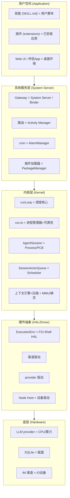

# 第十七部分：Agent OS 映射分析

把 OpenClaw 视为「Agent 操作系统」的一部分，将其模块映射到经典 OS 概念。

## 17.1 OS 概念映射表

| OS 概念 | OpenClaw 对应模块 | 说明 |
|---|---|---|
| **Kernel（内核）** | `@openclaw/agent-core` 的 `runLoop` + `src/agents/embedded-agent-runner/run.ts` | 调度「思考-行动」基本循环，是最小不可分的执行核心 |
| **Process（进程）** | `AgentSession` / 一次 run / 子代理 run | 每个会话/运行是一个「Agent 进程」，有生命周期、状态、abort |
| **PCB（进程控制块）** | `AgentState` + `subagent-registry` 条目 | 持有进程状态（streaming/pendingToolCalls/errorMessage）与登记信息 |
| **Scheduler（调度器）** | `SessionActorQueue`（每会话串行）+ lane 机制 + `src/cron` | 串行化会话、lane 隔离、定时唤醒 |
| **Memory（内存管理）** | 上下文引擎 + 压缩 + 记忆插件 | 上下文窗口 = 主存（有限、需换页/压缩）；长期记忆 = 磁盘 |
| **虚拟内存/换页** | 压缩（compaction）+ checkpoint | 超窗时「换出」旧历史为摘要，保留工作集（keepRecentTokens） |
| **IPC（进程间通信）** | `sessions_send`（A2A）+ `enqueueSystemEvent`+`heartbeat`（唤醒）+ subagent announce | Agent 间通过会话键 + 系统事件通信 |
| **Driver（驱动）** | 渠道适配器（`src/channels`）+ provider adapter（`src/llm/providers`） | 把异构硬件（渠道/模型）抽象为统一接口 |
| **HAL（硬件抽象层）** | `ExecutionEnv`（FileSystem + Shell，`harness/types.ts:350`）+ Node Host | 抽象文件系统/shell/设备，使 harness 可移植 |
| **Filesystem（文件系统）** | 会话树（append-only）+ SQLite（state + 每Agent库）+ `MEMORY.md` | 持久化的命名空间 |
| **Permission（权限）** | 工具策略管线 + scope（gateway）+ sandbox + exec 审批 | 多层访问控制 |
| **Package Manager（包管理）** | 插件加载器（manifest-first）+ ClawHub + npm 分发 | 发现/安装/激活能力包 |
| **System Call（系统调用）** | 工具调用（AgentTool.execute）+ Gateway RPC 方法 | Agent 通过工具/RPC 请求内核服务 |
| **Init / Bootloader** | `src/entry.ts` + `src/gateway/server.impl.ts` startup + daemon | 启动序列 |
| **Service Manager（服务管理）** | `src/daemon`（launchd/systemd/schtasks） | 守护进程监督 |
| **Device（设备）** | Node Host（跨设备节点） | 远程设备作为可调用资源 |
| **Shell / Terminal** | CLI（`src/cli`）+ terminal-core | 用户与系统交互界面 |
| **Network Stack** | Gateway Protocol v4（WS）+ net-policy/SSRF | 通信协议栈 + 网络策略 |

## 17.2 分层对应图

## 17.3 缺失的 Agent OS 能力

OpenClaw 作为「个人 Agent OS」相对完整，但若按「通用 Agent OS」标准衡量，缺失：

1. **真正的多 Agent 调度器**：无中心化任务队列→worker 池的抢占式调度；只有单层委派 + 每会话串行。无优先级调度、无资源配额（除子代理数量上限）。
2. **资源隔离与配额（cgroups 类比）**：无 per-agent 的 token/成本/CPU 硬配额机制（有 idle 断路器但非配额）。
3. **Agent 间共享内存/黑板（shared memory）**：无跨 Agent 共享状态原语，IPC 仅消息式。
4. **能力发现的标准服务（service discovery）**：插件发现是清单驱动的静态发现，无运行时动态服务注册中心（ClawHub 是外部市场）。
5. **嵌套规划/层级编排（进程树深度）**：刻意限制 depth=1，无原生的深层进程树。
6. **抢占与时间片**：会话串行执行，无 turn 级抢占（只能 abort 整个 run）。
7. **统一的事务/回滚**：会话树支持分支但无跨工具的事务语义（工具副作用不可原子回滚）。
8. **形式化的权限能力模型（capability-based security 完整版）**：有分层策略，但非细粒度 capability token 传递。

## 17.4 OpenClaw 在 Agent OS 谱系中的位置

- **像 Android**：Gateway = System Server（Binder/控制平面），插件 = APK，渠道驱动 = HAL，技能 = 用户脚本。它提供「框架 + 运行时 + 应用商店愿景（ClawHub）」，而非裸内核。
- **不像 Linux Kernel**：它不管理裸算力/内存的最底层（那是 LLM provider + Node 运行时 + SQLite），它工作在「框架/系统服务」层。
- **核心创新**：把「上下文窗口当主存 + 压缩当换页 + 会话树当文件系统 + 渠道当 IO 设备 + 工具当系统调用」这套 OS 隐喻**工程化落地**，且做到生产可靠。

详细的分层定位见第二十一部分。
