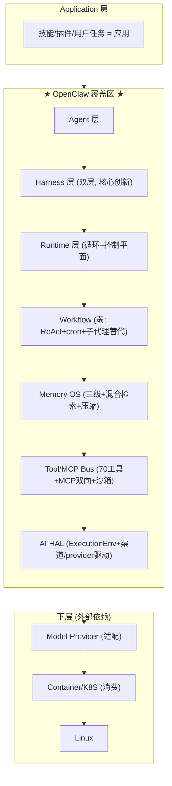

# 第二十一部分：Agentic OS 分层定位

## 21.1 给定的 Agentic OS 分层栈

```
Agent
  ↓
Harness
  ↓
Runtime
  ↓
Workflow Engine
  ↓
Memory OS
  ↓
Tool/MCP Bus
  ↓
AI HAL
  ↓
Model Provider
  ↓
Container/K8S
  ↓
Linux
```

## 21.2 OpenClaw 覆盖哪几层？

OpenClaw **横跨从 Agent 到 AI HAL 的中上部 5~6 层**，向下依赖 Model Provider / Container / Linux，**不拥有底层**。逐层定位：

| 栈层 | OpenClaw 覆盖度 | 对应实现 |
|---|---|---|
| **Agent** | ✅ 完整拥有 | `AgentSession` / run / 子代理；系统提示定义 Agent 人格与能力 |
| **Harness** | ✅✅ 双层拥有（核心创新） | `CoreAgentHarness`（库级）+ `AgentHarness` 契约（可插拔后端，含 Codex） |
| **Runtime** | ✅ 完整拥有 | `agent-core` 循环 + `embedded-agent-runner` 可靠性状态机 + Gateway 控制平面 |
| **Workflow Engine** | ⚠️ 部分/刻意弱 | **无独立工作流引擎**；ReAct 循环 + steering + cron + 单层子代理替代；`VISION.md:124` 明确不做重编排 |
| **Memory OS** | ✅ 完整拥有 | 三级记忆 + 混合检索 + dreaming + 上下文引擎 + 压缩（=内存管理 + 换页） |
| **Tool/MCP Bus** | ✅ 完整拥有 | 70 工具 + MCP 双向 + 技能 + 策略管线 + 沙箱（=系统调用总线） |
| **AI HAL** | ✅ 拥有 | `ExecutionEnv`（FS+Shell HAL）+ 渠道驱动 + provider 驱动 + Node Host 设备抽象 |
| **Model Provider** | ⚠️ 适配不拥有 | 8 API 家族 adapter + 70 provider 插件，但模型本体是外部依赖 |
| **Container/K8S** | ❌ 仅消费 | Docker/Nix/fly.toml/render.yaml 部署目标，不管理编排 |
| **Linux** | ❌ 依赖 | Node ≥22.19 运行其上 |

## 21.3 向上提供什么能力？

OpenClaw 向「应用层」（技能、插件、用户）提供：
1. **统一的 Agent 调用面**：经渠道消息 / Gateway RPC / SDK / CLI 调用一个能真实执行的助理。
2. **能力即插件**：manifest 插件 + MCP + 技能，应用层无需碰核心即可扩展能力。
3. **多渠道呈现**：可移植呈现/动作自动适配 23+ 渠道。
4. **会话与记忆服务**：持久会话树 + 跨会话长期记忆。
5. **跨设备执行**：Node Host 把多设备暴露为可调用资源。
6. **可插拔执行后端**：能驱动外部 agent（Codex）作为后端。

## 21.4 向下依赖什么能力？

1. **Model Provider**：LLM 推理算力（Anthropic/OpenAI/Google/...70 家）。
2. **Node 运行时 + 原生扩展**：JS 执行、sqlite-vec、node-llama-cpp。
3. **操作系统**：文件系统、进程（shell exec）、网络、守护进程（launchd/systemd/schtasks）。
4. **Container/部署平台**：可选 Docker/Nix/Fly/Render。
5. **第三方渠道平台 + SDK**：IM 平台 API。

## 21.5 缺失哪些 Agent OS 接口？

1. **Workflow/编排引擎接口**：无声明式 DAG/图编排 API（刻意）。
2. **多 Agent 调度接口**：无优先级/抢占/worker 池调度 API。
3. **资源配额接口**：无 per-agent token/成本/算力配额 API。
4. **Agent 间共享内存接口**：无 shared-memory/黑板 API，IPC 仅消息式。
5. **运行时服务发现接口**：无动态能力注册中心（清单是静态的）。
6. **事务/补偿接口**：工具副作用无原子回滚 API。
7. **分布式 Agent 进程迁移接口**：Node Host 只是远程执行器，无 Agent 进程跨机迁移。
8. **细粒度 capability 安全接口**：有分层策略，无 capability token 传递模型。

## 21.6 纳入完整 Agentic OS 时它扮演什么角色？

**OpenClaw = Agentic OS 的「System Server + Framework + HAL」层**，即对应 **Android Framework / System Server**，而非 Linux Kernel 或裸 Runtime。



## 21.7 与经典 OS 角色的精确对应

| 候选角色 | 是否对应 | 论证 |
|---|---|---|
| **Android Framework** | ✅ **最贴切** | 提供框架 + 系统服务 + HAL + 应用商店愿景（ClawHub），应用（插件/技能）跑在其上；Gateway ≈ System Server/Binder，渠道 ≈ HAL，插件 ≈ APK |
| **System Server** | ✅ 部分 | Gateway 就是控制平面/系统服务进程，管理生命周期/权限/调度/服务 |
| **Linux Kernel** | ❌ | 不管理裸内存/CPU/进程的最底层；那是 Node + LLM provider + OS |
| **Runtime** | ⚠️ 包含但不止于 | 它包含 Runtime 层，但向上延伸到 Agent/Harness，向下到 HAL，远超「纯 Runtime」 |
| **Application** | ❌ | 它是承载应用（技能/插件）的平台，自身不是单一应用 |

## 21.8 终极定位结论

> **OpenClaw 是「个人 Agentic OS 的 Framework + System Server + HAL 三合一」，定位等价于 Android Framework 之于 Android。**

它向上为技能/插件提供统一的 Agent 能力面与多渠道呈现，向下依赖 Model Provider（算力）、Node/OS（执行）、Container（部署）。它**完整拥有** Agent / Harness / Runtime / Memory OS / Tool-MCP Bus / AI HAL 六层，**刻意弱化** Workflow Engine 层，**不拥有** Model Provider 本体与底层 Container/Linux。

它真正的历史意义在于：**第一个把「Agent OS」从概念隐喻（上下文=内存、压缩=换页、会话树=文件系统、工具=系统调用、渠道=IO 设备、插件=应用包）以产品级工程质量完整落地的开源系统** —— 即便它在多 Agent 编排与多用户规模上有明确的、刻意的边界。
