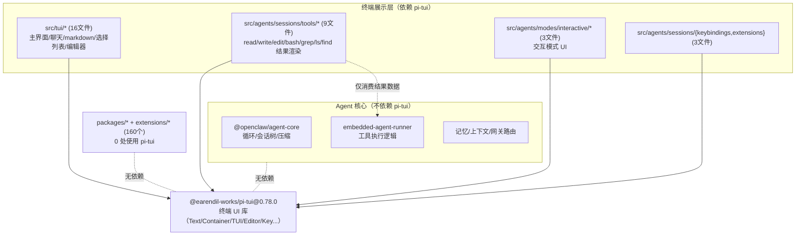

# OpenClaw 对 `pi` 的依赖梳理

> 结论先行：OpenClaw **不依赖任何 “pi agent”（推理/agent 后端）**；它**只依赖一个名字带 pi 的终端 UI 库 `@earendil-works/pi-tui`**，且严格隔离在「终端展示层」，不参与任何 agent 决策/循环/工具执行逻辑。

---

## 1. 两个必须区分的东西

| 名称 | 是什么 | OpenClaw 是否依赖 |
|---|---|---|
| **pi-agent**（pi 推理/agent 后端） | 一个 agent 推理框架/后端 | **否** ❌ —— 全仓库（package.json / 各包与扩展 / 源码 import / lockfile）无任何 `pi-agent`、`@*/pi`、pi 推理后端依赖。agent 能力由自研 `@openclaw/agent-core` 承担。 |
| **`@earendil-works/pi-tui`** | 终端 UI 组件库（渲染文字/框/编辑器/选择列表/键盘事件） | **是** ✅ —— 版本 `0.78.0`，仅做 TUI 绘制。 |

AGENTS.md 中出现的 “Pi-style runtimes” 是**描述性措辞**（指「类 Pi 风格的运行时」这一类别，用于代码评审范围提示），**不是**依赖声明。

---

## 2. pi-tui 依赖声明位置

| 文件 | 内容 |
|---|---|
| `package.json:1957` | `"@earendil-works/pi-tui": "0.78.0"` —— 根直接依赖 |
| `pnpm-workspace.yaml:39` | 列入 `minimumReleaseAgeExclude`（豁免发布延迟门槛，即允许使用新版本而不等待最小发布周期） |
| `pnpm-lock.yaml` | 锁定 `0.78.0`（根直接依赖）与 `0.76.0`（传递依赖的旧版本，被其他包间接拉入）；包要求 `engines.node >= 22.12.0` |

---

## 3. 使用范围：高度隔离

- **仅核心 `src/` 用，共 31 个文件**。
- **`packages/`（21 个内部包）：0 处使用**。
- **`extensions/`（139 个插件）：0 处使用**。

即 pi-tui 完全隔离在 OpenClaw 主体的终端展示层，未渗透到内部包契约或插件生态。

### 3.1 31 个使用文件按模块分组

| 模块 | 文件数 | 文件 |
|---|---:|---|
| **TUI 主界面 + 组件** (`src/tui/`) | 16 | `tui.ts`, `tui-overlays.ts`, `tui-command-handlers.ts`, `tui-local-shell.ts`, `tui-session-actions.ts`, `commands.ts`, `theme/theme.ts`, `components/`（`assistant-message`, `btw-inline-message`, `chat-log`, `custom-editor`, `filterable-select-list`, `hyperlink-markdown`, `markdown-message`, `searchable-select-list`, `selectors`, `tool-execution`） |
| **工具结果渲染** (`src/agents/sessions/tools/`) | 9 | `read.ts`, `write.ts`, `edit.ts`, `bash.ts`, `grep.ts`, `ls.ts`, `find.ts`, `render-utils.ts`（+ `keybindings.ts`） |
| **交互模式** (`src/agents/modes/interactive/`) | 3 | `components/visual-truncate.ts`, `components/keybinding-hints.ts`, `theme/theme.ts` |
| **会话扩展/键位** (`src/agents/sessions/`) | 3 | `keybindings.ts`, `extensions/types.ts`, `extensions/runner.ts` |

### 3.2 导入的符号频次（全是 UI 原语，无 agent 逻辑）

| 符号 | 次数 | 用途 |
|---|---:|---|
| `Text` | 12 | 文本渲染原语 |
| `Container` | 9 | 布局容器 |
| `Component` | 9 | 组件基类型 |
| `TUI` | 7 | 终端 UI 根对象 |
| `Spacer` | 6 | 间距 |
| `matchesKey` | 4 | 键盘事件匹配 |
| `KeyId` | 4 | 键位标识类型 |
| `truncateToWidth` | 2 | 按终端宽度截断文本 |
| `Keybinding` | 2 | 键位绑定类型 |
| `Key` / `isKeyRelease` | 2/2 | 键事件 |
| `getCapabilities` | 2 | 探测终端能力 |
| `Box` | 2 | 盒布局 |
| `Editor` | 1 | 行内编辑器 |
| `getKeybindings` | 1 | 取键位表 |
| `getImageDimensions` / `imageFallback` | 1/1 | 终端图片度量/回退 |

全部为「在终端里怎么画」的原语，**不涉及** agent 决策、循环、工具执行、模型调用、会话/记忆逻辑。

---

## 4. 依赖隔离关系图

关键：工具渲染文件（read/write/bash 等）**只是消费工具执行产生的结果数据并画到终端**，工具的执行逻辑本身在 agent-core / embedded-runner 中，**不碰 pi-tui**。

---

## 5. 移除 / 替换评估

| 维度 | 评估 |
|---|---|
| 影响面 | 仅 `src/` 的 31 个文件（TUI 16 + 工具渲染 9 + 交互 3 + 会话键位 3） |
| 是否影响 agent 核心能力 | **否**。循环/会话/压缩/工具执行/记忆/网关全不依赖 pi-tui |
| 是否影响插件生态 | **否**。139 扩展 + 21 内部包 0 使用 |
| 其他入口 | Web UI（Lit/Vite）、SDK、渠道 各有独立呈现栈，不经 pi-tui |
| 替换难度 | 中等：需替换终端 UI 原语（Text/Container/TUI/Editor/Key 事件）+ 工具结果渲染，agent 逻辑零改动 |
| 风险点 | pi-tui 是外部库、迭代较快（lockfile 已现 0.76→0.78），但因隔离良好，升级/替换的爆炸半径限于展示层 |

---

## 6. 一句话总结

- **pi agent（推理后端）：从不依赖** —— agent 能力 100% 由自研 `@openclaw/agent-core` 提供。
- **pi-tui（终端 UI 库）：依赖 `@earendil-works/pi-tui@0.78.0`**，仅用于终端绘制，隔离在 `src/` 展示层的 31 个文件，不触及核心逻辑与插件生态。
