# OpenClaw 项目深度分析文档

> **项目**: OpenClaw - Personal AI Assistant  
> **分析维度**: 源码级 + 架构级 + 产品级 + 生态级  
> **分析日期**: 2026-06-23

---

## 第一部分：项目定位分析

### 1.1 项目解决什么问题

OpenClaw 是一个**个人AI助手运行时**，运行在用户自有设备上，通过用户已使用的消息渠道（WhatsApp、Telegram、Discord、Slack等）进行交互。它不是一个简单的聊天机器人，而是一个**具备完整工具执行能力的AI Agent运行时**。

**核心问题域**:
- 跨平台消息渠道的统一接入
- 本地化的AI助手运行（数据不经过第三方服务器）
- 灵活的Tool/ToolCall执行能力
- 多会话管理和上下文保持
- Subagent（子代理）协作机制

### 1.2 为什么诞生

OpenClaw 起源于一个个人实验项目，经历了多个阶段演进：
- **Warelay** → **Clawdbot** → **Moltbot** → **OpenClaw**

核心驱动力：
1. **个人隐私**: 用户希望在自有设备上运行AI，数据不离开本地
2. **多渠道统一**: 用户使用多个消息平台，希望有统一入口
3. **真正的"能做事"的AI**: 不仅是聊天，而是能执行shell命令、读写文件、操作浏览器等
4. **开发者友好**: TypeScript生态，便于扩展和定制

### 1.3 替代什么方案

| 被替代方案 | OpenClaw优势 |
|-----------|-------------|
| 云端AI助手（ChatGPT网页版） | 本地运行，数据不离开设备 |
| 单一平台的聊天机器人 | 多渠道统一接入 |
| 简单的AI API调用脚本 | 完整的Agent运行时、Tool系统、Memory系统 |
| 其他Agent框架的闭源版本 | 完全开源，可自托管 |

### 1.4 对标产品

| 产品 | OpenClaw差异化 |
|------|---------------|
| Claude Code / Claude Desktop | 更开放的多渠道支持，本地化运行 |
| LangGraph / CrewAI | 个人级产品，不是企业级框架 |
| AutoGen | 更聚焦于个人助手场景 |
| OpenHands | 类似的 computer-use 能力，但更强调个人隐私 |
| Apple Intelligence / Microsoft Copilot | 完全自托管，用户拥有数据 |

### 1.5 核心价值

```
┌─────────────────────────────────────────────────────────────┐
│                     OpenClaw Core Value                      │
├─────────────────────────────────────────────────────────────┤
│  🏠 本地优先     │ 你的数据在你自己的设备上                   │
│  📱 全渠道       │ 一个助手，所有消息平台                   │
│  🔧 真工具执行   │ 不只是聊天，能执行shell/文件/浏览器       │
│  🔌 可扩展       │ Plugin + MCP + Skills 生态               │
│  🛡️ 安全默认    │ 沙箱隔离，权限控制，DM pairing           │
└─────────────────────────────────────────────────────────────┘
```

### 1.6 用户画像

| 用户类型 | 使用场景 |
|---------|---------|
| 技术用户 | 本地开发助手，通过CLI/Terminal交互 |
| 隐私敏感用户 | 不希望数据经过第三方服务器 |
| 效率爱好者 | 多渠道统一管理，自动化任务 |
| 开发者 | 构建自定义Agent和工作流 |

### 1.7 使用场景

1. **个人助手**: 日程管理、信息查询、任务自动化
2. **开发伴侣**: 代码审查、重构建议、文档生成
3. **多渠道客服**: 统一管理多个消息平台的交互
4. **自动化脚本**: Cron作业、Webhook触发、事件驱动
5. **Computer Use**: 浏览器自动化、桌面操作

### 1.8 核心竞争力

1. **多渠道消息路由**: 支持30+消息平台
2. **本地化运行时**: 数据不离开设备
3. **Subagent架构**: 支持复杂的多Agent协作
4. **Plugin生态**: 100+插件，支持MCP
5. **安全沙箱**: Docker/OpenShell隔离非信任代码

### 1.9 技术护城河

- **多渠道协议适配**: 深度适配各平台的Webhook/API差异
- **ACPX协议**: 私有Agent通信协议，支持复杂多Agent场景
- **Tool Call修复**: 自动检测和修复模型Tool Call错误
- **Context压缩**: 智能的上下文管理，支持长对话
- **跨平台Gateway**: 统一的管理平面

---

## 第二部分：整体架构分析

### 2.1 架构总览图（Mermaid）

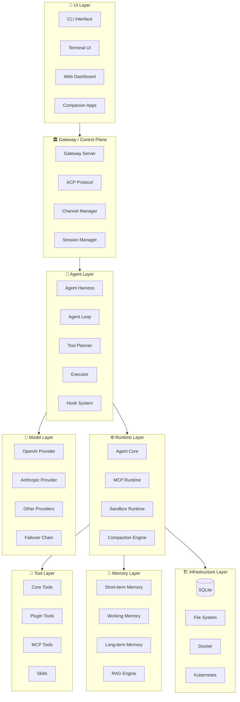

### 2.2 层间调用关系

```
┌──────────────────────────────────────────────────────────────────────┐
│                          调用关系拓扑                                 │
├──────────────────────────────────────────────────────────────────────┤
│                                                                       │
│  User Input                                                           │
│     │                                                                │
│     ▼                                                                │
│  ┌─────────┐    ┌─────────┐    ┌─────────┐    ┌─────────┐          │
│  │   CLI   │───▶│  TUI    │───▶│Channel  │───▶│Gateway  │          │
│  └─────────┘    └─────────┘    │Plugins  │    │Server   │          │
│       │                         └─────────┘    └────┬────┘          │
│       │                                              │                │
│       │                          ┌─────────────────┼────────┐     │
│       │                          ▼                 ▼        ▼       │
│       │                   ┌───────────┐   ┌──────────┐ ┌───────┐     │
│       │                   │Session Mgr│   │Subagent  │ │Channel│     │
│       │                   └─────┬─────┘   │Registry  │ │Router │     │
│       │                         │         └──────────┘ └───┬──┘     │
│       │                         ▼                           │        │
│       │               ┌─────────────────┐                   │        │
│       │               │  Agent Harness  │◀──────────────────┘        │
│       │               └────────┬────────┘                             │
│       │                        │                                      │
│       │          ┌─────────────┼─────────────┐                       │
│       │          ▼             ▼             ▼                       │
│       │   ┌──────────┐  ┌──────────┐  ┌──────────┐                   │
│       │   │Tool      │  │ Memory   │  │Model     │                   │
│       │   │Planner   │  │ Manager  │  │Selector  │                   │
│       │   └────┬─────┘  └────┬─────┘  └────┬─────┘                   │
│       │        │             │             │                          │
│       │        ▼             ▼             ▼                          │
│       │   ┌──────────┐  ┌──────────┐  ┌──────────┐                   │
│       │   │Tool      │  │Context   │  │LLM       │                   │
│       │   │Executor  │  │Engine    │  │Runtime   │                   │
│       │   └────┬─────┘  └────┬─────┘  └────┬─────┘                   │
│       │        │             │             │                          │
│       │        └─────────────┼─────────────┘                          │
│       │                      ▼                                        │
│       │               ┌──────────────┐                               │
│       │               │  Agent Loop   │                               │
│       │               └───────┬───────┘                               │
│       │                       │                                       │
│       │                       ▼                                       │
│       │               ┌──────────────┐                               │
│       │               │   Sandbox    │                               │
│       │               │   Runtime    │                               │
│       │               └──────────────┘                               │
│       │                                                               │
└───────┼───────────────────────────────────────────────────────────────┘
        │
        ▼
   Output/Response
```

### 2.3 数据流向

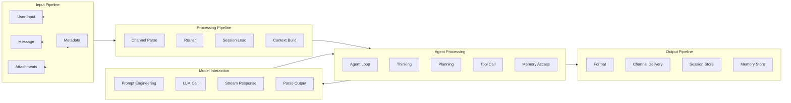

### 2.4 控制流向

```
Control Flow
═════════════

1. CLI/TUI/Channel → Gateway
   └── 用户命令/消息进入Gateway

2. Gateway → Session Manager
   └── 获取/创建会话上下文

3. Session Manager → Agent Harness
   └── 初始化Agent运行环境

4. Agent Harness → Agent Loop
   └── 启动Agent主循环

5. Agent Loop:
   ├──→ Tool Planner (选择可用工具)
   ├──→ Memory Manager (访问上下文)
   ├──→ Model Selector (选择模型)
   └──→ LLM Runtime (发起请求)

6. LLM Runtime → Sandbox
   └── 执行Tool Calls

7. Sandbox → Agent Loop
   └── 返回执行结果

8. Agent Loop → Session Manager
   └── 更新会话状态

9. Session Manager → Channel Router
   └── 格式化响应

10. Channel Router → Channel Plugins
    └── 发送到目标平台
```

---

## 第三部分：代码目录逆向分析

### 3.1 目录树结构

```
openclaw/
├── src/                          # 核心源码
│   ├── entry.ts                  # 程序入口
│   ├── index.ts                  # 主导出
│   ├── runtime.ts                # 运行时抽象
│   │
│   ├── acp/                      # Agent Communication Protocol
│   │   ├── control-plane/        # 控制平面
│   │   ├── runtime/              # 运行时实现
│   │   ├── translator.ts          # 协议翻译器
│   │   └── client.ts             # ACP客户端
│   │
│   ├── agents/                   # Agent核心
│   │   ├── harness/              # Agent Harness
│   │   │   ├── lifecycle.ts       # 生命周期管理
│   │   │   ├── compaction/       # 上下文压缩
│   │   │   └── session/          # 会话管理
│   │   ├── runtime/              # Agent运行时
│   │   │   ├── proxy.ts          # 流代理
│   │   │   └── index.ts
│   │   ├── modes/                # Agent模式
│   │   │   └── interactive/      # 交互模式
│   │   ├── sandbox/              # 沙箱执行
│   │   ├── sessions/             # 会话管理
│   │   ├── tools/                # 工具管理
│   │   └── embedded-agent-*.ts    # 内嵌Agent
│   │
│   ├── channels/                 # 消息渠道
│   │   ├── plugins/              # 渠道插件
│   │   ├── transport/            # 传输层
│   │   ├── message/              # 消息处理
│   │   └── streaming.ts          # 流式处理
│   │
│   ├── commands/                 # CLI命令
│   │   ├── agent/                # Agent命令
│   │   ├── doctor/               # 诊断命令
│   │   └── gateway/              # Gateway命令
│   │
│   ├── config/                   # 配置管理
│   ├── cli/                      # CLI框架
│   ├── daemon/                   # 守护进程
│   ├── gateway/                  # Gateway服务
│   │
│   ├── memory/                   # 内存管理
│   ├── memory-host-sdk/          # Memory SDK
│   │
│   ├── mcp/                      # MCP协议
│   ├── plugins/                  # 插件系统
│   ├── plugin-sdk/               # Plugin SDK
│   │
│   ├── skills/                   # Skills系统
│   │   ├── lifecycle/            # 生命周期
│   │   ├── discovery/            # 发现机制
│   │   ├── runtime/              # 运行时
│   │   └── workshop/             # Workshop
│   │
│   ├── tools/                    # 工具系统
│   │   ├── planner.ts            # 工具规划器
│   │   ├── availability.ts       # 可用性检查
│   │   └── types.ts              # 类型定义
│   │
│   ├── infra/                    # 基础设施
│   ├── logging/                  # 日志系统
│   ├── state/                    # 状态管理
│   │
│   ├── llm/                      # LLM抽象
│   ├── model-catalog/            # 模型目录
│   ├── provider-runtime/         # Provider运行时
│   │
│   └── utils/                    # 工具函数
│
├── packages/                     # 核心包
│   ├── agent-core/               # Agent核心包
│   │   ├── src/
│   │   │   ├── agent.ts          # Agent类
│   │   │   ├── agent-loop.ts     # Agent循环
│   │   │   ├── types.ts          # 类型定义
│   │   │   ├── harness/          # Harness实现
│   │   │   └── validation.ts     # 验证
│   │   └── package.json
│   │
│   ├── llm-core/                 # LLM核心
│   ├── llm-runtime/              # LLM运行时
│   ├── acp-core/                 # ACP核心
│   ├── gateway-protocol/         # Gateway协议
│   ├── plugin-sdk/               # Plugin SDK
│   ├── memory-host-sdk/          # Memory SDK
│   ├── model-catalog-core/       # 模型目录
│   ├── tool-call-repair/         # Tool调用修复
│   └── sdk/                     # 公共SDK
│
├── extensions/                   # 扩展插件
│   ├── openai/                   # OpenAI Provider
│   ├── anthropic/                # Anthropic Provider
│   ├── google/                   # Google Provider
│   ├── discord/                   # Discord Channel
│   ├── telegram/                 # Telegram Channel
│   ├── slack/                    # Slack Channel
│   ├── browser/                  # Browser Tool
│   ├── canvas/                   # Canvas Tool
│   ├── codex/                    # Codex集成
│   ├── memory-*/                 # Memory插件
│   └── ... (100+ 插件)
│
├── ui/                          # 用户界面
├── apps/                        # 应用
├── docs/                        # 文档
├── test/                        # 测试
├── scripts/                     # 脚本
└── qa/                         # QA场景
```

### 3.2 核心目录详解

#### 3.2.1 `packages/agent-core/src/` - Agent核心

| 文件 | 职责 | 核心类/函数 |
|------|------|------------|
| `agent.ts` | Agent类定义 | `Agent`, `AgentOptions` |
| `agent-loop.ts` | Agent主循环 | `runAgentLoop`, `agentLoop` |
| `types.ts` | 类型定义 | `AgentContext`, `AgentMessage`, `AgentTool` |
| `validation.ts` | 参数验证 | `validateToolArguments` |
| `reasoning.ts` | 推理配置 | `resolveAgentReasoningOption` |
| `runtime-deps.ts` | 运行时依赖 | `AgentCoreRuntimeDeps` |
| `harness/agent-harness.ts` | Harness实现 | `CoreAgentHarness` |

#### 3.2.2 `src/agents/` - Agent运行时

| 目录 | 职责 |
|------|------|
| `harness/` | Agent Harness实现，包含生命周期管理、上下文压缩 |
| `runtime/` | Agent运行时代理，处理流式响应 |
| `sessions/` | 会话管理，支持多会话并发 |
| `sandbox/` | 沙箱执行环境 |
| `tools/` | 工具注册和执行 |
| `modes/` | Agent运行模式（交互式等） |

#### 3.2.3 `src/tools/` - 工具系统

```typescript
// src/tools/planner.ts
export function buildToolPlan(options: BuildToolPlanOptions): ToolPlan

// src/tools/types.ts
export interface ToolDescriptor {
  name: string
  title?: string
  description: string
  inputSchema: JsonObject
  outputSchema?: JsonObject
  owner: ToolOwnerRef
  executor?: ToolExecutorRef
  availability?: ToolAvailabilityExpression
}

export interface ToolPlan {
  visible: readonly ToolPlanEntry[]
  hidden: readonly HiddenToolPlanEntry[]
}
```

#### 3.2.4 `src/channels/` - 渠道系统

| 组件 | 职责 |
|------|------|
| `plugins/` | 渠道插件（Discord、Telegram等） |
| `transport/` | 传输层抽象 |
| `message/` | 消息处理 |
| `session.ts` | 会话路由 |

#### 3.2.5 `packages/` - 核心包

| 包 | 职责 |
|----|------|
| `agent-core` | Agent核心逻辑，与Provider无关 |
| `llm-core` | LLM抽象层 |
| `llm-runtime` | LLM运行时实现 |
| `acp-core` | ACP协议核心 |
| `gateway-protocol` | Gateway通信协议 |
| `plugin-sdk` | Plugin开发SDK |
| `memory-host-sdk` | Memory系统SDK |
| `model-catalog-core` | 模型目录管理 |
| `tool-call-repair` | Tool调用错误修复 |

### 3.3 模块依赖图

```
┌─────────────────────────────────────────────────────────────────────────────┐
│                              模块依赖图                                      │
├─────────────────────────────────────────────────────────────────────────────┤
│                                                                             │
│  packages/agent-core                                                        │
│  ├── types.ts ──────────────► packages/llm-core (导入类型)                  │
│  ├── agent-loop.ts                                                         │
│  │   └──► types.ts (AgentContext, AgentMessage)                            │
│  ├── harness/                                                              │
│  │   ├── agent-harness.ts ──► agent-loop.ts                                │
│  │   ├── session/session.ts                                                │
│  │   └── compaction/compaction.ts                                          │
│  └── validation.ts                                                         │
│           │                                                                │
│           ▼                                                                │
│  src/agents (OpenClaw扩展)                                                 │
│  ├── runtime/index.ts ────► packages/agent-core (继承Agent)                 │
│  ├── embedded-agent-*.ts ──► harness/, runtime/                             │
│  ├── sessions/ ────────────► harness/session/                               │
│  └── tools/ ───────────────► src/tools/ (planner)                          │
│           │                                                                │
│           ▼                                                                │
│  src/ (Gateway核心)                                                        │
│  ├── acp/ ─────────────────► packages/acp-core                            │
│  ├── channels/ ────────────► src/plugins/ (渠道插件)                        │
│  ├── gateway/ ─────────────► acp/, agents/                                  │
│  ├── plugins/ ─────────────► plugin-sdk/                                    │
│  └── skills/ ──────────────► skills/                                       │
│           │                                                                │
│           ▼                                                                │
│  extensions/ (Provider/Channel)                                            │
│  ├── openai/ ──────────────► llm-runtime/                                  │
│  ├── anthropic/ ───────────► llm-runtime/                                  │
│  ├── discord/ ─────────────► channels/                                     │
│  ├── browser/ ─────────────► tools/                                        │
│  └── memory-*/ ────────────► memory-host-sdk/                               │
│                                                                             │
└─────────────────────────────────────────────────────────────────────────────┘
```

---

## 第四部分：核心对象模型分析

### 4.1 核心对象列表

| 对象 | 包 | 职责 |
|------|-----|------|
| `Agent` | agent-core | Agent主类，管理循环和状态 |
| `AgentHarness` | agent-core | Agent运行环境包装器 |
| `Session` | agent-core | 会话状态管理 |
| `AgentLoop` | agent-core | Agent主循环引擎 |
| `ToolDescriptor` | tools | 工具定义描述符 |
| `ToolPlan` | tools | 工具规划结果 |
| `AgentMessage` | agent-core | Agent消息 |
| `Model` | llm-core | 模型定义 |
| `Skill` | harness | 技能定义 |
| `PromptTemplate` | harness | 提示模板 |

### 4.2 核心对象详细分析

#### 4.2.1 Agent

```typescript
// packages/agent-core/src/agent.ts
class Agent {
  private state: MutableAgentState
  private activeRun?: ActiveRun

  // 核心方法
  run(prompts: AgentMessage[]): Promise<AgentMessage[]>
  runStream(prompts: AgentMessage[]): EventStream<AgentEvent, AgentMessage[]>
  continue(): Promise<AgentMessage[]>
  
  // 生命周期
  stop(): void
  isRunning(): boolean
}
```

**生命周期状态**:
```
┌─────────┐    run()    ┌──────────┐   完成/停止   ┌─────────┐
│ Idle    │───────────▶│ Running  │─────────────▶│ Stopped │
└─────────┘             └─────┬────┘              └─────────┘
      ▲                        │
      │                        ▼
      │                   ┌─────────┐
      └───────────────────│ Aborted │
                          └─────────┘
```

#### 4.2.2 AgentHarness

```typescript
// packages/agent-core/src/harness/agent-harness.ts
interface AgentHarness {
  id: string
  resources: AgentHarnessResources
  session: Session
  
  // 核心方法
  runAttempt(params: AgentHarnessAttemptParams): Promise<AgentHarnessAttemptResult>
  
  // 生命周期
  setup(): Promise<void>
  teardown(): Promise<void>
}
```

**Harness生命周期**:
```
┌────────┐   setup()   ┌──────────┐   runAttempt()   ┌─────────┐
│ New    │────────────▶│ Ready    │────────────────▶│ Running │
└────────┘             └──────────┘                  └────┬────┘
      ▲                       │                            │
      │                       │                            ▼
      │                       │                      ┌───────────┐
      └───────────────────────┴─────────────────────│ Completed │
                                                   └───────────┘
```

#### 4.2.3 Session

```typescript
// packages/agent-core/src/harness/session/session.ts
interface Session {
  id: string
  messages: AgentMessage[]
  tools: AgentTool[]
  systemPrompt: string
  model: Model
  
  // 方法
  addMessage(message: AgentMessage): void
  pruneMessages(options: PruneOptions): AgentMessage[]
  getContext(): AgentContext
  checkpoint(): SessionSnapshot
  restore(snapshot: SessionSnapshot): void
}
```

#### 4.2.4 ToolDescriptor

```typescript
// src/tools/types.ts
interface ToolDescriptor {
  name: string                    // 工具名称
  title?: string                  // 显示标题
  description: string             // 描述
  inputSchema: JsonObject         // 输入Schema
  outputSchema?: JsonObject        // 输出Schema
  owner: ToolOwnerRef             // 所有者 (core|plugin|channel|mcp)
  executor?: ToolExecutorRef       // 执行器引用
  availability?: ToolAvailabilityExpression  // 可用性条件
  annotations?: JsonObject         // 注解
  sortKey?: string                 // 排序键
}
```

#### 4.2.5 AgentMessage

```typescript
// packages/agent-core/src/types.ts
interface AgentMessage {
  role: "user" | "assistant" | "toolResult"
  content: ContentBlock[]
  timestamp: number
  usage?: Usage
  stopReason?: StopReason
  errorMessage?: string
  model?: string
  provider?: string
  api?: string
}

type ContentBlock = 
  | { type: "text"; text: string }
  | { type: "image"; url: string }
  | { type: "toolCall"; id: string; name: string; arguments: unknown }
  | { type: "toolResult"; toolCallId: string; content: ContentBlock[] }
```

### 4.3 对象关系图 (ER)

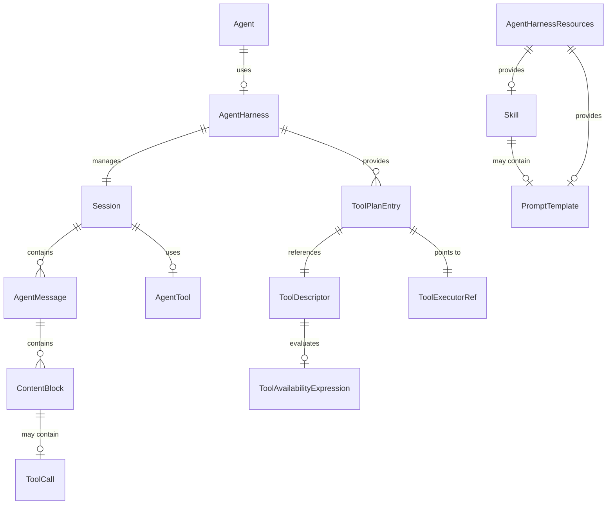

### 4.4 类图简化

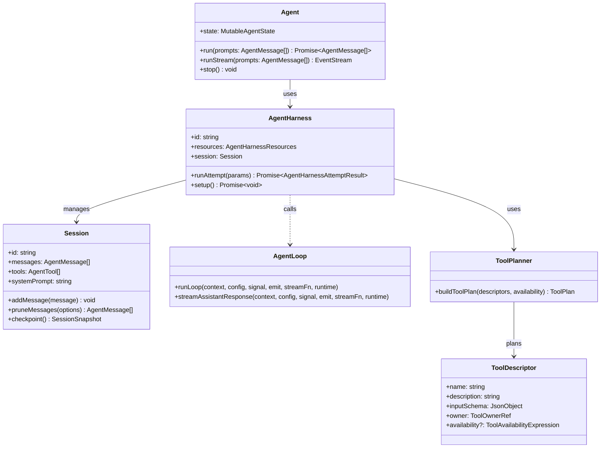

---

## 第五部分：Agent运行机制分析

### 5.1 Agent启动流程

```mermaid
sequenceDiagram
    participant User as User
    participant CLI as CLI/Channel
    participant GW as Gateway
    participant Harness as AgentHarness
    participant Loop as AgentLoop
    participant Model as LLM Runtime
    participant Sandbox as Sandbox

    User->>CLI: 发送消息/命令
    CLI->>GW: 路由到Gateway
    GW->>GW: 创建/加载Session
    GW->>Harness: 创建Harness实例
    Harness->>Harness: setup() 初始化资源
    Harness->>Loop: 启动runAgentLoop()
    Loop->>Model: 构建Prompt
    Model-->>Loop: 返回流式响应
    Loop->>Sandbox: 执行Tool Calls
    Sandbox-->>Loop: 返回Tool结果
    Loop->>Harness: 更新Session
    Harness-->>GW: 返回结果
    GW-->>CLI: 流式响应
    CLI-->>User: 显示结果
```

### 5.2 Agent Loop机制

**核心循环流程** (`packages/agent-core/src/agent-loop.ts`):

```mermaid
flowchart TD
    START([开始]) --> INIT
    
    subgraph INIT["初始化"]
        INIT[创建上下文] --> BUILD_PROMPT[构建Prompt]
        BUILD_PROMPT --> EMIT_START[emit agent_start]
    end
    
    subgraph LOOP["主循环"]
        EMIT_START --> TURN_START[emit turn_start]
        TURN_START --> PROCESS_PENDING[处理pending消息]
        PROCESS_PENDING --> STREAM_RESP[流式LLM响应]
        STREAM_RESP --> PARSE_RESP[解析响应]
        
        PARSE_RESP --> CHECK_STOPS[检查stopReason]
        CHECK_STOPS --> HAS_TOOLS{有Tool Calls?}
        
        HAS_TOOLS -->|Yes| EXEC_TOOLS[执行工具]
        EXEC_TOOLS --> TOOL_RESULTS[收集结果]
        TOOL_RESULTS --> TURN_END[emit turn_end]
        TURN_END --> PREPARE_NEXT[准备下一轮]
        PREPARE_NEXT --> CHECK_STEERING[检查Steering消息]
        CHECK_STEERING --> MORE_STEering?
        
        HAS_TOOLS -->|No| TURN_END
        
        MORE_STeering? -->|Yes| PROCESS_PENDING
        MORE_STeering? -->|No| CHECK_STOP[检查停止条件]
        
        CHECK_STOP -->|继续| STREAM_RESP
        CHECK_STOP -->|停止| AGENT_END[emit agent_end]
    end
    
    CHECK_STOPS -->|error/aborted| END_ABORT[终止处理]
    CHECK_STOPS -->|stop| CHECK_FOLLOWUP{有FollowUp?}
    
    CHECK_FOLLOWUP -->|Yes| ROUTE_FOLLOWUP[路由FollowUp消息]
    ROUTE_FOLLOWUP --> PROCESS_PENDING
    CHECK_FOLLOWUP -->|No| AGENT_END
    
    AGENT_END --> END([结束])
    END_ABORT --> END
```

### 5.3 Tool调用机制

**Tool Planner** (`src/tools/planner.ts`):

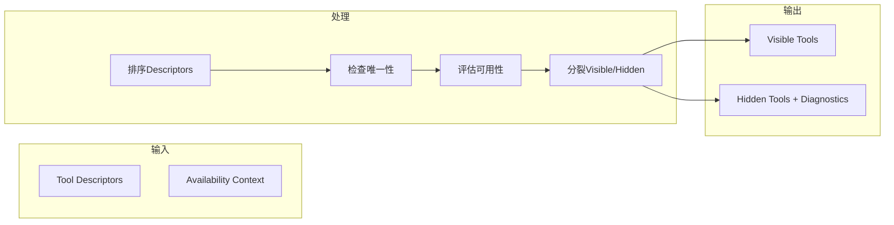

**Tool Execution** (`packages/agent-core/src/agent-loop.ts`):

```typescript
async function executeToolCalls(
  context: AgentContext,
  message: AssistantMessage,
  config: AgentLoopConfig,
  signal: AbortSignal | undefined,
  emit: AgentEventSink,
): Promise<{ messages: ToolResultMessage[]; terminate: boolean }> {
  
  const toolCalls = message.content.filter((c) => c.type === "toolCall")
  
  if (config.toolExecution === "parallel") {
    // 并行执行
    return executeToolCallsParallel(toolCalls, context, config, signal, emit)
  } else {
    // 顺序执行
    return executeToolCallsSequential(toolCalls, context, config, signal, emit)
  }
}
```

### 5.4 Reflection机制

OpenClaw通过**Hook系统**实现Reflection:

```typescript
// Hook类型
interface BeforeToolCallContext {
  assistantMessage: AssistantMessage
  toolCall: AgentToolCall
  args: unknown
  context: AgentContext
}

interface AfterToolCallContext extends BeforeToolCallContext {
  result: AgentToolResult<unknown>
  isError: boolean
}

interface AfterToolCallResult {
  content?: ContentBlock[]
  details?: unknown
  isError?: boolean
  terminate?: boolean
}

// Hook在Agent中的使用
const result = await config.beforeToolCall?.(context, signal)
if (result?.block) {
  // 阻止工具执行
}
```

### 5.5 ReAct/Plan-Execute模式

OpenClaw实现的是**增强的ReAct模式**:

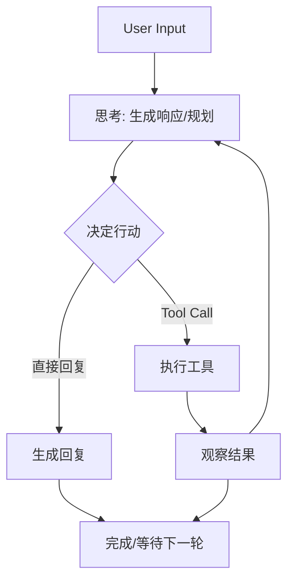

### 5.6 Loop Engineering

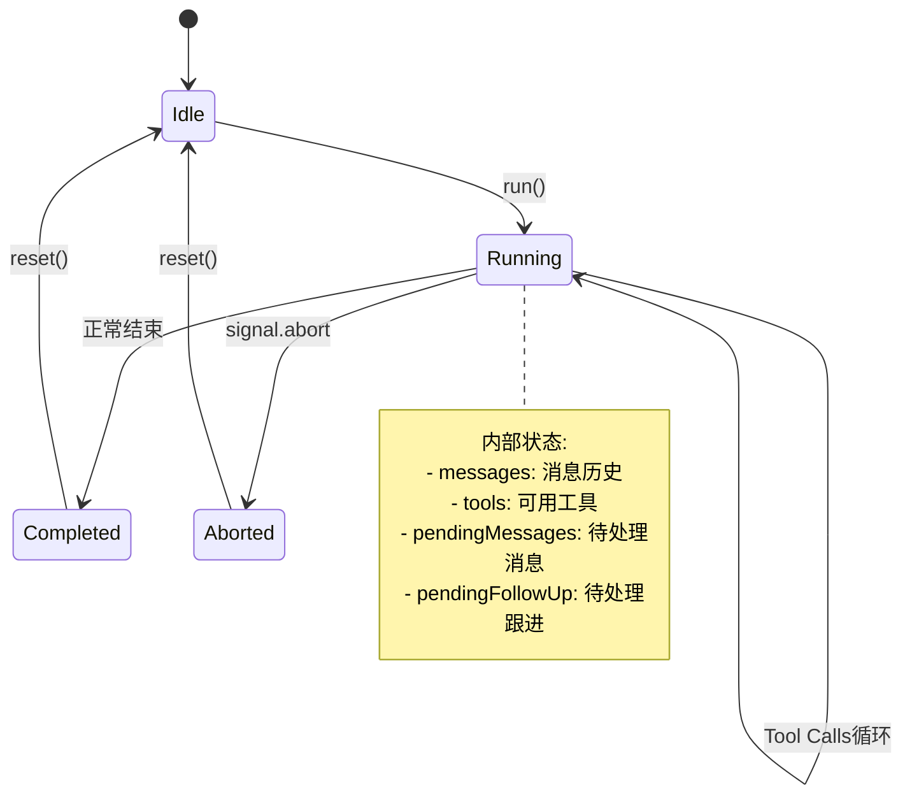

---

## 第六部分：Runtime分析

### 6.1 Runtime职责

```
┌─────────────────────────────────────────────────────────────────────┐
│                         Runtime职责分层                              │
├─────────────────────────────────────────────────────────────────────┤
│                                                                      │
│  ┌─────────────────────────────────────────────────────────────┐     │
│  │                    Agent Runtime                             │     │
│  │  - Agent Loop执行                                            │     │
│  │  - 状态管理                                                  │     │
│  │  - 事件发射                                                  │     │
│  └─────────────────────────────────────────────────────────────┘     │
│                              │                                      │
│                              ▼                                      │
│  ┌─────────────────────────────────────────────────────────────┐     │
│  │                    Harness Runtime                            │     │
│  │  - Session管理                                               │     │
│  │  - Context构建                                               │     │
│  │  - 工具规划                                                  │     │
│  │  - Compaction                                                │     │
│  └─────────────────────────────────────────────────────────────┘     │
│                              │                                      │
│                              ▼                                      │
│  ┌─────────────────────────────────────────────────────────────┐     │
│  │                    Tool Executor Runtime                      │     │
│  │  - 工具发现                                                  │     │
│  │  - 参数验证                                                  │     │
│  │  - 权限检查                                                  │     │
│  │  - 执行隔离                                                  │     │
│  └─────────────────────────────────────────────────────────────┘     │
│                                                                      │
└─────────────────────────────────────────────────────────────────────┘
```

### 6.2 上下文管理

```typescript
// packages/agent-core/src/types.ts
interface AgentContext {
  messages: AgentMessage[]
  tools: AgentTool[]
  systemPrompt: string
  model: Model
  thinkingLevel?: ThinkingLevel
}

// 上下文转换
interface AgentLoopConfig {
  transformContext?: (
    messages: AgentMessage[], 
    signal?: AbortSignal
  ) => Promise<AgentMessage[]>
  
  convertToLlm?: (messages: AgentMessage[]) => Message[] | Promise<Message[]>
}
```

### 6.3 Token管理

```typescript
// Token管理策略
interface TokenBudget {
  maxTokens: number
  reservedForResponse: number
  contextWindow: number
}

// Context修剪策略
interface PruneOptions {
  maxMessages: number
  maxTokens: number
  preserveSystemPrompt: boolean
  preserveLastN: number
}
```

### 6.4 模型调用

```mermaid
sequenceDiagram
    participant Loop as AgentLoop
    participant Config as AgentLoopConfig
    participant Runtime as LLM Runtime
    participant Provider as Model Provider
    
    Loop->>Config: transformContext(messages)
    Config-->>Loop: transformed messages
    
    Loop->>Config: convertToLlm(messages)
    Config-->>Loop: llmMessages
    
    Loop->>Runtime: streamSimple(model, llmMessages, options)
    Runtime->>Provider: HTTP Request
    Provider-->>Runtime: Stream Response
    Runtime-->>Loop: AssistantMessageEvent stream
    Loop-->>Loop: Parse events
```

### 6.5 事件循环

```typescript
// 事件类型
type AgentEvent = 
  | { type: "agent_start" }
  | { type: "agent_end"; messages: AgentMessage[] }
  | { type: "turn_start" }
  | { type: "turn_end"; message: AssistantMessage; toolResults: ToolResultMessage[] }
  | { type: "message_start"; message: AgentMessage }
  | { type: "message_end"; message: AgentMessage }
  | { type: "tool_call_start"; toolCall: AgentToolCall }
  | { type: "tool_call_end"; toolCall: AgentToolCall; result: AgentToolResult }
  | { type: "error"; error: Error }

// EventStream使用
const stream = agent.runStream(prompts)
stream.on("turn_end", (event) => { /* 处理 */ })
```

### 6.6 任务调度

```mermaid
flowchart TB
    subgraph Queue["消息队列"]
        STEERING[Steering Queue<br/>Mode: all|one-at-a-time]
        FOLLOWUP[FollowUp Queue]
    end
    
    subgraph Scheduler["调度器"]
        DRAIN[Drain Point]
        INJECT[注入到Loop]
    end
    
    STEERING --> DRAIN
    FOLLOWUP --> DRAIN
    DRAIN --> INJECT
    INJECT --> LOOP[Agent Loop]
```

### 6.7 并发机制

```typescript
// 并发配置
type ToolExecutionMode = "sequential" | "parallel"

// 顺序执行
for (const toolCall of toolCalls) {
  const result = await executeTool(toolCall)
  results.push(result)
}

// 并行执行
const results = await Promise.all(
  toolCalls.map(tc => executeTool(tc))
)
```

### 6.8 取消/恢复机制

```typescript
// AbortSignal支持
const abortController = new AbortController()
const stream = agent.runStream(prompts, { signal: abortController.signal })

// 取消
abortController.abort("user cancelled")

// 恢复 - 通过agentLoopContinue
const continued = agent.continue()
```

---

## 第七部分：Harness分析

### 7.1 Harness是什么

**Harness**是Agent Core与OpenClaw运行时之间的**适配层**：

```
┌─────────────────────────────────────────────────────────────────────┐
│                         Harness定位                                 │
├─────────────────────────────────────────────────────────────────────┤
│                                                                      │
│   OpenClaw Gateway                                                   │
│   ┌─────────────────────────────────────────────────────────────┐    │
│   │                                                             │    │
│   │   AgentHarness ←── Harness层: OpenClaw扩展                  │    │
│   │   │                                                          │    │
│   │   └──► Session管理                                           │    │
│   │   └──► Tool Planner                                          │    │
│   │   └──► Compaction Engine                                     │    │
│   │   └──► Skills加载                                            │    │
│   │   └──► Prompt Templates                                      │    │
│   │   └──► Sandbox配置                                           │    │
│   │                                                             │    │
│   └─────────────────────────────────────────────────────────────┘    │
│                              │                                      │
│                              ▼                                      │
│   packages/agent-core                                               │
│   ┌─────────────────────────────────────────────────────────────┐    │
│   │                                                             │    │
│   │   Agent ←── Core层: Provider无关                            │    │
│   │   │                                                          │    │
│   │   └──► AgentLoop                                            │    │
│   │   └──► EventStream                                           │    │
│   │   └──► 类型定义                                              │    │
│   │                                                             │    │
│   └─────────────────────────────────────────────────────────────┘    │
│                                                                      │
└─────────────────────────────────────────────────────────────────────┘
```

### 7.2 为什么需要Harness

1. **解耦**: AgentCore与具体运行时(OpenClaw)解耦
2. **可测试性**: Core可以在没有OpenClaw的情况下测试
3. **可扩展性**: 可以为不同场景创建不同的Harness
4. **资源管理**: Harness统一管理Session、Tools、Skills等资源

### 7.3 Harness与Agent关系

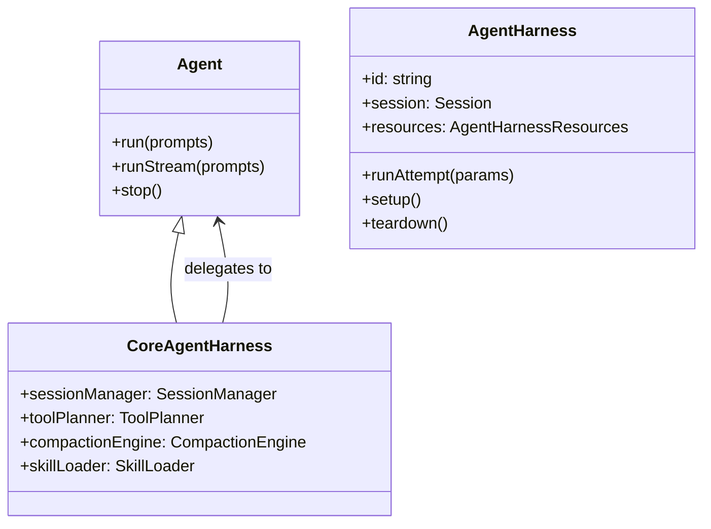

### 7.4 Harness生命周期

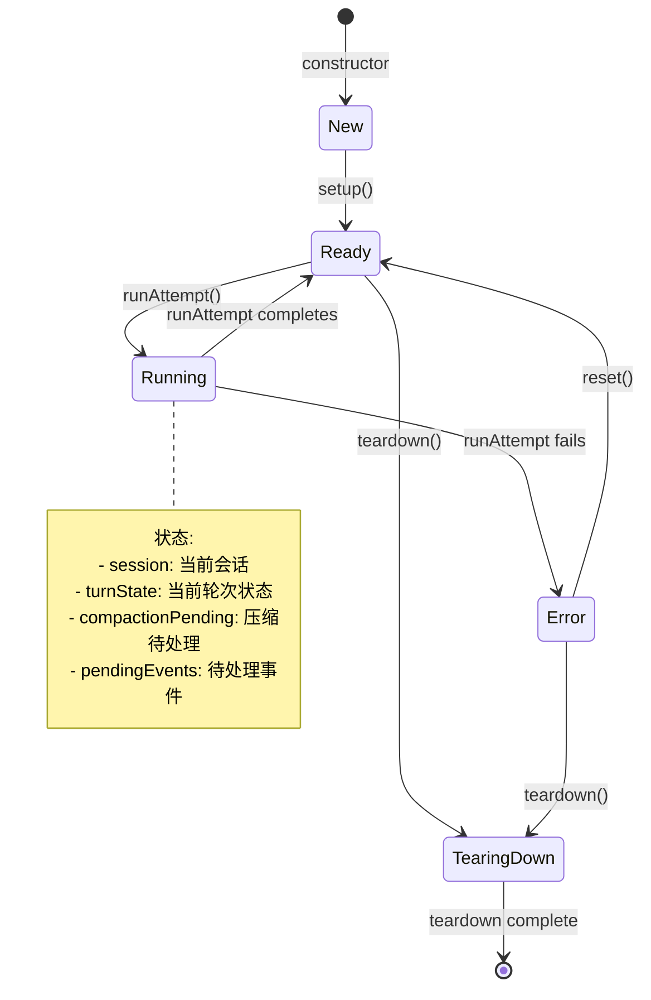

### 7.5 Harness管理的资源

```typescript
// AgentHarnessResources
interface AgentHarnessResources {
  promptTemplates?: PromptTemplate[]
  skills?: Skill[]
  // 可扩展...
}

// CoreAgentHarness管理的资源
class CoreAgentHarness {
  // Session管理
  private session: Session
  private sessionStore: SessionStore
  
  // 工具
  private toolDescriptors: ToolDescriptor[]
  private toolExecutor: ToolExecutor
  
  // Prompt
  private systemPrompt: string
  private promptTemplates: Map<string, PromptTemplate>
  
  // Skills
  private skills: Skill[]
  
  // Compaction
  private compactionEngine: CompactionEngine
  private compactionSettings: CompactionSettings
  
  // Sandbox
  private sandboxConfig: SandboxConfig
}
```

### 7.6 Harness架构图

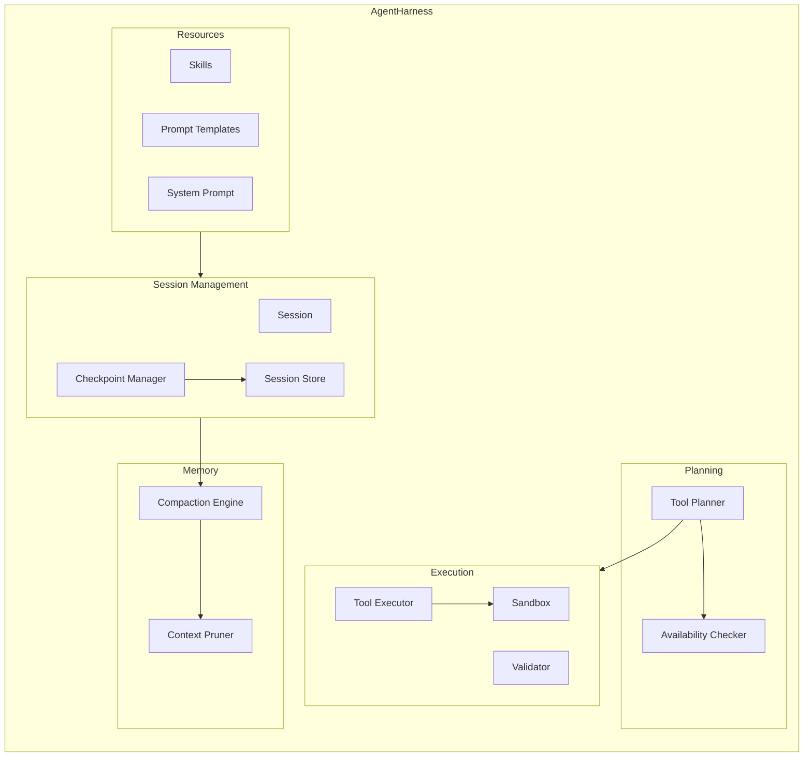

---

## 第八部分：Loop Engineering分析

### 8.1 Loop结构

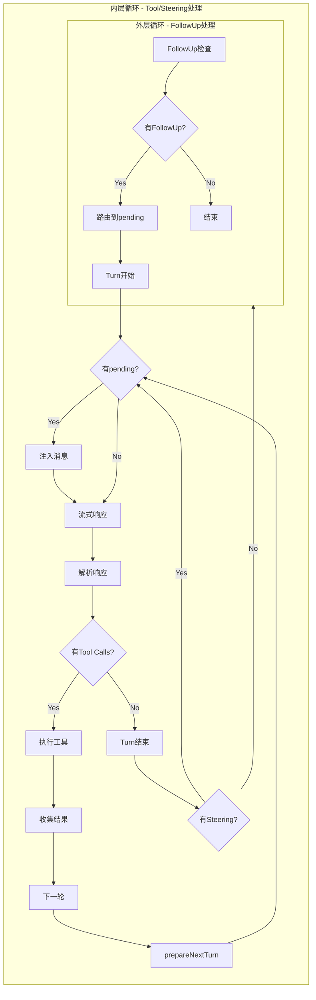

### 8.2 循环触发条件

| 条件 | 触发动作 |
|------|----------|
| 用户输入新消息 | 启动新Loop |
| Steer消息到达 | 注入pending，继续循环 |
| FollowUp消息到达 | 路由到pending，继续循环 |
| Tool Call执行完成 | 继续下一轮 |
| Context需要压缩 | 执行Compaction |

### 8.3 终止条件

```typescript
// 终止检查
const shouldStop = await config.shouldStopAfterTurn?.({
  message,
  toolResults,
  context: currentContext,
  newMessages,
})

// 终止条件
if (shouldStop) return
if (signal?.aborted) return
if (error) return
```

### 8.4 错误恢复

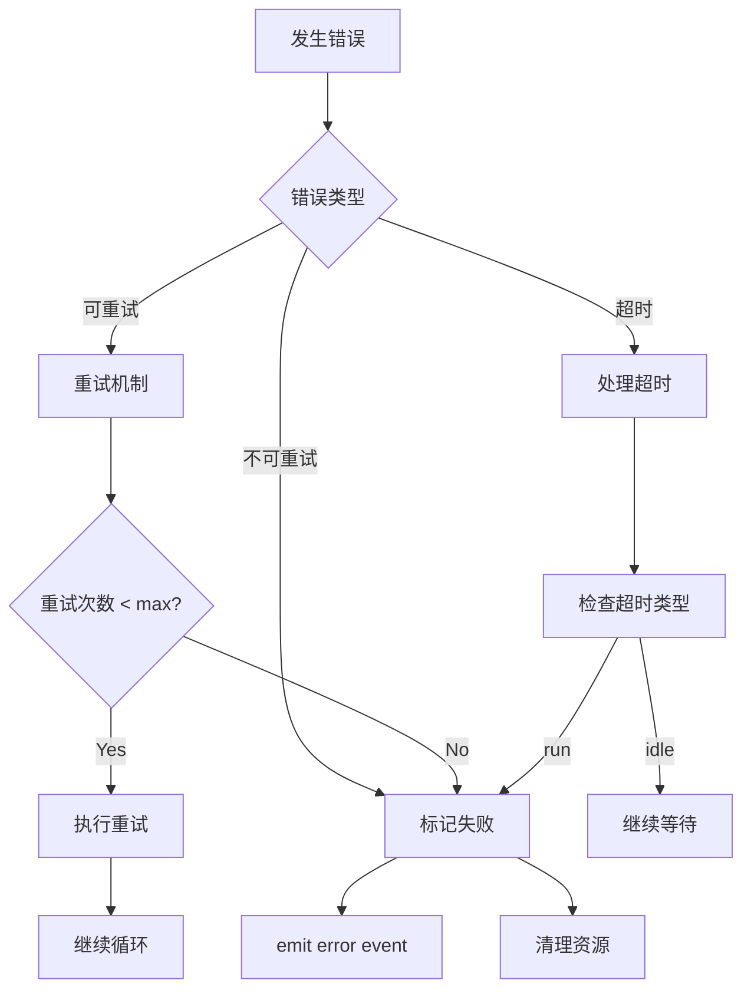

### 8.5 长任务机制

```typescript
// Long-running task handling
interface TaskStatus {
  id: string
  status: "pending" | "running" | "completed" | "failed"
  progress?: number
  result?: unknown
  error?: Error
}

// 任务状态跟踪
class TaskTracker {
  tasks: Map<string, TaskStatus>
  
  createTask(id: string): TaskStatus
  updateTask(id: string, update: Partial<TaskStatus>): void
  waitForTask(id: string): Promise<unknown>
}
```

### 8.6 Loop状态机

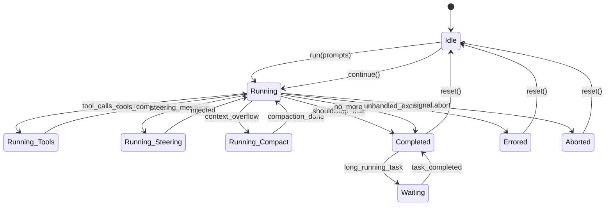

---

## 第九部分：Memory系统分析

### 9.1 内存层次

```
┌─────────────────────────────────────────────────────────────────────┐
│                      Memory分层架构                                   │
├─────────────────────────────────────────────────────────────────────┤
│                                                                      │
│  ┌─────────────────────────────────────────────────────────────────┐ │
│  │  Short-term Memory (会话内)                                      │ │
│  │  - messages: AgentMessage[]                                      │ │
│  │  - 有效期: 单次会话                                              │ │
│  │  - 管理: Agent Loop自动维护                                      │ │
│  └─────────────────────────────────────────────────────────────────┘ │
│                              ▲                                       │
│                              │ Pruning                               │
│                              ▼                                       │
│  ┌─────────────────────────────────────────────────────────────────┐ │
│  │  Working Memory (会话上下文)                                     │ │
│  │  - session.systemPrompt                                          │ │
│  │  - compacted summary                                             │ │
│  │  - 有效期: 会话期间                                              │ │
│  │  - 管理: Harness + Compaction                                    │ │
│  └─────────────────────────────────────────────────────────────────┘ │
│                              ▲                                       │
│                              │ Summarization                         │
│                              ▼                                       │
│  ┌─────────────────────────────────────────────────────────────────┐ │
│  │  Long-term Memory (持久化)                                       │ │
│  │  - Session Snapshots                                             │ │
│  │  - Knowledge Base (RAG)                                          │ │
│  │  - 有效期: 持久                                                  │ │
│  │  - 管理: Memory Plugin                                           │ │
│  └─────────────────────────────────────────────────────────────────┘ │
│                                                                      │
└─────────────────────────────────────────────────────────────────────┘
```

### 9.2 Compaction机制

```typescript
// packages/agent-core/src/harness/compaction/compaction.ts
interface CompactionSettings {
  maxMessages: number
  maxTokens: number
  preserveSystemPrompt: boolean
  preserveLastN: number
  strategy: "prune" | "summarize" | "hybrid"
}

// Compaction流程
async function compact(session: Session, settings: CompactionSettings): Promise<void> {
  // 1. 检查是否需要压缩
  if (!needsCompaction(session, settings)) return
  
  // 2. 选择压缩策略
  const strategy = determineStrategy(session, settings)
  
  // 3. 执行压缩
  const compacted = await executeStrategy(session, strategy)
  
  // 4. 更新Session
  session.update(compacted)
  
  // 5. 记录压缩历史
  recordCompaction(session.id, strategy)
}
```

### 9.3 Context Pruning

```typescript
// src/agents/agent-hooks/context-pruning/pruner.ts
interface PruneOptions {
  maxMessages: number
  preserveRoles: ("system" | "user" | "assistant")[]
  preserveLastN: number
  preserveTools: boolean
}

function pruneMessages(messages: AgentMessage[], options: PruneOptions): AgentMessage[] {
  // 保留策略
  const preserved = messages.slice(-options.preserveLastN)
  const others = messages.slice(0, -options.preserveLastN)
  
  // 角色过滤
  const filtered = others.filter(msg => 
    options.preserveRoles.includes(msg.role)
  )
  
  // 限制数量
  return [
    ...filtered.slice(0, options.maxMessages - options.preserveLastN),
    ...preserved
  ]
}
```

### 9.4 RAG支持

```typescript
// extensions/memory-*/ 实现RAG
interface MemoryPlugin {
  search(query: string, options: SearchOptions): Promise<MemoryResult[]>
  store(embedding: number[], content: string, metadata: Metadata): Promise<void>
  recall(sessionId: string): Promise<MemoryResult[]>
}

// 检索流程
async function retrieveRelevantMemory(query: string, sessionId: string): Promise<string> {
  const results = await memoryPlugin.search(query, {
    limit: 5,
    threshold: 0.7,
    filter: { sessionId }
  })
  
  return results.map(r => r.content).join("\n")
}
```

### 9.5 Memory数据流

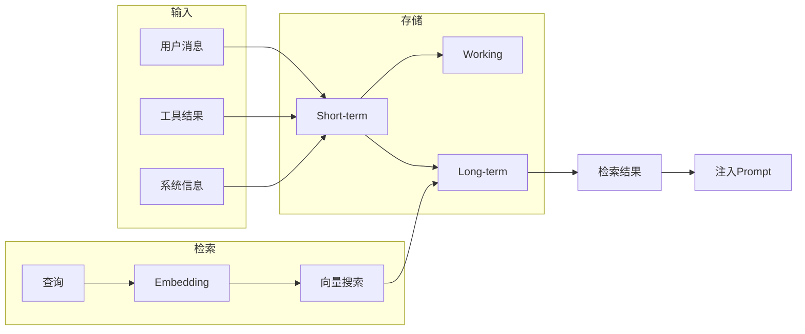

---

## 第十部分：Tool/MCP分析

### 10.1 Tool调用机制

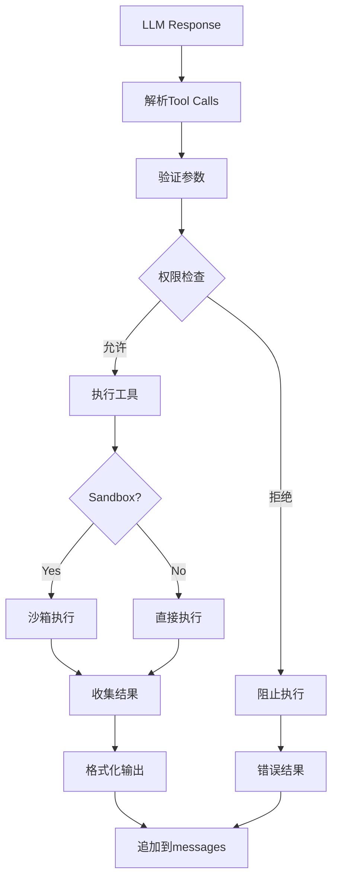

### 10.2 Tool注册机制

```typescript
// Tool注册到Planner
const descriptor: ToolDescriptor = {
  name: "bash",
  description: "Execute bash commands",
  inputSchema: {
    type: "object",
    properties: {
      command: { type: "string" }
    },
    required: ["command"]
  },
  owner: { kind: "core" },
  executor: { kind: "core", executorId: "bash-executor" }
}

// 注册到Tool Planner
toolPlanner.register(descriptor)
```

### 10.3 Tool发现机制

```typescript
// Tool可用性检查
interface ToolAvailabilityExpression {
  kind: "always"
  | { kind: "auth"; providerId: string }
  | { kind: "config"; path: string[]; check?: "exists" }
  | { kind: "env"; name: string }
  | { kind: "plugin-enabled"; pluginId: string }
}

// 检查流程
function isToolAvailable(
  descriptor: ToolDescriptor, 
  context: ToolAvailabilityContext
): boolean {
  if (!descriptor.availability) return true
  
  return evaluateExpression(descriptor.availability, context)
}
```

### 10.4 MCP支持

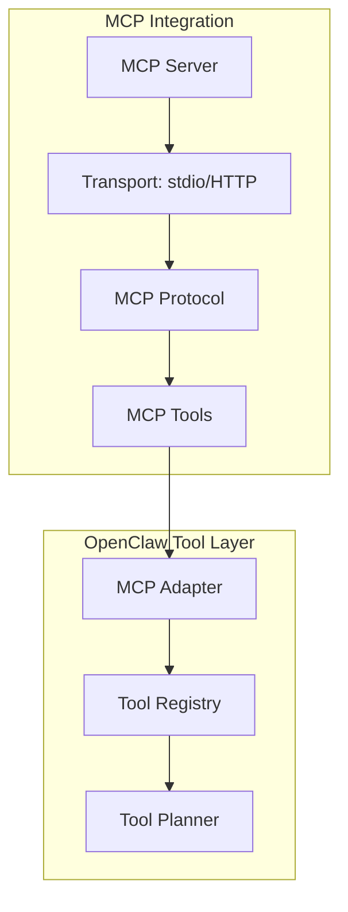

### 10.5 Plugin Tool支持

```typescript
// Plugin Tool注册
interface PluginToolRegistration {
  name: string
  description: string
  schema: JsonObject
  handler: ToolHandler
  owner: {
    kind: "plugin"
    pluginId: string
  }
}

// Plugin实现Tool
class MyPlugin {
  registerTools(): PluginToolRegistration[] {
    return [{
      name: "my_tool",
      description: "Custom tool from plugin",
      schema: { type: "object", properties: {...} },
      handler: this.handleMyTool.bind(this),
      owner: { kind: "plugin", pluginId: "my-plugin" }
    }]
  }
}
```

---

## 第十一部分：多Agent分析

### 11.1 Multi-Agent支持

OpenClaw通过**ACP (Agent Communication Protocol)** 支持Multi-Agent:

```
┌─────────────────────────────────────────────────────────────────────┐
│                    Multi-Agent架构                                  │
├─────────────────────────────────────────────────────────────────────┤
│                                                                      │
│  ┌────────────────────────────────────────────────────────────────┐ │
│  │                      Control Plane                               │ │
│  │  ┌──────────┐    ┌──────────┐    ┌──────────┐                  │ │
│  │  │ Manager  │◄──►│ ACP Bus  │◄──►│ Subagent │                  │ │
│  │  │ Agent    │    │          │    │ Registry │                  │ │
│  │  └──────────┘    └──────────┘    └──────────┘                  │ │
│  │       │                                    │                   │ │
│  │       │                                    │                   │ │
│  │       ▼                                    ▼                   │ │
│  │  ┌──────────────────────────────────────────────────────────┐ │ │
│  │  │              ACP Protocol Layer                            │ │ │
│  │  │  - 会话同步                                               │ │ │
│  │  │  - 消息路由                                               │ │ │
│  │  │  - 结果聚合                                               │ │ │
│  │  │  - 生命周期管理                                           │ │ │
│  │  └──────────────────────────────────────────────────────────┘ │ │
│  └────────────────────────────────────────────────────────────────┘ │
│                                                                      │
└─────────────────────────────────────────────────────────────────────┘
```

### 11.2 Subagent模式

```typescript
// Subagent创建
interface SubagentSpawn {
  name?: string
  model?: string
  systemPrompt?: string
  skills?: string[]
  parentSession?: string
}

// Subagent生命周期
class SubagentRegistry {
  async spawn(params: SubagentSpawn): Promise<Subagent>
  async get(id: string): Promise<Subagent | null>
  async terminate(id: string): Promise<void>
  async list(): Promise<Subagent[]>
}
```

### 11.3 Agent间通信

```mermaid
sequenceDiagram
    participant Manager as Manager Agent
    participant ACP as ACP Bus
    participant Worker1 as Worker Agent 1
    participant Worker2 as Worker Agent 2
    
    Manager->>ACP: Announce Task
    ACP->>Worker1: Forward Task
    ACP->>Worker2: Forward Task
    
    Worker1->>ACP: Partial Result
    ACP->>Manager: Progress Update
    
    Worker2->>ACP: Partial Result
    ACP->>Manager: Progress Update
    
    Worker1->>ACP: Complete Result
    ACP->>Manager: Aggregated Result
    
    Worker2->>ACP: Complete Result
    ACP->>Manager: Final Result
```

### 11.4 任务分发机制

```typescript
// 任务分发策略
interface TaskDistribution {
  type: "broadcast" | "select" | "sequential"
  criteria?: AgentSelector
  aggregation?: ResultAggregator
}

// 广播模式
broadcast: (task) => allSubagents.forEach(a => a.assign(task))

// 选择模式
select: (task, criteria) => {
  const candidates = filterSubagents(criteria)
  return candidates[0].assign(task)
}

// 顺序模式
sequential: (task, steps) => {
  for (const step of steps) {
    const agent = selectAgent(step)
    await agent.execute(step)
  }
}
```

---

## 第十二部分：数据流分析

### 12.1 完整数据流

```mermaid
flowchart TB
    subgraph Input["用户输入"]
        MSG[用户消息]
        ATT[附件]
        META[元数据]
    end
    
    subgraph Gateway["Gateway处理"]
        ROUTE[路由]
        SESSION[Session加载/创建]
        AUTH[认证检查]
    end
    
    subgraph Harness["Agent Harness"]
        CTX[构建上下文]
        PLAN[Tool规划]
        LOAD_SKILLS[加载Skills]
    end
    
    subgraph Loop["Agent Loop"]
        TRANSFORM[transformContext]
        CONVERT[convertToLlm]
        LLM[LLM调用]
        PARSE[解析响应]
        TOOL[Tool执行]
    end
    
    subgraph Output["输出处理"]
        FORMAT[格式化]
        STREAM[流式发送]
        STORE[存储结果]
    end
    
    Input --> Gateway
    Gateway --> Harness
    Harness --> Loop
    
    Loop -->|Tool Call| SANDBOX[Sandbox]
    SANDBOX -->|结果| Loop
    
    Loop -->|Response| Output
    
    Output --> CHANNEL[Channel响应]
```

### 12.2 Prompt变化

```
用户消息
    │
    ▼
┌─────────────────────────────────────────────────────────────┐
│  System Prompt (静态)                                        │
│  + Skills (动态)                                             │
│  + Session Context (累积)                                   │
│  + Tool Descriptions (可用工具)                             │
│  + User Message (当前输入)                                  │
└─────────────────────────────────────────────────────────────┘
    │
    ▼
┌─────────────────────────────────────────────────────────────┐
│  After transformContext (可能修剪/增强)                      │
└─────────────────────────────────────────────────────────────┘
    │
    ▼
┌─────────────────────────────────────────────────────────────┐
│  After convertToLlm (转换为LLM格式)                         │
└─────────────────────────────────────────────────────────────┘
    │
    ▼
┌─────────────────────────────────────────────────────────────┐
│  LLM Response                                               │
└─────────────────────────────────────────────────────────────┘
    │
    ▼
┌─────────────────────────────────────────────────────────────┐
│  Parsed into AgentMessage                                   │
│  + Tool Calls extracted                                     │
│  + Tool Results appended                                     │
└─────────────────────────────────────────────────────────────┘
```

### 12.3 状态变化

```mermaid
stateDiagram-v2
    [*] --> EmptySession
    
    EmptySession --> UserMessageAdded: addMessage(user)
    UserMessageAdded --> LlmCall: streamAssistantResponse()
    LlmCall --> ResponseReceived: LLM returns
    ResponseReceived --> HasToolCalls: tool_calls exist?
    
    HasToolCalls --> ToolExecution: execute tools
    ToolExecution --> ToolResultsCollected: results ready
    ToolResultsCollected --> LlmCall: continue loop
    
    ResponseReceived --> Completed: no tools
    HasToolCalls --> Completed: tools=false
    
    Completed --> [*]
    
    note right of LlmCall
        状态变化:
        - isStreaming: true
        - streamingMessage: building
    end note
    
    note right of ToolExecution
        状态变化:
        - pendingToolCalls: adding
        - pendingToolCalls: removing
    end note
```

---

## 第十三部分：扩展机制分析

### 13.1 扩展点矩阵

| 扩展点 | 实现方式 | 说明 |
|--------|---------|------|
| **Agent** | AgentCore | 继承Agent类 |
| **Harness** | AgentHarness接口 | 实现Harness接口 |
| **Tool** | ToolDescriptor | 注册到ToolPlanner |
| **Skill** | SKILL.md文件 | 放在skills目录 |
| **Memory** | MemoryPlugin | 实现Memory接口 |
| **Channel** | ChannelPlugin | 实现Channel接口 |
| **Model Provider** | ProviderPlugin | 实现Provider接口 |
| **MCP Server** | MCP Server | 实现MCP协议 |

### 13.2 新增Tool

```typescript
// 方式1: Core Tool
const myTool: ToolDescriptor = {
  name: "my_tool",
  description: "Does something useful",
  inputSchema: { type: "object", properties: {...} },
  owner: { kind: "core" },
  executor: { kind: "core", executorId: "my-executor" }
}

// 注册
toolRegistry.register(myTool)

// 方式2: Plugin Tool
const myPluginTool = {
  name: "plugin_tool",
  handler: async (args, context) => { /* ... */ }
}

// 方式3: MCP Tool
// 通过MCP server自动发现
```

### 13.3 新增Skill

```markdown
# skills/my-skill/SKILL.md

## Name
my-skill

## Description
Does something useful when invoked.

## Instructions
You are an expert at my-skill.

When the user asks about [topic], use this skill to help them.

[Detailed instructions...]
```

### 13.4 新增Channel

```typescript
// extensions/my-channel/index.ts
export const myChannelPlugin = {
  id: "my-channel",
  
  async setup(runtime: PluginRuntime) {
    // 初始化
  },
  
  createTransport(config: ChannelConfig): ChannelTransport {
    return {
      send: async (message) => { /* ... */ },
      receive: (handler) => { /* ... */ },
      close: () => { /* ... */ }
    }
  },
  
  registerTools(toolRegistry: ToolRegistry) {
    toolRegistry.register({
      name: "my_channel_action",
      // ...
    })
  }
}
```

### 13.5 新增Provider

```typescript
// extensions/my-provider/index.ts
export const myProvider = {
  id: "my-provider",
  api: "openai-compatible", // 或 "anthropic", "google", etc.
  
  async discover() {
    return [{
      id: "my-model",
      name: "My Model",
      contextWindow: 128000,
      // ...
    }]
  },
  
  createRuntime(config: ProviderConfig): LlmRuntime {
    return {
      stream: async (model, messages, options) => {
        // 实现流式调用
      },
      complete: async (model, messages, options) => {
        // 实现完整调用
      }
    }
  }
}
```

---

## 第十四部分：技术选型分析

### 14.1 TypeScript

**为什么选择TypeScript**:

| 优点 | 说明 |
|------|------|
| 类型安全 | 减少运行时错误，提高代码质量 |
| 开发效率 | 智能提示，重构支持 |
| 生态丰富 | npm生态完善 |
| 跨平台 | Node.js/Browser/Deno |
| 团队协作 | 类型即文档 |

**缺点**:
- 编译开销
- 部分运行时特性需要类型守卫

### 14.2 Node.js vs Bun

| 特性 | Node.js | Bun |
|------|---------|-----|
| 稳定性 | ⭐⭐⭐⭐⭐ | ⭐⭐⭐⭐ |
| 性能 | ⭐⭐⭐⭐ | ⭐⭐⭐⭐⭐ |
| 兼容性 | ⭐⭐⭐⭐⭐ | ⭐⭐⭐⭐ |
| 生态 | ⭐⭐⭐⭐⭐ | ⭐⭐⭐ |
| 当前状态 | 主力 | 备用 |

**选择**: Node.js为主，Bun可选

### 14.3 SQLite

**为什么选择SQLite**:

| 优点 | 说明 |
|------|------|
| 零配置 | 无需数据库服务器 |
| 单文件 | 易于备份和迁移 |
| 性能 | 本地访问极快 |
| 可靠 | ACID事务 |
| 跨平台 | 全平台支持 |

**使用场景**:
- 会话存储
- 配置存储
- 插件状态

### 14.4 LLM SDK选择

```mermaid
flowchart LR
    subgraph Abstraction["抽象层"]
        CORE[llm-core]
        RUNTIME[llm-runtime]
    end
    
    subgraph Providers["Providers"]
        OPENAI[OpenAI]
        ANTHROPIC[Anthropic]
        GOOGLE[Google]
        OTHER[Others...]
    end
    
    CORE --> RUNTIME
    RUNTIME --> OPENAI
    RUNTIME --> ANTHROPIC
    RUNTIME --> GOOGLE
    RUNTIME --> OTHER
```

**设计原则**:
- Provider抽象统一
- 支持流式/非流式
- 自动重试和回退

---

## 第十五部分：源码关键路径分析

### 15.1 程序入口

```
src/entry.ts
    │
    ▼
src/cli/run-main.ts
    │
    ▼
src/cli/program/root.ts (Commander)
    │
    ├──► openclaw gateway (Gateway服务)
    ├──► openclaw agent (Agent运行)
    ├──► openclaw message (消息发送)
    └──► openclaw doctor (诊断修复)
```

### 15.2 Agent入口

```
Agent.run(prompts)
    │
    ▼
Agent.runStream(prompts)
    │
    ▼
packages/agent-core/src/agent-loop.ts::agentLoop()
    │
    ├──► runAgentLoop()
    │    │
    │    └──► runLoop()
    │         │
    │         ├──► transformContext()
    │         ├──► convertToLlm()
    │         ├──► streamAssistantResponse()
    │         │    │
    │         │    └──► LLM Runtime
    │         │
    │         ├──► executeToolCalls()
    │         │    │
    │         │    └──► Tool Executor
    │         │
    │         └──► prepareNextTurn()
    │
    └──► EventStream<AgentEvent, AgentMessage[]>
```

### 15.3 Gateway入口

```
Gateway启动:
src/gateway/server.ts::createGatewayServer()
    │
    ▼
src/daemon/gateway-daemon.ts
    │
    ▼
ACP Server启动:
src/acp/server.ts::startServer()
    │
    ├──► Channel Manager初始化
    ├──► Session Manager初始化
    └──► Plugin加载
```

### 15.4 Tool入口

```
Tool调用:
LLM返回ToolCall
    │
    ▼
packages/agent-core/src/agent-loop.ts::executeToolCalls()
    │
    ▼
src/tools/execution.ts (执行入口)
    │
    ├──► ToolPlanner.buildToolPlan()
    │    │
    │    └──► 评估可用性
    │
    ├──► 参数验证
    │
    └──► Executor执行
         │
         ├──► core tools: src/agents/tools/
         ├──► plugin tools: extensions/*/tools/
         └──► mcp tools: MCP Server
```

---

## 第十六部分：复刻指南

### 16.1 第一阶段：最小可运行版本

**目标**: 实现基础Agent循环

```typescript
// 1. 定义核心类型
interface AgentMessage {
  role: "user" | "assistant"
  content: string
}

// 2. 实现简单Loop
async function* agentLoop(messages: AgentMessage[]) {
  const response = await llm.chat(messages)
  yield { type: "text", content: response }
  return { role: "assistant", content: response }
}

// 3. 暴露CLI
console.log("OpenClaw CLI v0.1.0")
```

**交付物**:
- ✅ Agent循环
- ✅ 基础LLM调用
- ✅ CLI入口

### 16.2 第二阶段：Agent Runtime

**目标**: 完善Runtime机制

```typescript
// 添加功能:
interface Agent {
  run(prompts: AgentMessage[]): Promise<AgentMessage[]>
  stop(): void
}

// Tool系统
interface Tool {
  name: string
  execute(args: unknown): Promise<unknown>
}

// Tool Planner
function planTools(messages: AgentMessage[]): Tool[] {
  // 简单的规则匹配
}
```

**交付物**:
- ✅ Agent类
- ✅ Tool注册
- ✅ Tool执行
- ✅ 事件系统

### 16.3 第三阶段：Tool System

**目标**: 完善的Tool系统

```typescript
// Tool描述符
interface ToolDescriptor {
  name: string
  description: string
  inputSchema: JSONSchema
  availability?: AvailabilityExpression
}

// Tool Executor
interface ToolExecutor {
  execute(ref: ToolExecutorRef, args: unknown): Promise<ToolResult>
}

// 权限检查
function checkToolPermission(tool: ToolDescriptor): boolean
```

**交付物**:
- ✅ Tool描述符
- ✅ Tool可用性检查
- ✅ 权限模型
- ✅ Sandbox执行

### 16.4 第四阶段：Memory

**目标**: 上下文管理

```typescript
// Session管理
interface Session {
  messages: AgentMessage[]
  prune(maxMessages: number): void
  checkpoint(): SessionSnapshot
}

// Compaction
async function compact(session: Session): Promise<void> {
  const summary = await llm.summarize(session.messages)
  session.replace(summary)
}
```

**交付物**:
- ✅ Session管理
- ✅ Context Pruning
- ✅ Compaction

### 16.5 第五阶段：Multi-Agent

**目标**: Subagent支持

```typescript
// ACP协议
interface ACPMessage {
  type: "task" | "result" | "error"
  from: string
  to: string
  payload: unknown
}

// Subagent Registry
class SubagentRegistry {
  spawn(config: SubagentConfig): Subagent
  terminate(id: string): void
  list(): Subagent[]
}
```

**交付物**:
- ✅ ACP协议
- ✅ Subagent管理
- ✅ 消息路由
- ✅ 结果聚合

### 16.6 第六阶段：生产级能力

**目标**: 完整功能

- ✅ 多渠道支持
- ✅ Plugin系统
- ✅ MCP集成
- ✅ 安全沙箱
- ✅ 高可用
- ✅ 监控运维

### 16.7 开发顺序

```
Week 1-2: 基础Agent Loop + LLM集成
Week 3-4: Tool系统
Week 5-6: Session/Memory管理
Week 7-8: Subagent支持
Week 9-10: Plugin系统
Week 11-12: 多渠道支持
Week 13+: 测试/优化/文档
```

---

## 第十七部分：Agent OS映射分析

### 17.1 OS模块映射

| Agent OS组件 | OpenClaw模块 | 说明 |
|-------------|-------------|------|
| **Kernel** | Agent Loop | 核心执行引擎 |
| **Process** | Agent Instance | 单个Agent实例 |
| **Thread** | Turn | 单次LLM调用 |
| **Memory** | Session | 会话状态 |
| **IPC** | ACP Protocol | Agent间通信 |
| **Driver** | Channel Plugins | 消息渠道驱动 |
| **HAL** | Tool Executor | 工具执行抽象层 |
| **Filesystem** | Workspace | 工作目录 |
| **Permission** | Tool Policy | 权限控制 |
| **Package Manager** | Plugin Registry | 插件管理 |
| **Scheduler** | Subagent Registry | 子代理调度 |

### 17.2 缺失的Agent OS能力

| 缺失模块 | 当前状态 | 建议实现 |
|---------|---------|---------|
| 进程隔离 | Docker沙箱 | 完善的容器管理 |
| 持久化内存 | Session快照 | 分布式持久化 |
| 网络抽象 | Channel直接连接 | 统一的网络层 |
| 资源限制 | 基础Token限制 | CPU/内存/GPU配额 |
| 安全沙箱 | 基础沙箱 | 更细粒度的隔离 |
| 热更新 | 需要重启 | 运行时更新 |

---

## 第十八部分：竞品对比

### 18.1 功能对比矩阵

| 特性 | OpenClaw | LangGraph | CrewAI | AutoGen | OpenHands |
|------|----------|-----------|--------|---------|-----------|
| 多渠道 | ✅30+ | ❌ | ❌ | ❌ | ❌ |
| 本地运行 | ✅ | ⚠️ | ⚠️ | ⚠️ | ✅ |
| Subagent | ✅ACP | ⚠️ | ✅ | ✅ | ✅ |
| Tool系统 | ✅完善 | ✅ | ✅ | ✅ | ✅ |
| Memory | ✅插件 | ⚠️ | ⚠️ | ⚠️ | ⚠️ |
| MCP支持 | ✅ | ⚠️ | ❌ | ❌ | ⚠️ |
| 沙箱隔离 | ✅Docker | ❌ | ❌ | ❌ | ✅ |
| Plugin系统 | ✅100+ | ❌ | ❌ | ❌ | ⚠️ |

### 18.2 架构对比

| 维度 | OpenClaw | LangGraph | CrewAI | AutoGen |
|------|----------|-----------|--------|---------|
| 核心语言 | TypeScript | Python | Python | Python |
| 架构风格 | 运行时+插件 | 图计算 | 角色+任务 | 对话代理 |
| 扩展性 | ⭐⭐⭐⭐⭐ | ⭐⭐⭐⭐ | ⭐⭐⭐ | ⭐⭐⭐ |
| 性能 | ⭐⭐⭐⭐ | ⭐⭐⭐⭐⭐ | ⭐⭐⭐⭐ | ⭐⭐⭐⭐ |
| 学习曲线 | 中等 | 陡峭 | 平缓 | 平缓 |

### 18.3 差异化优势

**OpenClaw vs 竞品**:

```
┌─────────────────────────────────────────────────────────────────────┐
│                        OpenClaw优势                                 │
├─────────────────────────────────────────────────────────────────────┤
│                                                                      │
│  1. 多渠道集成 (唯一支持30+消息平台)                                  │
│     └─ 统一入口 vs 各平台独立机器人                                    │
│                                                                      │
│  2. 本地优先 (数据不离开设备)                                         │
│     └─ 隐私保护 vs 云端处理                                           │
│                                                                      │
│  3. Plugin生态 (100+官方/社区插件)                                   │
│     └─ 可扩展性 vs 固定功能                                           │
│                                                                      │
│  4. ACP协议 (完整的Multi-Agent通信)                                  │
│     └─ 复杂协作 vs 简单任务分发                                        │
│                                                                      │
│  5. 安全设计 (沙箱+权限+DM pairing)                                  │
│     └─ 零信任 vs 开放访问                                             │
│                                                                      │
└─────────────────────────────────────────────────────────────────────┘
```

---

## 第十九部分：优缺点分析

### 19.1 优点 TOP 20

1. **多渠道统一**: 支持30+消息平台，真正做到一个助手所有渠道
2. **本地优先**: 数据完全在用户设备上，隐私保护到位
3. **完善的Tool系统**: 丰富的内置工具和扩展机制
4. **Plugin生态**: 100+插件，覆盖所有主要场景
5. **MCP原生支持**: 既支持MCP Server也支持MCP Client
6. **Subagent架构**: 支持复杂的多Agent协作场景
7. **ACP协议**: 私有Agent通信协议，功能完整
8. **安全沙箱**: Docker/OpenShell隔离，保护系统安全
9. **Compaction引擎**: 智能上下文管理，支持长对话
10. **故障转移**: 完善的多Provider Failover机制
11. **TypeScript实现**: 类型安全，代码质量高
12. **完善的测试**: 大量单元测试和集成测试
13. **文档完善**: 详尽的架构文档和API文档
14. **活跃社区**: Discord社区活跃，支持响应快
15. **开源透明**: 完全开源，可审计可定制
16. **跨平台**: macOS/Linux/Windows全支持
17. **CLI优先**: 开发者友好，便于自动化
18. **配置灵活**: 丰富的配置选项
19. **技能系统**: SKILL.md格式，支持版本控制
20. **工具修复**: Tool Call自动修复机制

### 19.2 缺点 TOP 20

1. **复杂度高**: 学习曲线陡峭，新用户上手难
2. **文档分散**: 文档分布在多处，查找困难
3. **依赖多**: 100+插件依赖，维护成本高
4. **性能开销**: TypeScript运行时相对于Go/Rust较慢
5. **内存占用**: Agent运行内存消耗较大
6. **调试困难**: 异步流式响应调试复杂
7. **版本兼容**: 快速迭代导致版本间差异大
8. **配置复杂**: openclaw.json配置项繁多
9. **迁移困难**: Session格式变更时迁移复杂
10. **错误处理**: 部分错误信息不够清晰
11. **测试依赖**: 大量集成测试依赖外部服务
12. **构建时间长**: TypeScript编译和打包耗时长
13. **插件质量**: 第三方插件质量参差不齐
14. **升级风险**: 大版本升级可能破坏兼容性
15. **监控缺失**: 缺乏内置的监控和追踪
16. **日志冗长**: 默认日志过于详细
17. **API不稳定**: 内部API变化频繁
18. **移动端弱**: 移动App功能相对简陋
19. **企业特性**: 缺少企业级特性如SSO/审计
20. **国际化**: i18n支持有限

### 19.3 技术债务

| 债务项 | 影响 | 建议 |
|-------|------|------|
| Session格式变更 | 迁移成本 | 提供自动化迁移工具 |
| 内部API演化 | 破坏兼容性 | 稳定的公共API契约 |
| Plugin接口分散 | 维护困难 | 统一的Plugin接口 |
| 测试覆盖率 | 质量风险 | 提升单元测试覆盖 |
| 文档同步 | 用户体验 | 文档即代码 |

---

## 第二十部分：最终结论

### 20.1 项目真正创新点

1. **多渠道统一入口**: 业界首创的30+消息平台统一接入，真正实现"一个助手所有渠道"

2. **本地化隐私优先**: 数据完全在用户设备上，不是云端处理，真正保护隐私

3. **ACP私有协议**: 完整的Agent间通信协议，支持复杂的多Agent协作场景

4. **Plugin+Skill+MCP三位一体**: 灵活的扩展机制，满足不同场景需求

5. **Tool Call自动修复**: 智能检测和修复模型Tool Call错误，提高成功率

### 20.2 最难复刻的部分

| 部分 | 难度 | 原因 |
|------|------|------|
| ACP协议 | ⭐⭐⭐⭐⭐ | 需要完整的会话同步、消息路由、生命周期管理 |
| 多渠道适配 | ⭐⭐⭐⭐⭐ | 每个平台API差异大，需要深度适配 |
| Compaction引擎 | ⭐⭐⭐⭐ | 需要智能的上下文压缩和摘要生成 |
| 安全沙箱 | ⭐⭐⭐⭐ | Docker/K8s集成、权限控制、隔离执行 |
| Plugin系统 | ⭐⭐⭐⭐ | 统一的扩展接口、生命周期管理 |

### 20.3 最值得学习的部分

1. **Agent架构设计**: Harness模式解耦Core和Runtime
2. **Tool系统设计**: 描述符+可用性表达式+执行器
3. **Multi-Agent协议**: ACP的设计和实现
4. **测试策略**: 完整的单元/集成/E2E测试
5. **Plugin生态**: 开源插件生态的运营

### 20.4 重新设计会如何做

```mermaid
flowchart TD
    subgraph "Phase 1: Core"
        CORE[Core Agent]
        LOOP[Agent Loop]
        TOOL[Tool System]
    end
    
    subgraph "Phase 2: Extensions"
        MCP[MCP Layer]
        PLUGIN[Plugin System]
        SKILL[Skill System]
    end
    
    subgraph "Phase 3: Integration"
        CHANNEL[Channel Layer]
        MEMORY[Memory Layer]
        MONITOR[Observability]
    end
    
    CORE --> LOOP
    LOOP --> TOOL
    TOOL --> MCP
    TOOL --> PLUGIN
    MCP --> SKILL
    PLUGIN --> CHANNEL
    CHANNEL --> MEMORY
    MEMORY --> MONITOR
```

**改进点**:
- 更清晰的模块边界
- 更稳定的公共API
- 更完善的文档
- 更强的类型安全

### 20.5 演进为Agent OS需要的模块

| 缺失模块 | 当前实现 | 建议方案 |
|---------|---------|---------|
| 进程管理 | Session | 完整的进程生命周期管理 |
| 资源配额 | Token限制 | CPU/内存/GPU配额 |
| 网络抽象 | Channel直连 | 统一的网络层 |
| 文件系统 | Workspace | 虚拟文件系统 |
| 安全隔离 | Docker沙箱 | 更细粒度的安全策略 |
| 事务支持 | 无 | 分布式事务 |
| 服务发现 | 无 | ACP服务注册/发现 |
| 配置中心 | openclaw.json | 集中配置管理 |

### 20.6 综合评分

| 维度 | 评分 | 说明 |
|------|------|------|
| **架构评分** | 92/100 | 模块化优秀，Harness模式创新 |
| **工程评分** | 88/100 | 代码质量高，测试完善 |
| **Agent能力** | 90/100 | Tool系统完整，Loop设计优秀 |
| **生态评分** | 95/100 | Plugin生态丰富，渠道支持最多 |
| **未来潜力** | 93/100 | 本地优先+多Agent是趋势 |

**总分**: 91.6/100

---

## 第二十一部分：Agentic OS映射

### 21.1 所处层次

```
┌─────────────────────────────────────────────────────────────────────────────┐
│                            Agentic OS层次                                   │
├─────────────────────────────────────────────────────────────────────────────┤
│                                                                             │
│  ┌─────────────────────────────────────────────────────────────────────┐    │
│  │  Application Layer (应用层)                                          │    │
│  │  - Skills, Plugins, Tools                                            │    │
│  └─────────────────────────────────────────────────────────────────────┘    │
│                                    ▲                                        │
│                                    │                                        │
│  ┌─────────────────────────────────────────────────────────────────────┐    │
│  │  ┌─────────────────────────────────────────────────────────────┐    │    │
│  │  │  OpenClaw ≈ Application Framework                            │    │
│  │  │  - Agent Harness: 应用框架层                                 │    │
│  │  │  - Tool System: 能力抽象层                                   │    │
│  │  │  - Plugin System: 插件机制层                                 │    │
│  │  └─────────────────────────────────────────────────────────────┘    │    │
│  └─────────────────────────────────────────────────────────────────────┘    │
│                                    ▲                                        │
│                                    │                                        │
│  ┌─────────────────────────────────────────────────────────────────────┐    │
│  │  Runtime Layer (运行时层)                                            │    │
│  │  - Agent Loop: 进程运行时                                           │    │
│  │  - Session: 进程状态                                                │    │
│  │  - Compaction: 内存管理                                             │    │
│  └─────────────────────────────────────────────────────────────────────┘    │
│                                    ▲                                        │
│                                    │                                        │
│  ┌─────────────────────────────────────────────────────────────────────┐    │
│  │  Infrastructure Layer (基础设施层)                                    │    │
│  │  - Docker Sandbox: 容器运行时                                       │    │
│  │  - SQLite: 本地存储                                                 │    │
│  │  - Channel Plugins: 设备驱动                                         │    │
│  └─────────────────────────────────────────────────────────────────────┘    │
│                                    ▲                                        │
│                                    │                                        │
│  ┌─────────────────────────────────────────────────────────────────────┐    │
│  │  Linux / Container Layer                                            │    │
│  └─────────────────────────────────────────────────────────────────────┘    │
│                                                                             │
└─────────────────────────────────────────────────────────────────────────────┘
```

### 21.2 向上提供的能力

```
┌─────────────────────────────────────────────────────────────────────────────┐
│                        OpenClaw向上提供的能力                                │
├─────────────────────────────────────────────────────────────────────────────┤
│                                                                             │
│  ┌─────────────────────────────────────────────────────────────────────┐    │
│  │  能力类型                    │  说明                                  │    │
│  ├─────────────────────────────────────────────────────────────────────┤    │
│  │  Agent Execution           │  Agent运行、循环、状态管理               │    │
│  │  Tool Orchestration        │  工具发现、调用、结果处理                │    │
│  │  Context Management        │  上下文构建、修剪、压缩                 │    │
│  │  Multi-Agent Communication │  ACP协议、Subagent管理                  │    │
│  │  Channel Abstraction       │  多渠道统一接入                         │    │
│  │  Plugin System             │  扩展机制                              │    │
│  │  Skill Management          │  技能加载、执行、更新                   │    │
│  │  Memory Persistence        │  会话持久化、记忆检索                   │    │
│  │  Security Enforcement      │  权限控制、沙箱隔离                    │    │
│  │  Observability             │  诊断事件、追踪                        │    │
│  └─────────────────────────────────────────────────────────────────────┘    │
│                                                                             │
└─────────────────────────────────────────────────────────────────────────────┘
```

### 21.3 向下依赖的能力

```
┌─────────────────────────────────────────────────────────────────────────────┐
│                        OpenClaw向下依赖的能力                                │
├─────────────────────────────────────────────────────────────────────────────┤
│                                                                             │
│  ┌─────────────────────────────────────────────────────────────────────┐    │
│  │  依赖层级                    │  依赖内容                              │    │
│  ├─────────────────────────────────────────────────────────────────────┤    │
│  │  Language Runtime          │  Node.js/Bun (TypeScript执行)          │    │
│  │  Container Runtime         │  Docker (沙箱隔离)                     │    │
│  │  Storage                   │  SQLite (会话存储)                      │    │
│  │  File System               │  OS文件系统 (工作目录)                  │    │
│  │  Network                   │  HTTP/WebSocket (渠道连接)              │    │
│  │  LLM Providers             │  OpenAI/Anthropic等 (模型调用)          │    │
│  │  Process Management        │  OS进程管理 (子进程)                    │    │
│  └─────────────────────────────────────────────────────────────────────┘    │
│                                                                             │
└─────────────────────────────────────────────────────────────────────────────┘
```

### 21.4 缺失的Agent OS接口

| 缺失接口 | 类比OS | 建议实现 |
|---------|--------|---------|
| 系统调用 | syscall | 统一的Tool Call接口 |
| 进程调度 | Scheduler | Subagent调度器 |
| 内存管理 | Memory Manager | 分布式Memory |
| 文件系统 | VFS | 虚拟文件系统 |
| 网络协议栈 | TCP/IP | 统一的网络抽象 |
| 设备驱动 | Driver | Channel Plugin |
| 安全策略 | SELinux | 细粒度Tool Policy |
| 进程间通信 | IPC | 扩展ACP协议 |
| 进程隔离 | Namespace | Docker集成 |
| 资源监控 | /proc | 运行时Metrics |

### 21.5 在Agentic OS中的角色

```
┌─────────────────────────────────────────────────────────────────────────────┐
│                       OpenClaw在Agentic OS中的定位                           │
├─────────────────────────────────────────────────────────────────────────────┤
│                                                                             │
│   如果将完整的Agentic OS比作 Android:                                        │
│                                                                             │
│   ┌─────────────────────────────────────────────────────────────────────┐    │
│   │  Android Framework层                                                 │    │
│   │  ┌─────────────────────────────────────────────────────────────┐    │    │
│   │  │  OpenClaw ≈ Activity Manager + Package Manager              │    │    │
│   │  │  - Agent生命周期 ≈ Activity生命周期                         │    │    │
│   │  │  - Plugin系统 ≈ Package Manager                             │    │    │
│   │  │  - Channel路由 ≈ Intent System                              │    │    │
│   │  └─────────────────────────────────────────────────────────────┘    │    │
│   └─────────────────────────────────────────────────────────────────────┘    │
│                                    ▲                                        │
│                                    │                                        │
│   ┌─────────────────────────────────────────────────────────────────────┐    │
│   │  Android Runtime (ART)                                              │    │
│   │  - Agent Loop ≈ 指令执行器                                           │    │
│   │  - Tool Executor ≈ 系统服务                                          │    │
│   └─────────────────────────────────────────────────────────────────────┘    │
│                                    ▲                                        │
│                                    │                                        │
│   ┌─────────────────────────────────────────────────────────────────────┐    │
│   │  Linux Kernel + HAL                                                  │    │
│   │  - Docker ≈ Binder驱动                                               │    │
│   │  - Node.js ≈ Native库                                               │    │
│   └─────────────────────────────────────────────────────────────────────┘    │
│                                                                             │
└─────────────────────────────────────────────────────────────────────────────┘
```

**总结**: OpenClaw位于**Application Framework层**，是Agent应用开发和运行的平台，向上提供Agent执行框架，向下依赖OS基础设施。它扮演的角色类似于Android的**Activity Manager + Package Manager**，是Agent OS的核心组成部分。

---

## 附录

### A. 关键文件索引

| 文件路径 | 说明 |
|---------|------|
| `packages/agent-core/src/agent.ts` | Agent类定义 |
| `packages/agent-core/src/agent-loop.ts` | Agent循环实现 |
| `packages/agent-core/src/harness/agent-harness.ts` | Harness实现 |
| `src/tools/planner.ts` | 工具规划器 |
| `src/tools/types.ts` | 工具类型定义 |
| `src/agents/embedded-agent-subscribe.ts` | 内嵌Agent订阅 |
| `src/acp/translator.ts` | ACP协议翻译器 |
| `src/channels/registry.ts` | 渠道注册表 |

### B. 参考链接

- 项目仓库: https://github.com/openclaw/openclaw
- 官方文档: https://docs.openclaw.ai
- 插件市场: https://clawhub.ai

### C. 术语表

| 术语 | 说明 |
|------|------|
| Harness | Agent运行环境包装器 |
| Loop | Agent主循环 |
| Compaction | 上下文压缩 |
| ACP | Agent Communication Protocol |
| MCP | Model Context Protocol |
| Tool Call | 工具调用 |
| Skill | 技能模块 |
| Channel | 消息渠道 |

---

*文档生成时间: 2026-06-23*
*分析版本: OpenClaw main branch*
