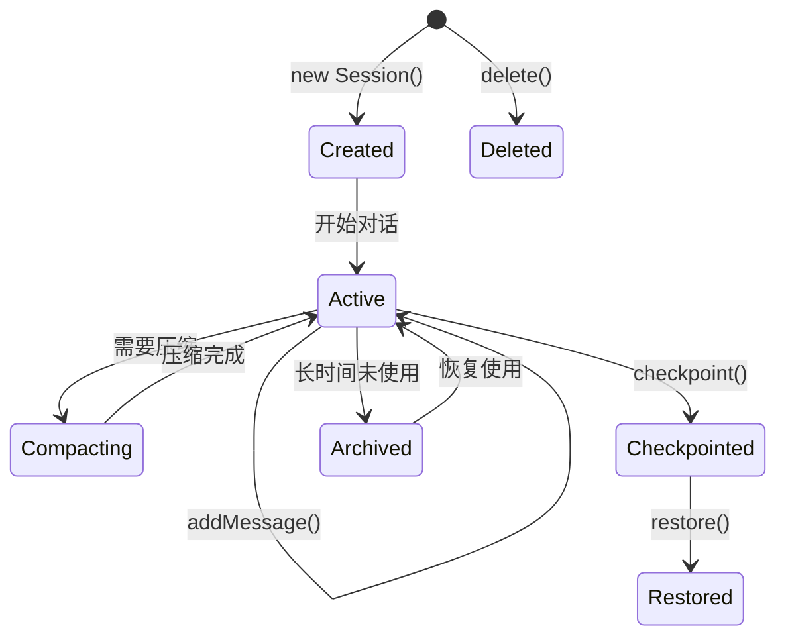

# OpenClaw 核心模块详细分析

## 目录

1. [Agent Core模块](#1-agent-core模块)
2. [Harness模块](#2-harness模块)
3. [Tool系统模块](#3-tool系统模块)
4. [Session管理模块](#4-session管理模块)
5. [ACP协议模块](#5-acp协议模块)
6. [Channel系统模块](#6-channel系统模块)
7. [Plugin SDK模块](#7-plugin-sdk模块)
8. [LLM Runtime模块](#8-llm-runtime模块)

---

## 1. Agent Core模块

### 1.1 模块概述

`packages/agent-core` 是OpenClaw的核心包，提供与Provider无关的Agent功能。

```
packages/agent-core/
├── src/
│   ├── agent.ts              # Agent类
│   ├── agent-loop.ts         # Agent循环
│   ├── types.ts              # 类型定义
│   ├── validation.ts          # 验证
│   ├── reasoning.ts           # 推理配置
│   ├── runtime-deps.ts        # 运行时依赖
│   ├── harness/              # Harness实现
│   │   ├── agent-harness.ts
│   │   ├── types.ts
│   │   ├── session/
│   │   └── compaction/
│   └── index.ts              # 主导出
└── package.json
```

### 1.2 Agent类详解

```typescript
// packages/agent-core/src/agent.ts

export interface AgentOptions {
  /** 初始状态 */
  initialState?: Partial<AgentState>
  
  /** 消息转换器 */
  convertToLlm?: (messages: AgentMessage[]) => Message[] | Promise<Message[]>
  
  /** 上下文转换器 */
  transformContext?: (messages: AgentMessage[], signal?: AbortSignal) => Promise<AgentMessage[]>
  
  /** 流函数 */
  streamFn?: StreamFn
  
  /** API Key获取器 */
  getApiKey?: (provider: string) => Promise<string | undefined>
  
  /** 工具调用前钩子 */
  beforeToolCall?: (context: BeforeToolCallContext) => Promise<BeforeToolCallResult | undefined>
  
  /** 工具调用后钩子 */
  afterToolCall?: (context: AfterToolCallContext) => Promise<AfterToolCallResult | undefined>
  
  /** 下一轮准备钩子 */
  prepareNextTurn?: () => Promise<AgentLoopTurnUpdate | undefined>
  
  /** 工具执行模式 */
  toolExecution?: ToolExecutionMode
}

export class Agent {
  private state: MutableAgentState
  private activeRun?: ActiveRun
  
  constructor(options: AgentOptions = {})
  
  /** 同步运行Agent，返回最终消息列表 */
  async run(prompts: AgentMessage[]): Promise<AgentMessage[]>
  
  /** 流式运行Agent，返回EventStream */
  runStream(prompts: AgentMessage[]): EventStream<AgentEvent, AgentMessage[]>
  
  /** 从当前状态继续运行 */
  async continue(): Promise<AgentMessage[]>
  
  /** 停止当前运行 */
  stop(): void
  
  /** 检查是否正在运行 */
  isRunning(): boolean
}
```

### 1.3 Agent Loop详解

```typescript
// packages/agent-core/src/agent-loop.ts

/**
 * 主循环流程
 * 
 * 1. 初始化上下文
 * 2. 进入主循环
 * 3. 流式获取LLM响应
 * 4. 处理Tool Calls
 * 5. 检查停止条件
 * 6. 重复直到结束
 */

async function runLoop(
  initialContext: AgentContext,
  newMessages: AgentMessage[],
  initialConfig: AgentLoopConfig,
  signal: AbortSignal | undefined,
  emit: AgentEventSink,
  streamFn?: StreamFn,
  runtime?: AgentCoreStreamRuntimeDeps,
): Promise<void> {
  let currentContext = initialContext
  let config = initialConfig
  let firstTurn = true
  let turnOpen = true
  let pendingMessages: AgentMessage[] = []
  
  // 外层循环: 处理Steering和FollowUp消息
  while (true) {
    let hasMoreToolCalls = true
    
    // 内层循环: 处理Tool Calls
    while (hasMoreToolCalls || pendingMessages.length > 0) {
      if (signal?.aborted) {
        // 处理中止
        return
      }
      
      if (!firstTurn) {
        await emit({ type: "turn_start" })
        turnOpen = true
      }
      
      // 处理pending消息
      if (pendingMessages.length > 0) {
        for (const message of pendingMessages) {
          await emit({ type: "message_start", message })
          await emit({ type: "message_end", message })
          currentContext.messages.push(message)
          newMessages.push(message)
        }
      }
      
      // 流式获取LLM响应
      const message = await streamAssistantResponse(
        currentContext,
        config,
        signal,
        emit,
        streamFn,
        runtime,
      )
      newMessages.push(message)
      
      // 处理Tool Calls
      const toolCalls = message.content.filter(c => c.type === "toolCall")
      
      if (toolCalls.length > 0) {
        const executedToolBatch = await executeToolCalls(
          currentContext,
          message,
          config,
          signal,
          emit,
        )
        // ... 收集结果，继续循环
      }
      
      await emit({ type: "turn_end", message, toolResults })
      
      // 准备下一轮
      const nextTurnSnapshot = await config.prepareNextTurn?.({...})
      if (nextTurnSnapshot) {
        currentContext = nextTurnSnapshot.context ?? currentContext
        config = { ...config, ...nextTurnSnapshot }
      }
      
      // 检查停止条件
      if (await config.shouldStopAfterTurn?.({...})) {
        await emit({ type: "agent_end", messages: newMessages })
        return
      }
      
      pendingMessages = await config.getSteeringMessages?.() ?? []
    }
    
    // 处理FollowUp消息
    const followUpMessages = await config.getFollowUpMessages?.() ?? []
    if (followUpMessages.length > 0) {
      pendingMessages = followUpMessages
      continue
    }
    
    break
  }
  
  await emit({ type: "agent_end", messages: newMessages })
}
```

### 1.4 类型定义

```typescript
// packages/agent-core/src/types.ts

export interface AgentContext {
  messages: AgentMessage[]
  tools: AgentTool[]
  systemPrompt: string
  model: Model
  thinkingLevel?: ThinkingLevel
}

export interface AgentMessage {
  role: "user" | "assistant" | "toolResult"
  content: ContentBlock[]
  timestamp: number
  usage?: Usage
  stopReason?: StopReason
  errorMessage?: string
  model?: string
  provider?: string
  api?: string
}

export type ContentBlock = 
  | { type: "text"; text: string }
  | { type: "image"; url: string }
  | { type: "toolCall"; id: string; name: string; arguments: unknown }
  | { type: "toolResult"; toolCallId: string; content: ContentBlock[]; isError?: boolean }

export type ToolExecutionMode = "sequential" | "parallel"

export interface BeforeToolCallContext {
  assistantMessage: AssistantMessage
  toolCall: AgentToolCall
  args: unknown
  context: AgentContext
}

export interface AfterToolCallContext extends BeforeToolCallContext {
  result: AgentToolResult<unknown>
  isError: boolean
}
```

---

## 2. Harness模块

### 2.1 模块概述

Harness是Agent Core与OpenClaw运行时之间的适配层，负责管理Session、Tool Planning、Compaction等。

### 2.2 CoreAgentHarness详解

```typescript
// packages/agent-core/src/harness/agent-harness.ts

export interface AgentHarnessOptions {
  id: string
  pluginId?: string
  session: Session
  resources: AgentHarnessResources
  toolDescriptors?: ToolDescriptor[]
  sandboxConfig?: SandboxConfig
  compactionSettings?: CompactionSettings
}

export class CoreAgentHarness implements AgentHarness {
  readonly id: string
  readonly pluginId?: string
  readonly session: Session
  readonly resources: AgentHarnessResources
  
  private toolDescriptors: ToolDescriptor[]
  private compactionEngine: CompactionEngine
  
  constructor(options: AgentHarnessOptions) {
    this.id = options.id
    this.session = options.session
    this.resources = options.resources
    this.toolDescriptors = options.toolDescriptors ?? []
  }
  
  async setup(): Promise<void> {
    // 初始化资源
    // 加载Skills
    // 配置Sandbox
  }
  
  async runAttempt(params: AgentHarnessAttemptParams): Promise<AgentHarnessAttemptResult> {
    // 1. 构建上下文
    const context = await this.buildContext(params)
    
    // 2. 规划工具
    const toolPlan = buildToolPlan({
      descriptors: this.toolDescriptors,
      availability: this.getAvailabilityContext()
    })
    
    // 3. 运行Agent
    const result = await runAgentLoop(
      params.prompts,
      context,
      this.buildLoopConfig(params, toolPlan),
      params.signal
    )
    
    // 4. 检查Compaction
    if (this.needsCompaction()) {
      await this.compact()
    }
    
    return result
  }
  
  async teardown(): Promise<void> {
    // 清理资源
  }
}
```

### 2.3 Session管理

```typescript
// packages/agent-core/src/harness/session/session.ts

export interface Session {
  id: string
  createdAt: number
  updatedAt: number
  messages: AgentMessage[]
  tools: AgentTool[]
  systemPrompt: string
  model: Model
  metadata?: SessionMetadata
  
  addMessage(message: AgentMessage): void
  pruneMessages(options: PruneOptions): AgentMessage[]
  checkpoint(): SessionSnapshot
  restore(snapshot: SessionSnapshot): void
  getContext(): AgentContext
}

export interface SessionSnapshot {
  id: string
  timestamp: number
  messages: AgentMessage[]
  systemPrompt: string
  model: Model
  metadata?: SessionMetadata
}

class InMemorySession implements Session {
  private _messages: AgentMessage[] = []
  private _systemPrompt: string = ""
  private _model: Model
  private _tools: AgentTool[] = []
  
  get messages(): AgentMessage[] {
    return this._messages
  }
  
  getContext(): AgentContext {
    return {
      messages: this._messages,
      tools: this._tools,
      systemPrompt: this._systemPrompt,
      model: this._model
    }
  }
  
  addMessage(message: AgentMessage): void {
    this._messages.push(message)
  }
  
  pruneMessages(options: PruneOptions): void {
    const preserved = this._messages.slice(-options.preserveLastN)
    const toPrune = this._messages.slice(0, -options.preserveLastN)
    
    const filtered = toPrune.filter(msg => 
      options.preserveRoles.includes(msg.role)
    )
    
    this._messages = [
      ...filtered.slice(0, options.maxMessages - options.preserveLastN),
      ...preserved
    ]
  }
  
  checkpoint(): SessionSnapshot {
    return {
      id: this.id,
      timestamp: Date.now(),
      messages: [...this._messages],
      systemPrompt: this._systemPrompt,
      model: this._model,
      metadata: this.metadata
    }
  }
  
  restore(snapshot: SessionSnapshot): void {
    this._messages = snapshot.messages
    this._systemPrompt = snapshot.systemPrompt
    this._model = snapshot.model
    this.metadata = snapshot.metadata
  }
}
```

### 2.4 Compaction机制

```typescript
// packages/agent-core/src/harness/compaction/compaction.ts

export interface CompactionSettings {
  maxMessages: number
  maxTokens: number
  preserveSystemPrompt: boolean
  preserveLastN: number
  strategy: "prune" | "summarize" | "hybrid"
}

export interface CompactionResult {
  originalCount: number
  compactedCount: number
  summary?: string
  durationMs: number
}

export async function compact(
  session: Session,
  settings: CompactionSettings,
  llm: LlmRuntime
): Promise<CompactionResult> {
  const startTime = Date.now()
  const originalCount = session.messages.length
  
  // 检查是否需要压缩
  if (!needsCompaction(session, settings)) {
    return { originalCount, compactedCount: originalCount, durationMs: 0 }
  }
  
  // 根据策略执行
  switch (settings.strategy) {
    case "prune":
      session.pruneMessages({
        maxMessages: settings.maxMessages,
        preserveLastN: settings.preserveLastN,
        preserveRoles: ["system", "assistant"]
      })
      break
      
    case "summarize":
      const summary = await generateSummary(session, llm)
      session.replaceWithSummary(summary)
      break
      
    case "hybrid":
      const partialPrune = await pruneWithSummary(session, settings, llm)
      session.applyPartialPrune(partialPrune)
      break
  }
  
  return {
    originalCount,
    compactedCount: session.messages.length,
    durationMs: Date.now() - startTime
  }
}

async function generateSummary(session: Session, llm: LlmRuntime): Promise<string> {
  const summaryPrompt = `
请总结以下对话的关键信息:

${session.messages.map(m => `${m.role}: ${m.content}`).join("\n")}

请提取:
1. 主要话题
2. 关键决定
3. 待办事项
4. 重要上下文
`
  
  const response = await llm.complete([{ role: "user", content: summaryPrompt }])
  return response.content
}
```

---

## 3. Tool系统模块

### 3.1 模块概述

Tool系统是OpenClaw的核心扩展机制，支持Core、Plugin、Channel、MCP多种来源的工具。

### 3.2 Tool Descriptor

```typescript
// src/tools/types.ts

export interface ToolDescriptor {
  /** 工具唯一名称 */
  name: string
  
  /** 显示标题 */
  title?: string
  
  /** 工具描述（模型可见） */
  description: string
  
  /** 输入Schema */
  inputSchema: JsonObject
  
  /** 输出Schema */
  outputSchema?: JsonObject
  
  /** 所有者 */
  owner: ToolOwnerRef
  
  /** 执行器引用 */
  executor?: ToolExecutorRef
  
  /** 可用性条件 */
  availability?: ToolAvailabilityExpression
  
  /** 注解 */
  annotations?: JsonObject
  
  /** 排序键 */
  sortKey?: string
}

export type ToolOwnerRef =
  | { kind: "core" }
  | { kind: "plugin"; pluginId: string }
  | { kind: "channel"; channelId: string; pluginId?: string }
  | { kind: "mcp"; serverId: string }

export type ToolExecutorRef =
  | { kind: "core"; executorId: string }
  | { kind: "plugin"; pluginId: string; toolName: string }
  | { kind: "channel"; channelId: string; actionId: string }
  | { kind: "mcp"; serverId: string; toolName: string }
```

### 3.3 Tool Availability

```typescript
// src/tools/availability.ts

export type ToolAvailabilityExpression =
  | ToolAvailabilitySignal
  | { allOf: readonly ToolAvailabilityExpression[] }
  | { anyOf: readonly ToolAvailabilityExpression[] }

export type ToolAvailabilitySignal =
  | { kind: "always" }
  | { kind: "auth"; providerId: string }
  | { kind: "config"; path: readonly string[]; check?: "exists" | "non-empty" | "available" }
  | { kind: "env"; name: string }
  | { kind: "plugin-enabled"; pluginId: string }
  | { kind: "context"; key: string; equals?: JsonPrimitive }

export interface ToolAvailabilityContext {
  authProviderIds?: ReadonlySet<string>
  config?: JsonObject
  isConfigValueAvailable?: (params: {
    value: JsonValue
    path: readonly string[]
    signal: Extract<ToolAvailabilitySignal, { kind: "config" }>
  }) => boolean
  env?: Readonly<Record<string, string | undefined>>
  enabledPluginIds?: ReadonlySet<string>
  values?: Readonly<Record<string, JsonPrimitive | undefined>>
}

// 评估可用性
export function evaluateToolAvailability(params: {
  descriptor: ToolDescriptor
  context: ToolAvailabilityContext
}): ToolAvailabilityDiagnostic[] {
  if (!params.descriptor.availability) {
    return []
  }
  
  const diagnostics: ToolAvailabilityDiagnostic[] = []
  
  // 递归评估表达式
  const evaluate = (expr: ToolAvailabilityExpression): void => {
    if ("kind" in expr) {
      const signal = expr as ToolAvailabilitySignal
      const diagnostic = checkSignal(signal, params.context)
      if (diagnostic) {
        diagnostics.push(diagnostic)
      }
    } else if ("allOf" in expr) {
      expr.allOf.forEach(evaluate)
    } else if ("anyOf" in expr) {
      const results = expr.anyOf.map(s => !checkSignal(s, params.context))
      if (results.every(r => r)) {
        diagnostics.push({
          reason: "context-mismatch",
          message: "No matching condition in anyOf"
        })
      }
    }
  }
  
  evaluate(params.descriptor.availability)
  return diagnostics
}
```

### 3.4 Tool Planner

```typescript
// src/tools/planner.ts

export interface ToolPlan {
  visible: readonly ToolPlanEntry[]
  hidden: readonly HiddenToolPlanEntry[]
}

export interface ToolPlanEntry {
  descriptor: ToolDescriptor
  executor: ToolExecutorRef
}

export interface HiddenToolPlanEntry {
  descriptor: ToolDescriptor
  diagnostics: readonly ToolAvailabilityDiagnostic[]
}

export function buildToolPlan(options: BuildToolPlanOptions): ToolPlan {
  const descriptors = options.descriptors.toSorted(compareDescriptors)
  assertUniqueNames(descriptors)
  
  const visible: ToolPlanEntry[] = []
  const hidden: HiddenToolPlanEntry[] = []
  
  for (const descriptor of descriptors) {
    const diagnostics = evaluateToolAvailability({
      descriptor,
      context: options.availability ?? {}
    })
    
    if (diagnostics.length > 0) {
      hidden.push({ descriptor, diagnostics })
      continue
    }
    
    if (!descriptor.executor) {
      throw new ToolPlanContractError({
        code: "missing-executor",
        toolName: descriptor.name,
        message: `Visible tool descriptor has no executor ref: ${descriptor.name}`
      })
    }
    
    visible.push({ descriptor, executor: descriptor.executor })
  }
  
  return { visible, hidden }
}
```

---

## 4. Session管理模块

### 4.1 Session生命周期



### 4.2 Session存储

```typescript
// src/agents/sessions/

export interface SessionStore {
  create(session: Session): Promise<void>
  get(id: string): Promise<Session | null>
  update(session: Session): Promise<void>
  delete(id: string): Promise<void>
  list(filter?: SessionFilter): Promise<Session[]>
}

export class SqliteSessionStore implements SessionStore {
  constructor(private db: Database) {}
  
  async create(session: Session): Promise<void> {
    await this.db.run(
      `INSERT INTO sessions (id, data, created_at, updated_at) VALUES (?, ?, ?, ?)`,
      [session.id, JSON.stringify(session.checkpoint()), Date.now(), Date.now()]
    )
  }
  
  async get(id: string): Promise<Session | null> {
    const row = await this.db.get(`SELECT data FROM sessions WHERE id = ?`, [id])
    if (!row) return null
    
    const snapshot = JSON.parse(row.data)
    return Session.fromSnapshot(snapshot)
  }
  
  async update(session: Session): Promise<void> {
    await this.db.run(
      `UPDATE sessions SET data = ?, updated_at = ? WHERE id = ?`,
      [JSON.stringify(session.checkpoint()), Date.now(), session.id]
    )
  }
  
  async delete(id: string): Promise<void> {
    await this.db.run(`DELETE FROM sessions WHERE id = ?`, [id])
  }
}
```

---

## 5. ACP协议模块

### 5.1 ACP概述

ACP (Agent Communication Protocol) 是OpenClaw的私有多Agent通信协议。

### 5.2 协议消息类型

```typescript
// src/acp/types.ts

export type AcpMessage =
  | AcpTaskMessage
  | AcpResultMessage
  | AcpProgressMessage
  | AcpErrorMessage
  | AcpControlMessage

export interface AcpTaskMessage {
  type: "task"
  id: string
  from: string
  to: string
  payload: AcpTaskPayload
  priority?: "low" | "normal" | "high"
  deadline?: number
}

export interface AcpResultMessage {
  type: "result"
  id: string
  taskId: string
  from: string
  to: string
  payload: unknown
  success: boolean
}

export interface AcpProgressMessage {
  type: "progress"
  taskId: string
  from: string
  progress: number
  message?: string
}

export interface AcpControlMessage {
  type: "control"
  action: "cancel" | "pause" | "resume" | "ping"
  target?: string
}
```

### 5.3 Subagent注册表

```typescript
// src/agents/subagent-registry.ts

export interface Subagent {
  id: string
  name: string
  parentId?: string
  status: "pending" | "running" | "completed" | "failed"
  createdAt: number
  updatedAt: number
  metadata?: Record<string, unknown>
}

export class SubagentRegistry {
  private subagents: Map<string, Subagent> = new Map()
  private eventEmitter: EventEmitter = new EventEmitter()
  
  async spawn(params: SubagentSpawnParams): Promise<Subagent> {
    const subagent: Subagent = {
      id: generateId(),
      name: params.name ?? `subagent-${Date.now()}`,
      parentId: params.parentId,
      status: "pending",
      createdAt: Date.now(),
      updatedAt: Date.now(),
      metadata: params.metadata
    }
    
    this.subagents.set(subagent.id, subagent)
    this.eventEmitter.emit("spawn", subagent)
    
    // 异步创建会话
    await this.createSubagentSession(subagent, params)
    
    return subagent
  }
  
  async terminate(id: string): Promise<void> {
    const subagent = this.subagents.get(id)
    if (!subagent) {
      throw new Error(`Subagent not found: ${id}`)
    }
    
    subagent.status = "completed"
    subagent.updatedAt = Date.now()
    
    await this.closeSubagentSession(id)
    this.eventEmitter.emit("terminate", subagent)
  }
  
  list(filter?: SubagentFilter): Subagent[] {
    let result = Array.from(this.subagents.values())
    
    if (filter?.status) {
      result = result.filter(s => s.status === filter.status)
    }
    if (filter?.parentId) {
      result = result.filter(s => s.parentId === filter.parentId)
    }
    
    return result
  }
}
```

---

## 6. Channel系统模块

### 6.1 Channel架构

```typescript
// src/channels/

export interface ChannelPlugin {
  id: string
  name: string
  
  setup(runtime: PluginRuntime): Promise<void>
  teardown(): Promise<void>
  
  createTransport(config: ChannelConfig): ChannelTransport
  createSession(config: ChannelSessionConfig): ChannelSession
}

export interface ChannelTransport {
  send(message: ChannelMessage): Promise<void>
  receive(handler: MessageHandler): void
  close(): Promise<void>
}

export interface ChannelSession {
  id: string
  send(message: OutboundMessage): Promise<void>
  updateTyping(typing: boolean): Promise<void>
  getInfo(): SessionInfo
}
```

### 6.2 消息路由

```typescript
// src/channels/router.ts

export class ChannelRouter {
  constructor(
    private registry: ChannelRegistry,
    private sessionManager: SessionManager
  ) {}
  
  async route(inbound: InboundMessage): Promise<void> {
    // 1. 解析来源渠道
    const channel = this.registry.get(inbound.channelId)
    if (!channel) {
      throw new Error(`Unknown channel: ${inbound.channelId}`)
    }
    
    // 2. 解析目标会话
    const session = await this.resolveSession(inbound)
    
    // 3. 检查权限
    if (!this.checkAccess(session, inbound)) {
      await this.handleNoAccess(session, inbound)
      return
    }
    
    // 4. 转发到Agent
    await this.forwardToAgent(session, inbound)
  }
  
  private async resolveSession(inbound: InboundMessage): Promise<Session> {
    // 根据sender/channel解析会话
    const sessionId = await this.sessionManager.resolveSessionKey({
      channel: inbound.channelId,
      sender: inbound.sender.id
    })
    
    return this.sessionManager.getOrCreate(sessionId)
  }
}
```

---

## 7. Plugin SDK模块

### 7.1 Plugin接口

```typescript
// packages/plugin-sdk/src/plugin-runtime.ts

export interface Plugin {
  /** Plugin唯一标识 */
  id: string
  
  /** Plugin名称 */
  name: string
  
  /** Plugin版本 */
  version: string
  
  /** Plugin描述 */
  description?: string
  
  /** 设置Plugin */
  setup(runtime: PluginRuntime): Promise<void> | void
  
  /** 销毁Plugin */
  teardown?(): Promise<void> | void
}

export interface PluginRuntime {
  /** 注册工具 */
  registerTools(tools: ToolDescriptor[]): void
  
  /** 注册技能 */
  registerSkills(skills: Skill[]): void
  
  /** 注册Provider */
  registerProvider(provider: ModelProvider): void
  
  /** 注册Channel */
  registerChannel(channel: ChannelPlugin): void
  
  /** 注册Hook */
  registerHook(hook: Hook): void
  
  /** 获取配置 */
  getConfig<T>(path: string[]): T | undefined
  
  /** 存储状态 */
  getState(): PluginState
  
  /** 日志 */
  logger: Logger
}
```

### 7.2 Provider接口

```typescript
// packages/plugin-sdk/src/provider-runtime.ts

export interface ModelProvider {
  id: string
  api: "openai" | "anthropic" | "google" | "custom"
  
  /** 发现可用模型 */
  discover(): Promise<Model[]>
  
  /** 创建运行时 */
  createRuntime(config: ProviderConfig): ProviderRuntime
  
  /** 验证配置 */
  validateConfig(config: unknown): ValidationResult
  
  /** 获取认证提示 */
  getAuthInstructions(): AuthInstructions
}

export interface ProviderRuntime {
  stream(
    model: Model,
    messages: Message[],
    options: StreamOptions
  ): Promise<AsyncIterable<ProviderEvent>>
  
  complete?(
    model: Model,
    messages: Message[],
    options: CompleteOptions
  ): Promise<ProviderResponse>
}
```

---

## 8. LLM Runtime模块

### 8.1 LLM抽象

```typescript
// packages/llm-core/src/types.ts

export interface Model {
  id: string
  name: string
  api: string
  provider: string
  baseUrl?: string
  reasoning?: boolean
  input: ContentFormat[]
  cost: ModelCost
  contextWindow: number
  maxTokens: number
}

export interface Message {
  role: "user" | "assistant" | "system" | "toolResult"
  content: Content[]
  name?: string
  toolCallId?: string
}

export type Content = 
  | { type: "text"; text: string }
  | { type: "image"; url: string }
  | { type: "toolCall"; id: string; name: string; arguments: unknown }
  | { type: "toolResult"; toolCallId: string; content: Content[] }

export interface StreamOptions {
  temperature?: number
  maxTokens?: number
  reasoning?: ReasoningOption
  stop?: string[]
  seed?: number
  presencePenalty?: number
  frequencyPenalty?: number
  headers?: Record<string, string>
  metadata?: Record<string, unknown>
}

export type ProviderEvent =
  | { type: "start" }
  | { type: "text_start"; contentIndex: number }
  | { type: "text_delta"; contentIndex: number; delta: string }
  | { type: "text_end"; contentIndex: number }
  | { type: "toolcall_start"; contentIndex: number; id: string; name: string }
  | { type: "toolcall_delta"; contentIndex: number; delta: string }
  | { type: "toolcall_end"; contentIndex: number }
  | { type: "done"; reason: StopReason; usage: Usage }
  | { type: "error"; error: string }
```

### 8.2 OpenAI Provider示例

```typescript
// extensions/openai/index.ts

export class OpenAIProvider implements ModelProvider {
  readonly id = "openai"
  readonly api = "openai"
  
  async discover(): Promise<Model[]> {
    return [
      {
        id: "gpt-4o",
        name: "GPT-4o",
        api: "openai",
        provider: "openai",
        input: ["text", "images"],
        cost: { input: 5, output: 15 },
        contextWindow: 128000,
        maxTokens: 16384,
        reasoning: true
      },
      // ... 其他模型
    ]
  }
  
  createRuntime(config: OpenAIConfig): ProviderRuntime {
    return {
      async *stream(model, messages, options) {
        const response = await fetch(`${config.baseUrl}/chat/completions`, {
          method: "POST",
          headers: {
            "Content-Type": "application/json",
            "Authorization": `Bearer ${config.apiKey}`
          },
          body: JSON.stringify({
            model: model.id,
            messages: transformToOpenAIMessages(messages),
            stream: true,
            ...options
          })
        })
        
        const reader = response.body?.getReader()
        if (!reader) throw new Error("No response body")
        
        while (true) {
          const { done, value } = await reader.read()
          if (done) break
          
          const text = new TextDecoder().decode(value)
          for (const line of text.split("\n")) {
            if (line.startsWith("data: ")) {
              const data = JSON.parse(line.slice(6))
              yield transformToProviderEvent(data)
            }
          }
        }
        
        yield { type: "done", reason: "stop", usage: extractUsage(response) }
      }
    }
  }
}
```

---

*文档生成时间: 2026-06-23*
