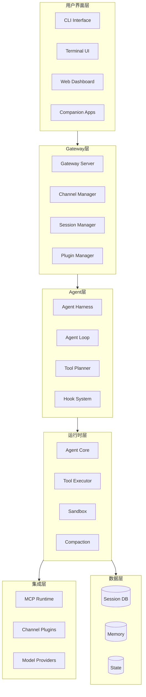
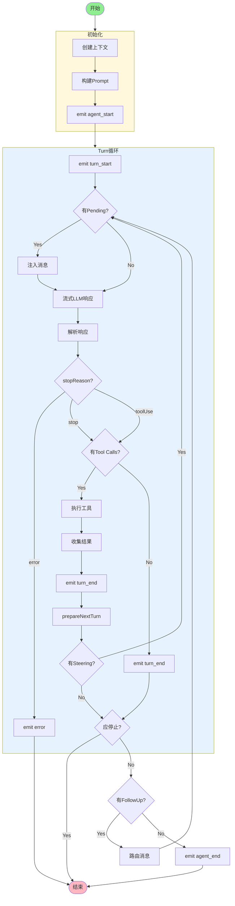
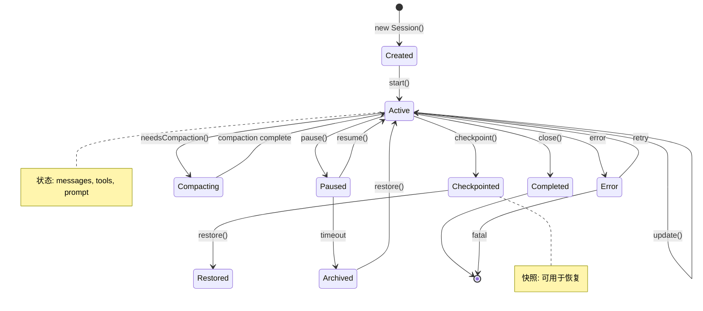
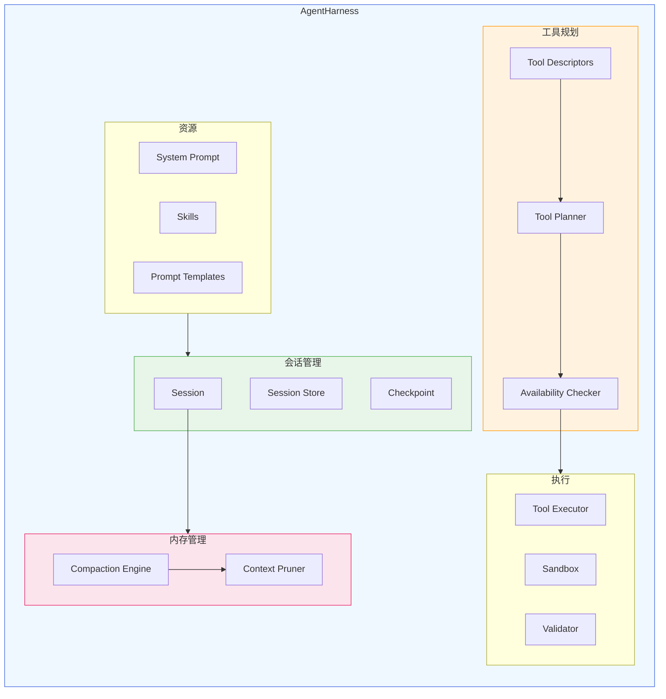
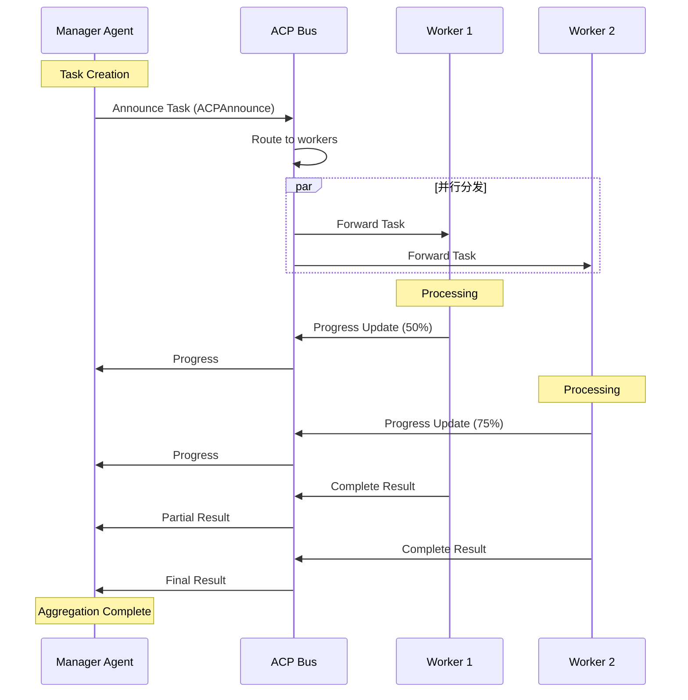
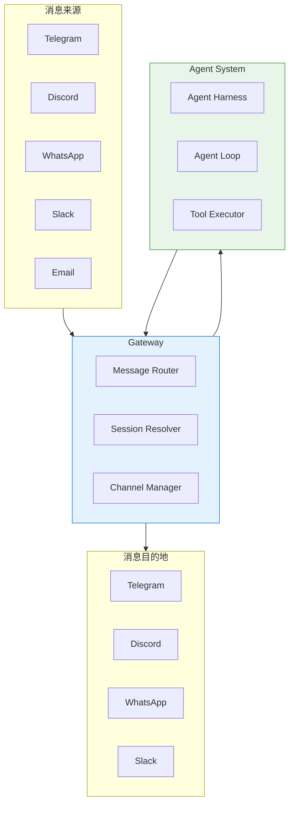
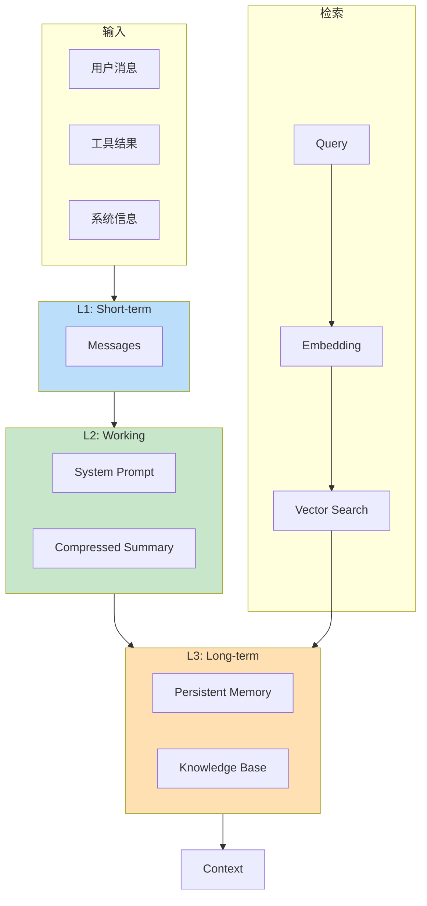
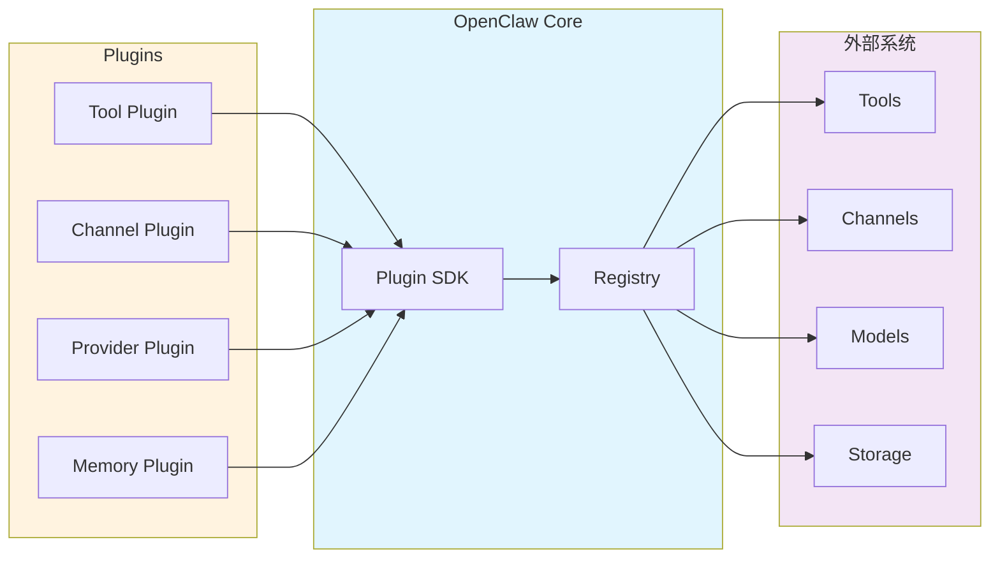

# OpenClaw 架构图表集

> 本文档包含 OpenClaw 项目的关键架构图和流程图，便于快速理解系统设计。

## 目录

1. [整体架构图](#1-整体架构图)
2. [Agent Loop流程图](#2-agent-loop流程图)
3. [Tool调用时序图](#3-tool调用时序图)
4. [Session生命周期图](#4-session生命周期图)
5. [Harness架构图](#5-harness架构图)
6. [ACP协议时序图](#6-acp协议时序图)
7. [多渠道架构图](#7-多渠道架构图)
8. [Memory分层图](#8-memory分层图)
9. [Plugin架构图](#9-plugin架构图)

---

## 1. 整体架构图



## 2. Agent Loop流程图



## 3. Tool调用时序图

```mermaid
sequenceDiagram
    participant LLM as LLM
    participant Loop as Agent Loop
    participant Planner as Tool Planner
    participant Executor as Tool Executor
    participant Sandbox as Sandbox
    participant Session as Session

    LLM-->>Loop: ToolCall响应
    Loop->>Planner: 规划可用工具
    Planner-->>Loop: ToolPlan (visible/hidden)

    Loop->>Executor: 执行Tool (name, args)
    
    alt 需要沙箱
        Executor->>Sandbox: 沙箱执行
        Sandbox-->>Executor: 执行结果
    else 直接执行
        Executor-->>Executor: 直接执行
    end
    
    Executor-->>Loop: ToolResult
    
    alt 执行失败
        Loop->>Session: 记录错误
        Session-->>Loop: 确认
    else 执行成功
        Loop->>Session: 更新状态
        Session-->>Loop: 确认
    end
    
    Loop->>Loop: 继续循环或结束
```

## 4. Session生命周期图



## 5. Harness架构图



## 6. ACP协议时序图



## 7. 多渠道架构图



## 8. Memory分层图



## 9. Plugin架构图



---

*图表生成时间: 2026-06-23*
